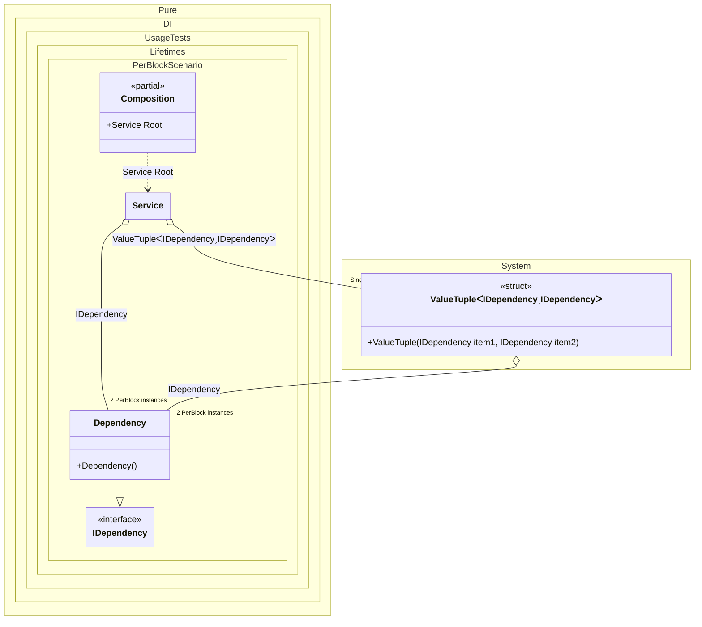

#### PerBlock

[](../tests/Pure.DI.UsageTests/Lifetimes/PerBlockScenario.cs)

The _PreBlock_ lifetime does not guarantee that there will be a single dependency instance for each instance of the composition root (as for the _PreResolve_ lifetime), but is useful for reducing the number of instances of a type.


```c#
using Pure.DI;
using Shouldly;
using static Pure.DI.Lifetime;

DI.Setup(nameof(Composition))
    // This hint indicates to not generate methods such as Resolve
    .Hint(Hint.Resolve, "Off")
    .Bind().As(PerBlock).To<Dependency>()
    .Bind().As(Singleton).To<(IDependency dep3, IDependency dep4)>()

    // Composition root
    .Root<Service>("Root");

var composition = new Composition();

var service1 = composition.Root;
service1.Dep1.ShouldBe(service1.Dep2);
service1.Dep3.ShouldBe(service1.Dep4);
service1.Dep1.ShouldNotBe(service1.Dep3);

var service2 = composition.Root;
service2.Dep1.ShouldNotBe(service1.Dep1);

interface IDependency;

class Dependency : IDependency;

class Service(
    IDependency dep1,
    IDependency dep2,
    (IDependency dep3, IDependency dep4) deps)
{
    public IDependency Dep1 { get; } = dep1;

    public IDependency Dep2 { get; } = dep2;

    public IDependency Dep3 { get; } = deps.dep3;

    public IDependency Dep4 { get; } = deps.dep4;
}
```


Class diagram:



