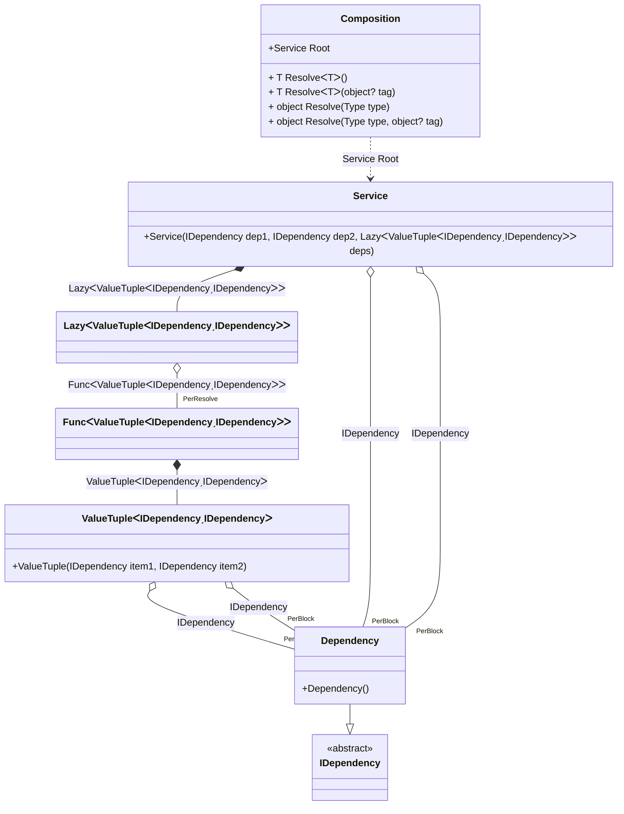

#### PerBlock

[](../tests/Pure.DI.UsageTests/Lifetimes/PerBlockScenario.cs)

The _PreBlock_ lifetime does not guarantee that there will be a single instance of the dependency for each root of the composition, but is useful to reduce the number of instances of type.

```c#
interface IDependency;

class Dependency : IDependency;

class Service(
    IDependency dep1,
    IDependency dep2,
    Lazy<(IDependency dep3, IDependency dep4)> deps)
{
    public IDependency Dep1 { get; } = dep1;

    public IDependency Dep2 { get; } = dep2;

    public IDependency Dep3 { get; } = deps.Value.dep3;

    public IDependency Dep4 { get; } = deps.Value.dep4;
}

DI.Setup(nameof(Composition))
    .Bind().As(Lifetime.PerBlock).To<Dependency>()

    // Composition root
    .Root<Service>("Root");

var composition = new Composition();

var service1 = composition.Root;
service1.Dep1.ShouldBe(service1.Dep2);
service1.Dep3.ShouldBe(service1.Dep4);
service1.Dep1.ShouldNotBe(service1.Dep3);
        
var service2 = composition.Root;
service2.Dep1.ShouldNotBe(service1.Dep1);
```

<details open>
<summary>Class Diagram</summary>



</details>

<details>
<summary>Pure.DI-generated partial class Composition</summary><blockquote>

```c#
partial class Composition
{
  private readonly Composition _root;
  private readonly object _lock;

  public Composition()
  {
    _root = this;
    _lock = new object();
  }

  internal Composition(Composition baseComposition)
  {
    _root = baseComposition._root;
    _lock = _root._lock;
  }

  public Service Root
  {
    [MethodImpl((MethodImplOptions)0x100)]
    get
    {
      var perResolve43_Func = default(Func<(IDependency dep3, IDependency dep4)>);
      perResolve43_Func = new Func<(IDependency dep3, IDependency dep4)>(
      [MethodImpl((MethodImplOptions)768)]
      () =>
      {
          Dependency perBlock4_Dependency = new Dependency();
          var value_1 = (perBlock4_Dependency, perBlock4_Dependency);
          return value_1;
      });
      Lazy<(IDependency dep3, IDependency dep4)> transient2_Lazy;
      {
          var factory_2 = perResolve43_Func;
          transient2_Lazy = new Lazy<(IDependency dep3, IDependency dep4)>(factory_2, true);
      }
      Dependency perBlock1_Dependency = new Dependency();
      return new Service(perBlock1_Dependency, perBlock1_Dependency, transient2_Lazy);
    }
  }

  [MethodImpl((MethodImplOptions)0x100)]
  public T Resolve<T>()
  {
    return Resolver<T>.Value.Resolve(this);
  }

  [MethodImpl((MethodImplOptions)0x100)]
  public T Resolve<T>(object? tag)
  {
    return Resolver<T>.Value.ResolveByTag(this, tag);
  }

  [MethodImpl((MethodImplOptions)0x100)]
  public object Resolve(Type type)
  {
    var index = (int)(_bucketSize * ((uint)RuntimeHelpers.GetHashCode(type) % 1));
    ref var pair = ref _buckets[index];
    return pair.Key == type ? pair.Value.Resolve(this) : Resolve(type, index);
  }

  [MethodImpl((MethodImplOptions)0x8)]
  private object Resolve(Type type, int index)
  {
    var finish = index + _bucketSize;
    while (++index < finish)
    {
      ref var pair = ref _buckets[index];
      if (pair.Key == type)
      {
        return pair.Value.Resolve(this);
      }
    }

    throw new InvalidOperationException($"Cannot resolve composition root of type {type}.");
  }

  [MethodImpl((MethodImplOptions)0x100)]
  public object Resolve(Type type, object? tag)
  {
    var index = (int)(_bucketSize * ((uint)RuntimeHelpers.GetHashCode(type) % 1));
    ref var pair = ref _buckets[index];
    return pair.Key == type ? pair.Value.ResolveByTag(this, tag) : Resolve(type, tag, index);
  }

  [MethodImpl((MethodImplOptions)0x8)]
  private object Resolve(Type type, object? tag, int index)
  {
    var finish = index + _bucketSize;
    while (++index < finish)
    {
      ref var pair = ref _buckets[index];
      if (pair.Key == type)
      {
        return pair.Value.ResolveByTag(this, tag);
      }
    }

    throw new InvalidOperationException($"Cannot resolve composition root \"{tag}\" of type {type}.");
  }

  public override string ToString()
  {
    return
      "classDiagram\n" +
        "  class Composition {\n" +
          "    +Service Root\n" +
          "    + T ResolveᐸTᐳ()\n" +
          "    + T ResolveᐸTᐳ(object? tag)\n" +
          "    + object Resolve(Type type)\n" +
          "    + object Resolve(Type type, object? tag)\n" +
        "  }\n" +
        "  class ValueTupleᐸIDependencyˏIDependencyᐳ {\n" +
          "    +ValueTuple(IDependency item1, IDependency item2)\n" +
        "  }\n" +
        "  class Service {\n" +
          "    +Service(IDependency dep1, IDependency dep2, LazyᐸValueTupleᐸIDependencyˏIDependencyᐳᐳ deps)\n" +
        "  }\n" +
        "  Dependency --|> IDependency : \n" +
        "  class Dependency {\n" +
          "    +Dependency()\n" +
        "  }\n" +
        "  class LazyᐸValueTupleᐸIDependencyˏIDependencyᐳᐳ\n" +
        "  class FuncᐸValueTupleᐸIDependencyˏIDependencyᐳᐳ\n" +
        "  class IDependency {\n" +
          "    <<abstract>>\n" +
        "  }\n" +
        "  ValueTupleᐸIDependencyˏIDependencyᐳ o--  \"PerBlock\" Dependency : IDependency\n" +
        "  ValueTupleᐸIDependencyˏIDependencyᐳ o--  \"PerBlock\" Dependency : IDependency\n" +
        "  Service o--  \"PerBlock\" Dependency : IDependency\n" +
        "  Service o--  \"PerBlock\" Dependency : IDependency\n" +
        "  Service *--  LazyᐸValueTupleᐸIDependencyˏIDependencyᐳᐳ : LazyᐸValueTupleᐸIDependencyˏIDependencyᐳᐳ\n" +
        "  Composition ..> Service : Service Root\n" +
        "  LazyᐸValueTupleᐸIDependencyˏIDependencyᐳᐳ o--  \"PerResolve\" FuncᐸValueTupleᐸIDependencyˏIDependencyᐳᐳ : FuncᐸValueTupleᐸIDependencyˏIDependencyᐳᐳ\n" +
        "  FuncᐸValueTupleᐸIDependencyˏIDependencyᐳᐳ *--  ValueTupleᐸIDependencyˏIDependencyᐳ : ValueTupleᐸIDependencyˏIDependencyᐳ";
  }

  private readonly static int _bucketSize;
  private readonly static Pair<Type, IResolver<Composition, object>>[] _buckets;

  static Composition()
  {
    var valResolver_0000 = new Resolver_0000();
    Resolver<Service>.Value = valResolver_0000;
    _buckets = Buckets<Type, IResolver<Composition, object>>.Create(
      1,
      out _bucketSize,
      new Pair<Type, IResolver<Composition, object>>[1]
      {
         new Pair<Type, IResolver<Composition, object>>(typeof(Service), valResolver_0000)
      });
  }

  private sealed class Resolver<T>: IResolver<Composition, T>
  {
    public static IResolver<Composition, T> Value = new Resolver<T>();

    public T Resolve(Composition composite)
    {
      throw new InvalidOperationException($"Cannot resolve composition root of type {typeof(T)}.");
    }

    public T ResolveByTag(Composition composite, object tag)
    {
      throw new InvalidOperationException($"Cannot resolve composition root \"{tag}\" of type {typeof(T)}.");
    }
  }

  private sealed class Resolver_0000: IResolver<Composition, Service>
  {
    public Service Resolve(Composition composition)
    {
      return composition.Root;
    }

    public Service ResolveByTag(Composition composition, object tag)
    {
      switch (tag)
      {
        case null:
          return composition.Root;
        default:
          throw new InvalidOperationException($"Cannot resolve composition root \"{tag}\" of type Service.");
      }
    }
  }
}
```

</blockquote></details>

