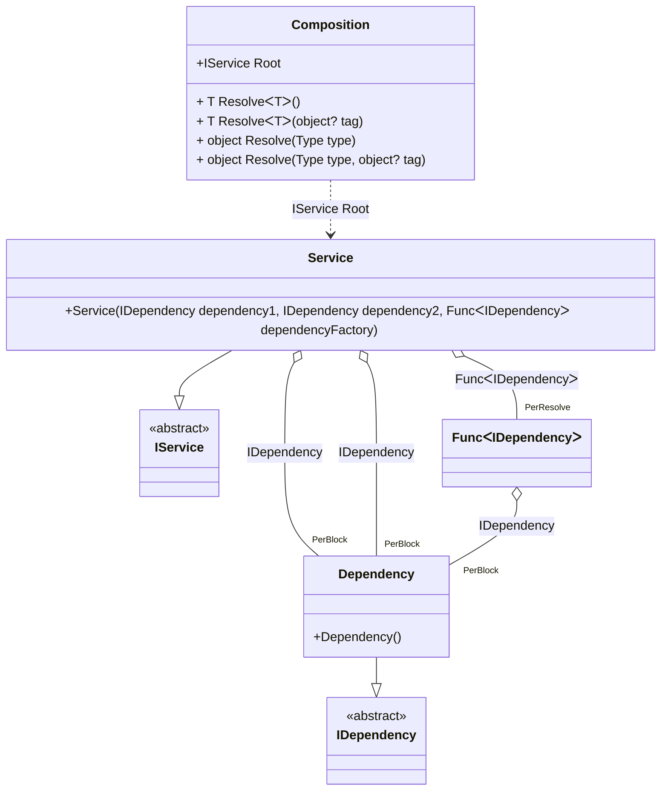

#### PerBlock

[](../tests/Pure.DI.UsageTests/Lifetimes/PerBlockScenario.cs)

The _PreBlock_ lifetime does not guarantee that there will be a single instance of the dependency for each root of the composition, but is useful to reduce the number of instances of type.

```c#
interface IDependency { }

class Dependency : IDependency { }

interface IService
{
    public IDependency Dependency1 { get; }

    public IDependency Dependency2 { get; }

    public IDependency Dependency3 { get; }
}

class Service : IService
{
    public Service(
        IDependency dependency1,
        IDependency dependency2,
        Func<IDependency> dependencyFactory)
    {
        Dependency1 = dependency1;
        Dependency2 = dependency2;
        Dependency3 = dependencyFactory();
    }

    public IDependency Dependency1 { get; }

    public IDependency Dependency2 { get; }

    public IDependency Dependency3 { get; }
}

DI.Setup("Composition")
    .Bind<IDependency>().As(Lifetime.PerBlock).To<Dependency>()
    .Bind<IService>().To<Service>().Root<IService>("Root");

var composition = new Composition();
var service1 = composition.Root;
var service2 = composition.Root;
service1.Dependency1.ShouldBe(service1.Dependency2);
service1.Dependency1.ShouldNotBe(service1.Dependency3);
service2.Dependency1.ShouldNotBe(service1.Dependency1);
```

<details open>
<summary>Class Diagram</summary>



</details>

<details>
<summary>Pure.DI-generated partial class Composition</summary><blockquote>

```c#
partial class Composition
{
  private readonly global::System.IDisposable[] _disposableSingletonsM12D26di;
  
  public Composition()
  {
    _disposableSingletonsM12D26di = new global::System.IDisposable[0];
  }
  
  internal Composition(Composition parent)
  {
    _disposableSingletonsM12D26di = new global::System.IDisposable[0];
  }
  
  #region Composition Roots
  public Pure.DI.UsageTests.Lifetimes.PerBlockScenario.IService Root
  {
    #if NETSTANDARD2_0_OR_GREATER || NETCOREAPP || NET40_OR_GREATER || NET
    [global::System.Diagnostics.Contracts.Pure]
    #endif
    get
    {
      var perResolveM12D26di23 = default(System.Func<Pure.DI.UsageTests.Lifetimes.PerBlockScenario.IDependency>);
      perResolveM12D26di23 = default(System.Func<Pure.DI.UsageTests.Lifetimes.PerBlockScenario.IDependency>);
      perResolveM12D26di23 = new global::System.Func<Pure.DI.UsageTests.Lifetimes.PerBlockScenario.IDependency>(
      [global::System.Runtime.CompilerServices.MethodImpl((global::System.Runtime.CompilerServices.MethodImplOptions)768)]
      () =>
      {
          var perBlockM12D26di2 = new Pure.DI.UsageTests.Lifetimes.PerBlockScenario.Dependency();
          var localM12D26di1 = perBlockM12D26di2;
          return localM12D26di1;
      });
      var perBlockM12D26di1 = new Pure.DI.UsageTests.Lifetimes.PerBlockScenario.Dependency();
      return new Pure.DI.UsageTests.Lifetimes.PerBlockScenario.Service(perBlockM12D26di1, perBlockM12D26di1, perResolveM12D26di23);
    }
  }
  #endregion
  
  #region API
  #if NETSTANDARD2_0_OR_GREATER || NETCOREAPP || NET40_OR_GREATER || NET
  [global::System.Diagnostics.Contracts.Pure]
  #endif
  public T Resolve<T>()
  {
    return ResolverM12D26di<T>.Value.Resolve(this);
  }
  
  #if NETSTANDARD2_0_OR_GREATER || NETCOREAPP || NET40_OR_GREATER || NET
  [global::System.Diagnostics.Contracts.Pure]
  #endif
  public T Resolve<T>(object? tag)
  {
    return ResolverM12D26di<T>.Value.ResolveByTag(this, tag);
  }
  
  #if NETSTANDARD2_0_OR_GREATER || NETCOREAPP || NET40_OR_GREATER || NET
  [global::System.Diagnostics.Contracts.Pure]
  #endif
  public object Resolve(global::System.Type type)
  {
    var index = (int)(_bucketSizeM12D26di * ((uint)global::System.Runtime.CompilerServices.RuntimeHelpers.GetHashCode(type) % 1));
    var finish = index + _bucketSizeM12D26di;
    do {
      ref var pair = ref _bucketsM12D26di[index];
      if (ReferenceEquals(pair.Key, type))
      {
        return pair.Value.Resolve(this);
      }
    } while (++index < finish);
    
    throw new global::System.InvalidOperationException($"Cannot resolve composition root of type {type}.");
  }
  
  #if NETSTANDARD2_0_OR_GREATER || NETCOREAPP || NET40_OR_GREATER || NET
  [global::System.Diagnostics.Contracts.Pure]
  #endif
  public object Resolve(global::System.Type type, object? tag)
  {
    var index = (int)(_bucketSizeM12D26di * ((uint)global::System.Runtime.CompilerServices.RuntimeHelpers.GetHashCode(type) % 1));
    var finish = index + _bucketSizeM12D26di;
    do {
      ref var pair = ref _bucketsM12D26di[index];
      if (ReferenceEquals(pair.Key, type))
      {
        return pair.Value.ResolveByTag(this, tag);
      }
    } while (++index < finish);
    
    throw new global::System.InvalidOperationException($"Cannot resolve composition root \"{tag}\" of type {type}.");
  }
  #endregion
  
  public override string ToString()
  {
    return
      "classDiagram\n" +
        "  class Composition {\n" +
          "    +IService Root\n" +
          "    + T ResolveᐸTᐳ()\n" +
          "    + T ResolveᐸTᐳ(object? tag)\n" +
          "    + object Resolve(Type type)\n" +
          "    + object Resolve(Type type, object? tag)\n" +
        "  }\n" +
        "  Service --|> IService : \n" +
        "  class Service {\n" +
          "    +Service(IDependency dependency1, IDependency dependency2, FuncᐸIDependencyᐳ dependencyFactory)\n" +
        "  }\n" +
        "  Dependency --|> IDependency : \n" +
        "  class Dependency {\n" +
          "    +Dependency()\n" +
        "  }\n" +
        "  class FuncᐸIDependencyᐳ\n" +
        "  class IService {\n" +
          "    <<abstract>>\n" +
        "  }\n" +
        "  class IDependency {\n" +
          "    <<abstract>>\n" +
        "  }\n" +
        "  Service o--  \"PerBlock\" Dependency : IDependency\n" +
        "  Service o--  \"PerBlock\" Dependency : IDependency\n" +
        "  Service o--  \"PerResolve\" FuncᐸIDependencyᐳ : FuncᐸIDependencyᐳ\n" +
        "  Composition ..> Service : IService Root\n" +
        "  FuncᐸIDependencyᐳ o--  \"PerBlock\" Dependency : IDependency";
  }
  
  private readonly static int _bucketSizeM12D26di;
  private readonly static global::Pure.DI.Pair<global::System.Type, global::Pure.DI.IResolver<Composition, object>>[] _bucketsM12D26di;
  
  
  static Composition()
  {
    var valResolverM12D26di_0000 = new ResolverM12D26di_0000();
    ResolverM12D26di<Pure.DI.UsageTests.Lifetimes.PerBlockScenario.IService>.Value = valResolverM12D26di_0000;
    _bucketsM12D26di = global::Pure.DI.Buckets<global::System.Type, global::Pure.DI.IResolver<Composition, object>>.Create(
      1,
      out _bucketSizeM12D26di,
      new global::Pure.DI.Pair<global::System.Type, global::Pure.DI.IResolver<Composition, object>>[1]
      {
         new global::Pure.DI.Pair<global::System.Type, global::Pure.DI.IResolver<Composition, object>>(typeof(Pure.DI.UsageTests.Lifetimes.PerBlockScenario.IService), valResolverM12D26di_0000)
      });
  }
  
  #region Resolvers
  private sealed class ResolverM12D26di<T>: global::Pure.DI.IResolver<Composition, T>
  {
    public static global::Pure.DI.IResolver<Composition, T> Value = new ResolverM12D26di<T>();
    
    public T Resolve(Composition composite)
    {
      throw new global::System.InvalidOperationException($"Cannot resolve composition root of type {typeof(T)}.");
    }
    
    public T ResolveByTag(Composition composite, object tag)
    {
      throw new global::System.InvalidOperationException($"Cannot resolve composition root \"{tag}\" of type {typeof(T)}.");
    }
  }
  
  private sealed class ResolverM12D26di_0000: global::Pure.DI.IResolver<Composition, Pure.DI.UsageTests.Lifetimes.PerBlockScenario.IService>
  {
    public Pure.DI.UsageTests.Lifetimes.PerBlockScenario.IService Resolve(Composition composition)
    {
      return composition.Root;
    }
    
    public Pure.DI.UsageTests.Lifetimes.PerBlockScenario.IService ResolveByTag(Composition composition, object tag)
    {
      if (Equals(tag, null)) return composition.Root;;
      throw new global::System.InvalidOperationException($"Cannot resolve composition root \"{tag}\" of type Pure.DI.UsageTests.Lifetimes.PerBlockScenario.IService.");
    }
  }
  #endregion
}
```

</blockquote></details>

