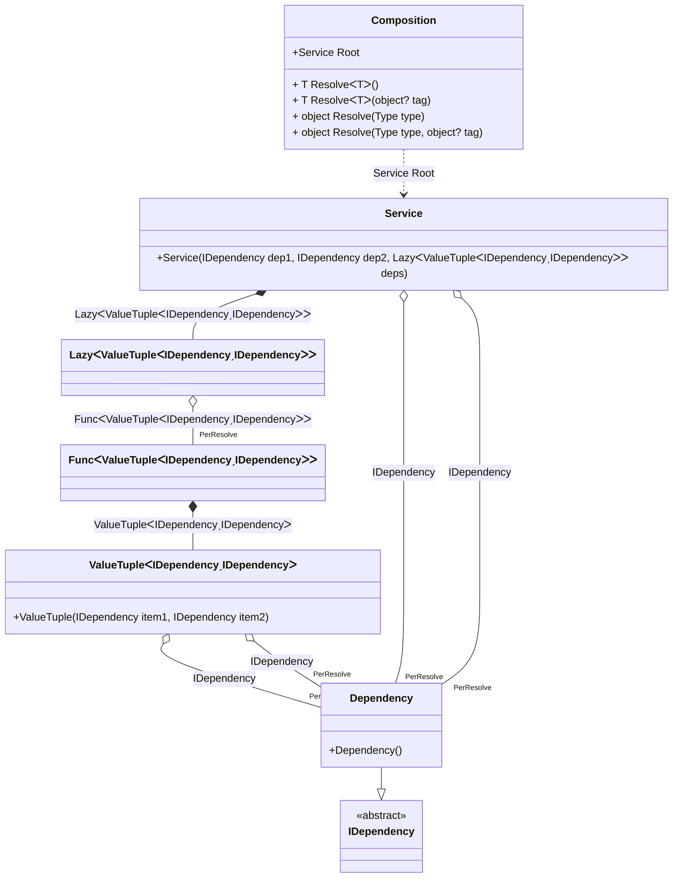

#### PerResolve

[](../tests/Pure.DI.UsageTests/Lifetimes/PerResolveScenario.cs)

The _PerResolve_ lifetime guarantees that there will be a single instance of the dependency for each root of the composition.

```c#
interface IDependency;

class Dependency : IDependency;

class Service(
    IDependency dep1,
    IDependency dep2,
    Lazy<(IDependency dep3, IDependency dep4)> deps)
{
    public IDependency Dep1 { get; } = dep1;

    public IDependency Dep2 { get; } = dep2;

    public IDependency Dep3 { get; } = deps.Value.dep3;

    public IDependency Dep4 { get; } = deps.Value.dep4;
}

DI.Setup(nameof(Composition))
    .Bind().As(Lifetime.PerResolve).To<Dependency>()

    // Composition root
    .Root<Service>("Root");

var composition = new Composition();

var service1 = composition.Root;
service1.Dep1.ShouldBe(service1.Dep2);
service1.Dep3.ShouldBe(service1.Dep4);
service1.Dep1.ShouldBe(service1.Dep3);
        
var service2 = composition.Root;
service2.Dep1.ShouldNotBe(service1.Dep1);
```

<details open>
<summary>Class Diagram</summary>



</details>

<details>
<summary>Pure.DI-generated partial class Composition</summary><blockquote>

```c#
partial class Composition
{
  private readonly Composition _rootM04D13di;
  private readonly object _lockM04D13di;
  
  public Composition()
  {
    _rootM04D13di = this;
    _lockM04D13di = new object();
  }
  
  internal Composition(Composition baseComposition)
  {
    _rootM04D13di = baseComposition._rootM04D13di;
    _lockM04D13di = _rootM04D13di._lockM04D13di;
  }
  
  public Pure.DI.UsageTests.Lifetimes.PerResolveScenario.Service Root
  {
    [global::System.Runtime.CompilerServices.MethodImpl((global::System.Runtime.CompilerServices.MethodImplOptions)0x100)]
    get
    {
      var perResolveM04D13di36_Dependency = default(Pure.DI.UsageTests.Lifetimes.PerResolveScenario.Dependency);
      var perResolveM04D13di43_Func = default(System.Func<(Pure.DI.UsageTests.Lifetimes.PerResolveScenario.IDependency dep3, Pure.DI.UsageTests.Lifetimes.PerResolveScenario.IDependency dep4)>);
      perResolveM04D13di43_Func = new global::System.Func<(Pure.DI.UsageTests.Lifetimes.PerResolveScenario.IDependency dep3, Pure.DI.UsageTests.Lifetimes.PerResolveScenario.IDependency dep4)>(
      [global::System.Runtime.CompilerServices.MethodImpl((global::System.Runtime.CompilerServices.MethodImplOptions)768)]
      () =>
      {
          if (perResolveM04D13di36_Dependency == null)
          {
              lock (_lockM04D13di)
              {
                  if (perResolveM04D13di36_Dependency == null)
                  {
                      perResolveM04D13di36_Dependency = new Pure.DI.UsageTests.Lifetimes.PerResolveScenario.Dependency();
                  }
              }
          }
          var factory_M04D13di1 = (perResolveM04D13di36_Dependency, perResolveM04D13di36_Dependency);
          return factory_M04D13di1;
      });
      System.Lazy<(Pure.DI.UsageTests.Lifetimes.PerResolveScenario.IDependency dep3, Pure.DI.UsageTests.Lifetimes.PerResolveScenario.IDependency dep4)> transientM04D13di1_Lazy;
      {
          var factory_M04D13di2 = perResolveM04D13di43_Func;
          transientM04D13di1_Lazy = new global::System.Lazy<(Pure.DI.UsageTests.Lifetimes.PerResolveScenario.IDependency dep3, Pure.DI.UsageTests.Lifetimes.PerResolveScenario.IDependency dep4)>(factory_M04D13di2, true);
      }
      if (perResolveM04D13di36_Dependency == null)
      {
          lock (_lockM04D13di)
          {
              if (perResolveM04D13di36_Dependency == null)
              {
                  perResolveM04D13di36_Dependency = new Pure.DI.UsageTests.Lifetimes.PerResolveScenario.Dependency();
              }
          }
      }
      return new Pure.DI.UsageTests.Lifetimes.PerResolveScenario.Service(perResolveM04D13di36_Dependency, perResolveM04D13di36_Dependency, transientM04D13di1_Lazy);
    }
  }
  
  public T Resolve<T>()
  {
    return ResolverM04D13di<T>.Value.Resolve(this);
  }
  
  public T Resolve<T>(object? tag)
  {
    return ResolverM04D13di<T>.Value.ResolveByTag(this, tag);
  }
  
  [global::System.Runtime.CompilerServices.MethodImpl((global::System.Runtime.CompilerServices.MethodImplOptions)0x100)]
  public object Resolve(global::System.Type type)
  {
    var index = (int)(_bucketSizeM04D13di * ((uint)global::System.Runtime.CompilerServices.RuntimeHelpers.GetHashCode(type) % 1));
    ref var pair = ref _bucketsM04D13di[index];
    return pair.Key == type ? pair.Value.Resolve(this) : ResolveM04D13di(type, index);
  }
  
  [global::System.Runtime.CompilerServices.MethodImpl((global::System.Runtime.CompilerServices.MethodImplOptions)0x8)]
  private object ResolveM04D13di(global::System.Type type, int index)
  {
    var finish = index + _bucketSizeM04D13di;
    while (++index < finish)
    {
      ref var pair = ref _bucketsM04D13di[index];
      if (pair.Key == type)
      {
        return pair.Value.Resolve(this);
      }
    }
    
    throw new global::System.InvalidOperationException($"Cannot resolve composition root of type {type}.");
  }
  
  [global::System.Runtime.CompilerServices.MethodImpl((global::System.Runtime.CompilerServices.MethodImplOptions)0x100)]
  public object Resolve(global::System.Type type, object? tag)
  {
    var index = (int)(_bucketSizeM04D13di * ((uint)global::System.Runtime.CompilerServices.RuntimeHelpers.GetHashCode(type) % 1));
    ref var pair = ref _bucketsM04D13di[index];
    return pair.Key == type ? pair.Value.ResolveByTag(this, tag) : ResolveM04D13di(type, tag, index);
  }
  
  [global::System.Runtime.CompilerServices.MethodImpl((global::System.Runtime.CompilerServices.MethodImplOptions)0x8)]
  private object ResolveM04D13di(global::System.Type type, object? tag, int index)
  {
    var finish = index + _bucketSizeM04D13di;
    while (++index < finish)
    {
      ref var pair = ref _bucketsM04D13di[index];
      if (pair.Key == type)
      {
        return pair.Value.ResolveByTag(this, tag);
      }
    }
    
    throw new global::System.InvalidOperationException($"Cannot resolve composition root \"{tag}\" of type {type}.");
  }
  
  public override string ToString()
  {
    return
      "classDiagram\n" +
        "  class Composition {\n" +
          "    +Service Root\n" +
          "    + T ResolveᐸTᐳ()\n" +
          "    + T ResolveᐸTᐳ(object? tag)\n" +
          "    + object Resolve(Type type)\n" +
          "    + object Resolve(Type type, object? tag)\n" +
        "  }\n" +
        "  class ValueTupleᐸIDependencyˏIDependencyᐳ {\n" +
          "    +ValueTuple(IDependency item1, IDependency item2)\n" +
        "  }\n" +
        "  class Service {\n" +
          "    +Service(IDependency dep1, IDependency dep2, LazyᐸValueTupleᐸIDependencyˏIDependencyᐳᐳ deps)\n" +
        "  }\n" +
        "  Dependency --|> IDependency : \n" +
        "  class Dependency {\n" +
          "    +Dependency()\n" +
        "  }\n" +
        "  class LazyᐸValueTupleᐸIDependencyˏIDependencyᐳᐳ\n" +
        "  class FuncᐸValueTupleᐸIDependencyˏIDependencyᐳᐳ\n" +
        "  class IDependency {\n" +
          "    <<abstract>>\n" +
        "  }\n" +
        "  ValueTupleᐸIDependencyˏIDependencyᐳ o--  \"PerResolve\" Dependency : IDependency\n" +
        "  ValueTupleᐸIDependencyˏIDependencyᐳ o--  \"PerResolve\" Dependency : IDependency\n" +
        "  Service o--  \"PerResolve\" Dependency : IDependency\n" +
        "  Service o--  \"PerResolve\" Dependency : IDependency\n" +
        "  Service *--  LazyᐸValueTupleᐸIDependencyˏIDependencyᐳᐳ : LazyᐸValueTupleᐸIDependencyˏIDependencyᐳᐳ\n" +
        "  Composition ..> Service : Service Root\n" +
        "  LazyᐸValueTupleᐸIDependencyˏIDependencyᐳᐳ o--  \"PerResolve\" FuncᐸValueTupleᐸIDependencyˏIDependencyᐳᐳ : FuncᐸValueTupleᐸIDependencyˏIDependencyᐳᐳ\n" +
        "  FuncᐸValueTupleᐸIDependencyˏIDependencyᐳᐳ *--  ValueTupleᐸIDependencyˏIDependencyᐳ : ValueTupleᐸIDependencyˏIDependencyᐳ";
  }
  
  private readonly static int _bucketSizeM04D13di;
  private readonly static global::Pure.DI.Pair<global::System.Type, global::Pure.DI.IResolver<Composition, object>>[] _bucketsM04D13di;
  
  static Composition()
  {
    var valResolverM04D13di_0000 = new ResolverM04D13di_0000();
    ResolverM04D13di<Pure.DI.UsageTests.Lifetimes.PerResolveScenario.Service>.Value = valResolverM04D13di_0000;
    _bucketsM04D13di = global::Pure.DI.Buckets<global::System.Type, global::Pure.DI.IResolver<Composition, object>>.Create(
      1,
      out _bucketSizeM04D13di,
      new global::Pure.DI.Pair<global::System.Type, global::Pure.DI.IResolver<Composition, object>>[1]
      {
         new global::Pure.DI.Pair<global::System.Type, global::Pure.DI.IResolver<Composition, object>>(typeof(Pure.DI.UsageTests.Lifetimes.PerResolveScenario.Service), valResolverM04D13di_0000)
      });
  }
  
  private sealed class ResolverM04D13di<T>: global::Pure.DI.IResolver<Composition, T>
  {
    public static global::Pure.DI.IResolver<Composition, T> Value = new ResolverM04D13di<T>();
    
    public T Resolve(Composition composite)
    {
      throw new global::System.InvalidOperationException($"Cannot resolve composition root of type {typeof(T)}.");
    }
    
    public T ResolveByTag(Composition composite, object tag)
    {
      throw new global::System.InvalidOperationException($"Cannot resolve composition root \"{tag}\" of type {typeof(T)}.");
    }
  }
  
  private sealed class ResolverM04D13di_0000: global::Pure.DI.IResolver<Composition, Pure.DI.UsageTests.Lifetimes.PerResolveScenario.Service>
  {
    public Pure.DI.UsageTests.Lifetimes.PerResolveScenario.Service Resolve(Composition composition)
    {
      return composition.Root;
    }
    
    public Pure.DI.UsageTests.Lifetimes.PerResolveScenario.Service ResolveByTag(Composition composition, object tag)
    {
      switch (tag)
      {
        case null:
          return composition.Root;
        default:
          throw new global::System.InvalidOperationException($"Cannot resolve composition root \"{tag}\" of type Pure.DI.UsageTests.Lifetimes.PerResolveScenario.Service.");
      }
    }
  }
}
```

</blockquote></details>

