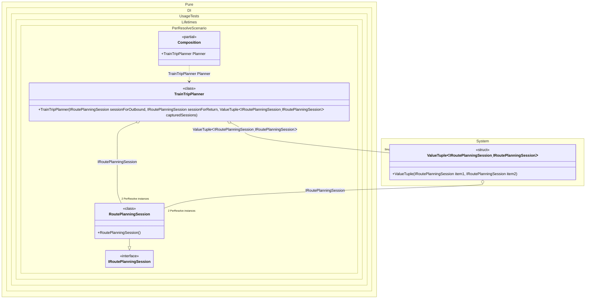

#### PerResolve

The _PerResolve_ lifetime ensures that there will be one instance of the dependency for each composition root instance.


```c#
using Shouldly;
using Pure.DI;
using static Pure.DI.Lifetime;

DI.Setup(nameof(Composition))
    // PerResolve = one "planning session" per root access.
    // Imagine: each time you ask for a plan, you get a fresh context.
    .Bind().As(PerResolve).To<RoutePlanningSession>()

    // Singleton = created once per Composition instance.
    // Here it intentionally captures session when it's created the first time
    // (this is a realistic pitfall: singleton accidentally holds request-scoped state).
    .Bind().As(Singleton).To<(IRoutePlanningSession s3, IRoutePlanningSession s4)>()

    // Composition root
    .Root<TrainTripPlanner>("Planner");

var composition = new Composition();

// First "user request": plan a trip now
var plan1 = composition.Planner;

// In the same request, PerResolve dependencies are the same instance:
plan1.SessionForOutbound.ShouldBe(plan1.SessionForReturn);

// Tuple is Singleton, so both entries are the same captured instance:
plan1.CapturedSessionA.ShouldBe(plan1.CapturedSessionB);

// Because the singleton tuple was created during the first request,
// it captured THAT request's PerResolve session:
plan1.SessionForOutbound.ShouldBe(plan1.CapturedSessionA);

// Second "user request": plan another trip (new root access)
var plan2 = composition.Planner;

// New request => new PerResolve session:
plan2.SessionForOutbound.ShouldNotBe(plan1.SessionForOutbound);

// But the singleton still holds the old captured session from the first request:
plan2.CapturedSessionA.ShouldBe(plan1.CapturedSessionA);
plan2.SessionForOutbound.ShouldNotBe(plan2.CapturedSessionA);

// A request-scoped context: e.g., contains "now", locale, pricing rules version,
// feature flags, etc. You typically want a new one per route planning request.
interface IRoutePlanningSession;

class RoutePlanningSession : IRoutePlanningSession;

// A service that plans a train trip.
// It asks for two session instances to demonstrate PerResolve:
// both should be the same within a single request.
class TrainTripPlanner(
    IRoutePlanningSession sessionForOutbound,
    IRoutePlanningSession sessionForReturn,
    (IRoutePlanningSession capturedA, IRoutePlanningSession capturedB) capturedSessions)
{
    public IRoutePlanningSession SessionForOutbound { get; } = sessionForOutbound;

    public IRoutePlanningSession SessionForReturn { get; } = sessionForReturn;

    // These come from a singleton tuple — effectively "global cached" instances.
    public IRoutePlanningSession CapturedSessionA { get; } = capturedSessions.capturedA;

    public IRoutePlanningSession CapturedSessionB { get; } = capturedSessions.capturedB;
}
```

<details>
<summary>Running this code sample locally</summary>

- Make sure you have the [.NET SDK 10.0](https://dotnet.microsoft.com/en-us/download/dotnet/10.0) or later is installed
```bash
dotnet --list-sdk
```
- Create a net10.0 (or later) console application
```bash
dotnet new console -n Sample
```
- Add references to NuGet packages
  - [Pure.DI](https://www.nuget.org/packages/Pure.DI)
  - [Shouldly](https://www.nuget.org/packages/Shouldly)
```bash
dotnet add package Pure.DI
dotnet add package Shouldly
```
- Copy the example code into the _Program.cs_ file

You are ready to run the example 🚀
```bash
dotnet run
```

</details>

The following partial class will be generated:

```c#
partial class Composition
{
  private readonly Composition _root;
#if NET9_0_OR_GREATER
  private readonly Lock _lock;
#else
  private readonly Object _lock;
#endif

  private (IRoutePlanningSession s3, IRoutePlanningSession s4) _singletonValueTuple54;
  private bool _singletonValueTuple54Created;

  [OrdinalAttribute(256)]
  public Composition()
  {
    _root = this;
#if NET9_0_OR_GREATER
    _lock = new Lock();
#else
    _lock = new Object();
#endif
  }

  internal Composition(Composition parentScope)
  {
    _root = (parentScope ?? throw new ArgumentNullException(nameof(parentScope)))._root;
    _lock = parentScope._lock;
  }

  public TrainTripPlanner Planner
  {
    [MethodImpl(MethodImplOptions.AggressiveInlining)]
    get
    {
      var perResolveRoutePlanningSession1 = default(RoutePlanningSession);
      if (!_root._singletonValueTuple54Created)
        lock (_lock)
          if (!_root._singletonValueTuple54Created)
          {
            EnsureRoutePlanningSessionExists();
            _root._singletonValueTuple54 = (perResolveRoutePlanningSession1, perResolveRoutePlanningSession1);
            Thread.MemoryBarrier();
            _root._singletonValueTuple54Created = true;
          }

      return new TrainTripPlanner(perResolveRoutePlanningSession1, perResolveRoutePlanningSession1, _root._singletonValueTuple54);
      [MethodImpl(MethodImplOptions.AggressiveInlining)]
      void EnsureRoutePlanningSessionExists()
      {
        if (perResolveRoutePlanningSession1 is null)
          lock (_lock)
            if (perResolveRoutePlanningSession1 is null)
            {
              perResolveRoutePlanningSession1 = new RoutePlanningSession();
            }
      }
    }
  }
}
```

Class diagram:



