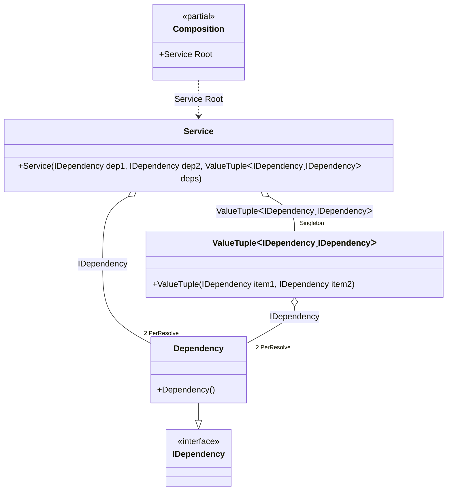

#### PerResolve

[](../tests/Pure.DI.UsageTests/Lifetimes/PerResolveScenario.cs)

The _PerResolve_ lifetime guarantees that there will be a single instance of the dependency for each root of the composition.


```c#
interface IDependency;

class Dependency : IDependency;

class Service(
    IDependency dep1,
    IDependency dep2,
    (IDependency dep3, IDependency dep4) deps)
{
    public IDependency Dep1 { get; } = dep1;

    public IDependency Dep2 { get; } = dep2;

    public IDependency Dep3 { get; } = deps.dep3;

    public IDependency Dep4 { get; } = deps.dep4;
}

DI.Setup(nameof(Composition))
    // This hint indicates to not generate methods such as Resolve
    .Hint(Hint.Resolve, "Off")
    .Bind().As(Lifetime.PerResolve).To<Dependency>()
    .Bind().As(Lifetime.Singleton).To<(IDependency dep3, IDependency dep4)>()

    // Composition root
    .Root<Service>("Root");

var composition = new Composition();

var service1 = composition.Root;
service1.Dep1.ShouldBe(service1.Dep2);
service1.Dep3.ShouldBe(service1.Dep4);
service1.Dep1.ShouldBe(service1.Dep3);
        
var service2 = composition.Root;
service2.Dep1.ShouldNotBe(service1.Dep1);
```

The following partial class will be generated:

```c#
partial class Composition
{
  private readonly Composition _root;
  private readonly object _lock;
  private (IDependency dep3, IDependency dep4) _singleton37_ValueTuple;
  private bool _singleton37_ValueTupleCreated;

  public Composition()
  {
    _root = this;
    _lock = new object();
  }

  internal Composition(Composition parentScope)
  {
    _root = (parentScope ?? throw new ArgumentNullException(nameof(parentScope)))._root;
    _lock = _root._lock;
  }

  public Service Root
  {
    [MethodImpl(MethodImplOptions.AggressiveInlining)]
    get
    {
      var perResolve36_Dependency = default(Dependency);
      if (!_root._singleton37_ValueTupleCreated)
      {
          lock (_lock)
          {
              if (!_root._singleton37_ValueTupleCreated)
              {
                  if (perResolve36_Dependency == null)
                  {
                      perResolve36_Dependency = new Dependency();
                  }
                  _root._singleton37_ValueTuple = (perResolve36_Dependency!, perResolve36_Dependency!);
                  Thread.MemoryBarrier();
                  _root._singleton37_ValueTupleCreated = true;
              }
          }
      }
      if (perResolve36_Dependency == null)
      {
          perResolve36_Dependency = new Dependency();
      }
      return new Service(perResolve36_Dependency!, perResolve36_Dependency!, _root._singleton37_ValueTuple);
    }
  }
}
```

Class diagram:



