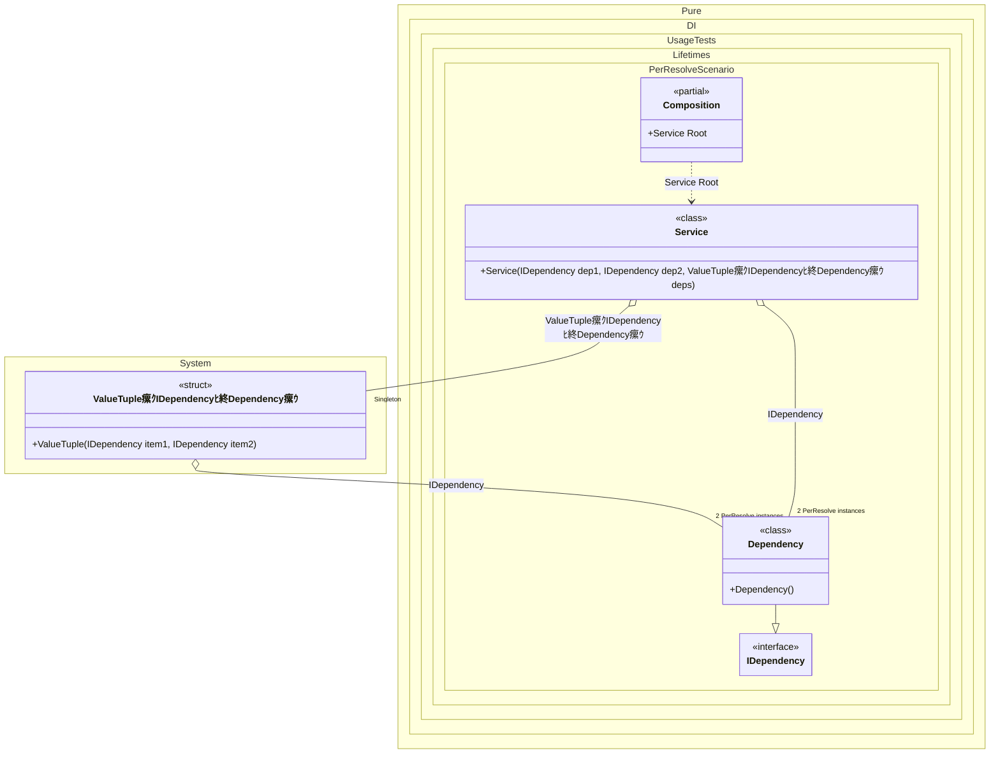

#### PerResolve

The _PerResolve_ lifetime ensures that there will be one instance of the dependency for each composition root instance.


```c#
using Shouldly;
using Pure.DI;
using static Pure.DI.Lifetime;

DI.Setup(nameof(Composition))
    .Bind().As(PerResolve).To<Dependency>()
    .Bind().As(Singleton).To<(IDependency dep3, IDependency dep4)>()

    // Composition root
    .Root<Service>("Root");

var composition = new Composition();

var service1 = composition.Root;
service1.Dep1.ShouldBe(service1.Dep2);
service1.Dep3.ShouldBe(service1.Dep4);
service1.Dep1.ShouldBe(service1.Dep3);

var service2 = composition.Root;
service2.Dep1.ShouldNotBe(service1.Dep1);

interface IDependency;

class Dependency : IDependency;

class Service(
    IDependency dep1,
    IDependency dep2,
    (IDependency dep3, IDependency dep4) deps)
{
    public IDependency Dep1 { get; } = dep1;

    public IDependency Dep2 { get; } = dep2;

    public IDependency Dep3 { get; } = deps.dep3;

    public IDependency Dep4 { get; } = deps.dep4;
}
```

<details>
<summary>Running this code sample locally</summary>

- Make sure you have the [.NET SDK 9.0](https://dotnet.microsoft.com/en-us/download/dotnet/9.0) or later is installed
```bash
dotnet --list-sdk
```
- Create a net9.0 (or later) console application
```bash
dotnet new console -n Sample
```
- Add references to NuGet packages
  - [Pure.DI](https://www.nuget.org/packages/Pure.DI)
  - [Shouldly](https://www.nuget.org/packages/Shouldly)
```bash
dotnet add package Pure.DI
dotnet add package Shouldly
```
- Copy the example code into the _Program.cs_ file

You are ready to run the example 🚀
```bash
dotnet run
```

</details>

The following partial class will be generated:

```c#
partial class Composition
{
  private readonly Composition _root;
#if NET9_0_OR_GREATER
  private readonly Lock _lock;
#else
  private readonly Object _lock;
#endif

  private (IDependency dep3, IDependency dep4) _singleValueTuple53;
  private bool _singleValueTuple53Created;

  [OrdinalAttribute(256)]
  public Composition()
  {
    _root = this;
#if NET9_0_OR_GREATER
    _lock = new Lock();
#else
    _lock = new Object();
#endif
  }

  internal Composition(Composition parentScope)
  {
    _root = (parentScope ?? throw new ArgumentNullException(nameof(parentScope)))._root;
    _lock = parentScope._lock;
  }

  public Service Root
  {
    [MethodImpl(MethodImplOptions.AggressiveInlining)]
    get
    {
      var resolveDependency1 = default(Dependency);
      if (!_root._singleValueTuple53Created)
      {
        lock (_lock)
        {
          EnsureDependencyExists0();
          _root._singleValueTuple53 = (resolveDependency1, resolveDependency1);
          Thread.MemoryBarrier();
          _root._singleValueTuple53Created = true;
        }
      }

      [MethodImpl(MethodImplOptions.AggressiveInlining)]
      void EnsureDependencyExists0()
      {
        if (resolveDependency1 is null)
        {
          resolveDependency1 = new Dependency();
        }
      }

      return new Service(resolveDependency1, resolveDependency1, _root._singleValueTuple53);
    }
  }
}
```

Class diagram:



