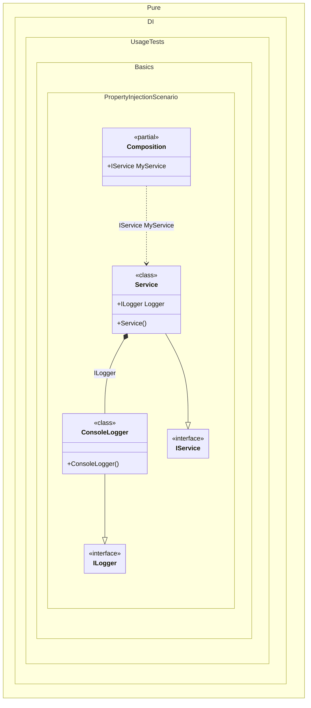

#### Property injection

To use dependency injection on a property, make sure the property is writable and simply add the _Ordinal_ attribute to that property, specifying the ordinal that will be used to determine the injection order:


```c#
using Shouldly;
using Pure.DI;

DI.Setup(nameof(Composition))
    .Bind<ILogger>().To<ConsoleLogger>()
    .Bind<IService>().To<Service>()

    // Composition root
    .Root<IService>("MyService");

var composition = new Composition();
var service = composition.MyService;
service.Logger.ShouldBeOfType<ConsoleLogger>();

interface ILogger;

class ConsoleLogger : ILogger;

interface IService
{
    ILogger? Logger { get; }
}

class Service : IService
{
    // The Dependency attribute specifies to perform an injection,
    // the integer value in the argument specifies
    // the ordinal of injection.
    // Usually, property injection is used for optional dependencies.
    [Dependency] public ILogger? Logger { get; set; }
}
```

<details>
<summary>Running this code sample locally</summary>

- Make sure you have the [.NET SDK 10.0](https://dotnet.microsoft.com/en-us/download/dotnet/10.0) or later is installed
```bash
dotnet --list-sdk
```
- Create a net10.0 (or later) console application
```bash
dotnet new console -n Sample
```
- Add references to NuGet packages
  - [Pure.DI](https://www.nuget.org/packages/Pure.DI)
  - [Shouldly](https://www.nuget.org/packages/Shouldly)
```bash
dotnet add package Pure.DI
dotnet add package Shouldly
```
- Copy the example code into the _Program.cs_ file

You are ready to run the example 🚀
```bash
dotnet run
```

</details>

The key points are:
- The property must be writable
- The `Dependency` (or `Ordinal`) attribute is used to mark the property for injection
- The container automatically injects the dependency when resolving the object graph

The following partial class will be generated:

```c#
partial class Composition
{
  public IService MyService
  {
    [MethodImpl(MethodImplOptions.AggressiveInlining)]
    get
    {
      var transientService = new Service();
      transientService.Logger = new ConsoleLogger();
      return transientService;
    }
  }
}
```

Class diagram:



