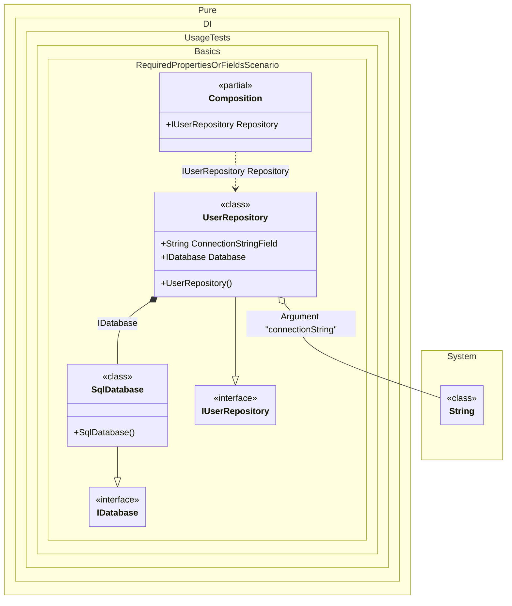

#### Required properties or fields

This example demonstrates how the `required` modifier can be used to automatically inject dependencies into properties and fields. When a property or field is marked with `required`, the DI will automatically inject the dependency without additional effort.


```c#
using Shouldly;
using Pure.DI;

DI.Setup(nameof(Composition))
    .Arg<string>("connectionString")
    .Bind<IDatabase>().To<SqlDatabase>()
    .Bind<IUserRepository>().To<UserRepository>()

    // Composition root
    .Root<IUserRepository>("Repository");

var composition = new Composition(connectionString: "Server=.;Database=MyDb;");
var repository = composition.Repository;

repository.Database.ShouldBeOfType<SqlDatabase>();
repository.ConnectionString.ShouldBe("Server=.;Database=MyDb;");

interface IDatabase;

class SqlDatabase : IDatabase;

interface IUserRepository
{
    string ConnectionString { get; }

    IDatabase Database { get; }
}

class UserRepository : IUserRepository
{
    // The required field will be injected automatically.
    // In this case, it gets the value from the composition argument
    // of type 'string'.
    public required string ConnectionStringField;

    public string ConnectionString => ConnectionStringField;

    // The required property will be injected automatically
    // without additional effort.
    public required IDatabase Database { get; init; }
}
```

<details>
<summary>Running this code sample locally</summary>

- Make sure you have the [.NET SDK 10.0](https://dotnet.microsoft.com/en-us/download/dotnet/10.0) or later is installed
```bash
dotnet --list-sdk
```
- Create a net10.0 (or later) console application
```bash
dotnet new console -n Sample
```
- Add references to NuGet packages
  - [Pure.DI](https://www.nuget.org/packages/Pure.DI)
  - [Shouldly](https://www.nuget.org/packages/Shouldly)
```bash
dotnet add package Pure.DI
dotnet add package Shouldly
```
- Copy the example code into the _Program.cs_ file

You are ready to run the example 🚀
```bash
dotnet run
```

</details>

This approach simplifies dependency injection by eliminating the need to manually configure bindings for required dependencies, making the code more concise and easier to maintain.

The following partial class will be generated:

```c#
partial class Composition
{
#if NET9_0_OR_GREATER
  private readonly Lock _lock;
#else
  private readonly Object _lock;
#endif

  private readonly string _argConnectionString;

  [OrdinalAttribute(128)]
  public Composition(string connectionString)
  {
    _argConnectionString = connectionString ?? throw new ArgumentNullException(nameof(connectionString));
#if NET9_0_OR_GREATER
    _lock = new Lock();
#else
    _lock = new Object();
#endif
  }

  public IUserRepository Repository
  {
    [MethodImpl(MethodImplOptions.AggressiveInlining)]
    get
    {
      return new UserRepository()
      {
        ConnectionStringField = _argConnectionString,
        Database = new SqlDatabase()
      };
    }
  }
}
```

Class diagram:



