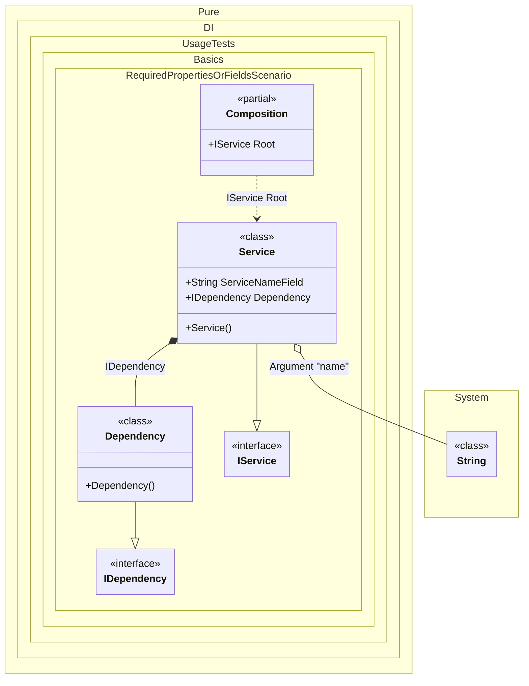

#### Required properties or fields

This example demonstrates how the `required` modifier can be used to automatically inject dependencies into properties and fields. When a property or field is marked with `required`, the DI will automatically inject the dependency without additional effort.


```c#
using Shouldly;
using Pure.DI;

DI.Setup(nameof(Composition))
    .Arg<string>("name")
    .Bind<IDependency>().To<Dependency>()
    .Bind<IService>().To<Service>()

    // Composition root
    .Root<IService>("Root");

var composition = new Composition(name: "My Service");
var service = composition.Root;
service.Dependency.ShouldBeOfType<Dependency>();
service.Name.ShouldBe("My Service");

interface IDependency;

class Dependency : IDependency;

interface IService
{
    string Name { get; }

    IDependency Dependency { get; }
}

class Service : IService
{
    public required string ServiceNameField;

    public string Name => ServiceNameField;

    // The required property will be injected automatically
    // without additional effort
    public required IDependency Dependency { get; init; }
}
```

<details>
<summary>Running this code sample locally</summary>

- Make sure you have the [.NET SDK 9.0](https://dotnet.microsoft.com/en-us/download/dotnet/9.0) or later is installed
```bash
dotnet --list-sdk
```
- Create a net9.0 (or later) console application
```bash
dotnet new console -n Sample
```
- Add references to NuGet packages
  - [Pure.DI](https://www.nuget.org/packages/Pure.DI)
  - [Shouldly](https://www.nuget.org/packages/Shouldly)
```bash
dotnet add package Pure.DI
dotnet add package Shouldly
```
- Copy the example code into the _Program.cs_ file

You are ready to run the example 🚀
```bash
dotnet run
```

</details>

This approach simplifies dependency injection by eliminating the need to manually configure bindings for required dependencies, making the code more concise and easier to maintain.

The following partial class will be generated:

```c#
partial class Composition
{
#if NET9_0_OR_GREATER
  private readonly Lock _lock;
#else
  private readonly Object _lock;
#endif

  private readonly string _argName;

  [OrdinalAttribute(128)]
  public Composition(string name)
  {
    _argName = name ?? throw new ArgumentNullException(nameof(name));
#if NET9_0_OR_GREATER
    _lock = new Lock();
#else
    _lock = new Object();
#endif
  }

  internal Composition(Composition parentScope)
  {
    _argName = parentScope._argName;
  }

  public IService Root
  {
    [MethodImpl(MethodImplOptions.AggressiveInlining)]
    get
    {
      return new Service()
      {
        ServiceNameField = _argName,
        Dependency = new Dependency()
      };
    }
  }
}
```

Class diagram:



