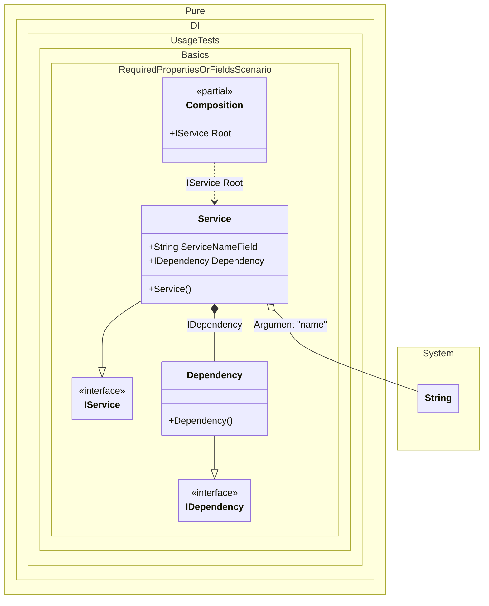

#### Required properties or fields

[](../tests/Pure.DI.UsageTests/Basics/RequiredPropertiesOrFieldsScenario.cs)

All properties or fields marked with the _required_ keyword automatically become injected dependencies.


```c#
using Shouldly;
using Pure.DI;

DI.Setup(nameof(Composition))
    .Arg<string>("name")
    .Bind<IDependency>().To<Dependency>()
    .Bind<IService>().To<Service>()

    // Composition root
    .Root<IService>("Root");

var composition = new Composition(name: "My Service");
var service = composition.Root;
service.Dependency.ShouldBeOfType<Dependency>();
service.Name.ShouldBe("My Service");

interface IDependency;

class Dependency : IDependency;

interface IService
{
    string Name { get; }

    IDependency Dependency { get; }
}

class Service : IService
{
    public required string ServiceNameField;

    public string Name => ServiceNameField;

    // The required property will be injected automatically
    // without additional effort
    public required IDependency Dependency { get; init; }
}
```

<details>
<summary>Running this code sample locally</summary>

- Make sure you have the [.NET SDK 9.0](https://dotnet.microsoft.com/en-us/download/dotnet/9.0) or later is installed
```bash
dotnet --list-sdk
```
- Create a net9.0 (or later) console application
```bash
dotnet new console -n Sample
```
- Add references to NuGet packages
  - [Pure.DI](https://www.nuget.org/packages/Pure.DI)
  - [Shouldly](https://www.nuget.org/packages/Shouldly)
```bash
dotnet add package Pure.DI
dotnet add package Shouldly
```
- Copy the example code into the _Program.cs_ file

You are ready to run the example 🚀
```bash
dotnet run
```

</details>

The following partial class will be generated:

```c#
partial class Composition
{
  private readonly Composition _root;

  private readonly string _argName;

  [OrdinalAttribute(128)]
  public Composition(string name)
  {
    _argName = name ?? throw new ArgumentNullException(nameof(name));
    _root = this;
  }

  internal Composition(Composition parentScope)
  {
    _root = (parentScope ?? throw new ArgumentNullException(nameof(parentScope)))._root;
    _argName = _root._argName;
  }

  public IService Root
  {
    [MethodImpl(MethodImplOptions.AggressiveInlining)]
    get
    {
      return new Service()
      {
        ServiceNameField = _argName,
        Dependency = new Dependency()
      };
    }
  }
}
```

Class diagram:



