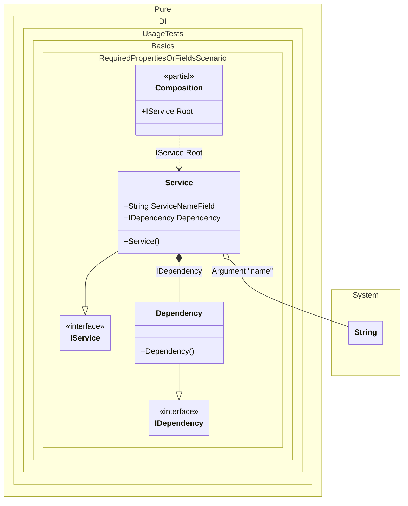

#### Required properties or fields

[](../tests/Pure.DI.UsageTests/Basics/RequiredPropertiesOrFieldsScenario.cs)

All properties or fields marked with the _required_ keyword automatically become injected dependencies.


```c#
using Pure.DI;
using Shouldly;

DI.Setup(nameof(Composition))
    .Arg<string>("name")
    .Bind<IDependency>().To<Dependency>()
    .Bind<IService>().To<Service>()

    // Composition root
    .Root<IService>("Root");

var composition = new Composition(name: "My Service");
var service = composition.Root;
service.Dependency.ShouldBeOfType<Dependency>();
service.Name.ShouldBe("My Service");

interface IDependency;

class Dependency : IDependency;

interface IService
{
    string Name { get; }

    IDependency Dependency { get; }
}

class Service : IService
{
    public required string ServiceNameField;

    public string Name => ServiceNameField;

    // The required property will be injected automatically
    // without additional effort
    public required IDependency Dependency { get; init; }
}
```


Class diagram:



