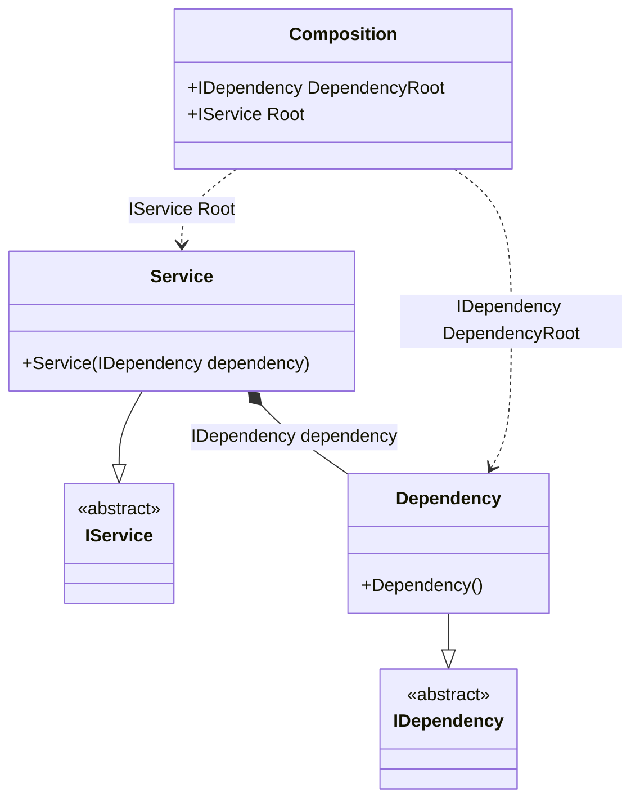

#### Resolve Hint

[](../tests/Pure.DI.UsageTests/Hints/ResolveHintScenario.cs)

The _Resolve_ hint determines whether to generate _Resolve_ methods. By default a set of four _Resolve_ methods are generated. Set this hint to _Off_ to disable the generation of resolve methods. This will reduce class composition generation time and no private composition roots will be generated in this case. When the _Resolve_ hint is disabled, only the public root properties are available, so be sure to define them explicitly with the `Root<T>(...)` method.

```c#
internal interface IDependency { }

internal class Dependency : IDependency { }

internal interface IService { }

internal class Service : IService
{
    public Service(IDependency dependency)
    {
    }
}

DI.Setup("Composition")
    .Hint(Hint.Resolve, "Off")
    .Bind<IDependency>().To<Dependency>().Root<IDependency>("DependencyRoot")
    .Bind<IService>().To<Service>().Root<IService>("Root");

var composition = new Composition();
var service = composition.Root;
var dependencyRoot = composition.DependencyRoot;
```

<details open>
<summary>Class Diagram</summary>



</details>

<details>
<summary>Generated Code</summary>

```c#
partial class Composition
{
  public Composition()
  {
  }
  
  internal Composition(Composition parent)
  {
  }
  
  #region Composition Roots
  public Pure.DI.UsageTests.Hints.ResolveHintScenario.IDependency DependencyRoot
  {
    [global::System.Runtime.CompilerServices.MethodImpl((global::System.Runtime.CompilerServices.MethodImplOptions)0x300)]
    get
    {
      Pure.DI.UsageTests.Hints.ResolveHintScenario.Dependency v74Local73742A = new Pure.DI.UsageTests.Hints.ResolveHintScenario.Dependency();
      return v74Local73742A;
    }
  }
  
  public Pure.DI.UsageTests.Hints.ResolveHintScenario.IService Root
  {
    [global::System.Runtime.CompilerServices.MethodImpl((global::System.Runtime.CompilerServices.MethodImplOptions)0x300)]
    get
    {
      Pure.DI.UsageTests.Hints.ResolveHintScenario.Dependency v76Local73742A = new Pure.DI.UsageTests.Hints.ResolveHintScenario.Dependency();
      Pure.DI.UsageTests.Hints.ResolveHintScenario.Service v75Local73742A = new Pure.DI.UsageTests.Hints.ResolveHintScenario.Service(v76Local73742A);
      return v75Local73742A;
    }
  }
  #endregion
  
  
  public override string ToString()
  {
    return
      "classDiagram\n" +
        "  class Composition {\n" +
          "    +IDependency DependencyRoot\n" +
          "    +IService Root\n" +
        "  }\n" +
        "  Service --|> IService : \n" +
        "  class Service {\n" +
          "    +Service(IDependency dependency)\n" +
        "  }\n" +
        "  Dependency --|> IDependency : \n" +
        "  class Dependency {\n" +
          "    +Dependency()\n" +
        "  }\n" +
        "  class IService {\n" +
          "    <<abstract>>\n" +
        "  }\n" +
        "  class IDependency {\n" +
          "    <<abstract>>\n" +
        "  }\n" +
        "  Service *--  Dependency : IDependency dependency\n" +
        "  Composition ..> Dependency : IDependency DependencyRoot\n" +
        "  Composition ..> Service : IService Root";
  }
}
```

</details>

