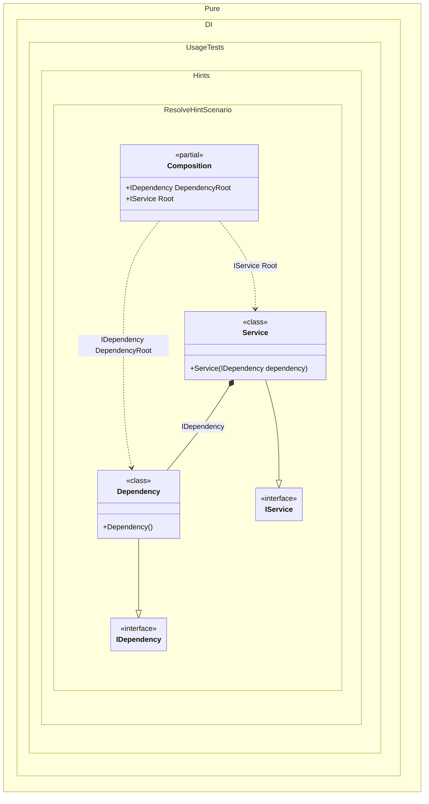

#### Resolve hint

Hints are used to fine-tune code generation. The _Resolve_ hint determines whether to generate _Resolve_ methods. By default, a set of four _Resolve_ methods are generated. Set this hint to _Off_ to disable the generation of resolve methods. This will reduce class composition generation time, and no anonymous composition roots will be generated in this case. When the _Resolve_ hint is disabled, only the regular root properties are available, so be sure to define them explicitly with the `Root<T>(...)` method.
In addition, setup hints can be comments before the _Setup_ method in the form ```hint = value```, for example: `// Resolve = Off`.


```c#
using Pure.DI;
using static Pure.DI.Hint;

DI.Setup(nameof(Composition))
    .Hint(Resolve, "Off")
    .Bind().To<Dependency>()
    .Root<IDependency>("DependencyRoot")
    .Bind().To<Service>()
    .Root<IService>("Root");

var composition = new Composition();
var service = composition.Root;
var dependencyRoot = composition.DependencyRoot;

interface IDependency;

class Dependency : IDependency;

interface IService;

class Service(IDependency dependency) : IService;
```

<details>
<summary>Running this code sample locally</summary>

- Make sure you have the [.NET SDK 9.0](https://dotnet.microsoft.com/en-us/download/dotnet/9.0) or later is installed
```bash
dotnet --list-sdk
```
- Create a net9.0 (or later) console application
```bash
dotnet new console -n Sample
```
- Add reference to NuGet package
  - [Pure.DI](https://www.nuget.org/packages/Pure.DI)
```bash
dotnet add package Pure.DI
```
- Copy the example code into the _Program.cs_ file

You are ready to run the example 🚀
```bash
dotnet run
```

</details>

For more hints, see [this](README.md#setup-hints) page.

The following partial class will be generated:

```c#
partial class Composition
{
  [OrdinalAttribute(256)]
  public Composition()
  {
  }

  internal Composition(Composition parentScope)
  {
  }

  public IDependency DependencyRoot
  {
    [MethodImpl(MethodImplOptions.AggressiveInlining)]
    get
    {
      return new Dependency();
    }
  }

  public IService Root
  {
    [MethodImpl(MethodImplOptions.AggressiveInlining)]
    get
    {
      return new Service(new Dependency());
    }
  }
}
```

Class diagram:



