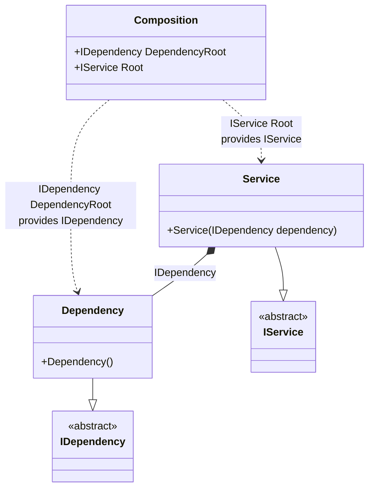

#### Resolve hint

[](../tests/Pure.DI.UsageTests/Hints/ResolveHintScenario.cs)

Hints are used to fine-tune code generation. The _Resolve_ hint determines whether to generate _Resolve_ methods. By default a set of four _Resolve_ methods are generated. Set this hint to _Off_ to disable the generation of resolve methods. This will reduce class composition generation time and no private composition roots will be generated in this case. When the _Resolve_ hint is disabled, only the public root properties are available, so be sure to define them explicitly with the `Root<T>(...)` method.
In addition, setup hints can be comments before the _Setup_ method in the form ```hint = value```, for example: `// Resolve = Off`.

```c#
using static Hint;

interface IDependency;

class Dependency : IDependency;

interface IService;

class Service(IDependency dependency) : IService;

DI.Setup(nameof(Composition))
    .Hint(Resolve, "Off")
    .Bind<IDependency>().To<Dependency>().Root<IDependency>("DependencyRoot")
    .Bind<IService>().To<Service>().Root<IService>("Root");

var composition = new Composition();
var service = composition.Root;
var dependencyRoot = composition.DependencyRoot;
```

For more hints, see [this](https://github.com/DevTeam/Pure.DI/blob/master/README.md#setup-hints) page.

<details open>
<summary>Class Diagram</summary>



</details>

<details>
<summary>Pure.DI-generated partial class Composition</summary><blockquote>

```c#
/// <para>
/// <b>Composition roots</b><br/>
/// <list type="table">
/// <listheader>
/// <term>Root</term>
/// <description>Description</description>
/// </listheader>
/// <item>
/// <term>
/// <see cref="Pure.DI.UsageTests.Hints.ResolveHintScenario.IDependency"/> <see cref="DependencyRoot"/><br/>or using <see cref="Resolve{T}()"/> method: <c>Resolve&lt;Pure.DI.UsageTests.Hints.ResolveHintScenario.IDependency&gt;()</c>
/// </term>
/// <description>
/// Provides a composition root of type <see cref="Pure.DI.UsageTests.Hints.ResolveHintScenario.Dependency"/>.
/// </description>
/// </item>
/// <item>
/// <term>
/// <see cref="Pure.DI.UsageTests.Hints.ResolveHintScenario.IService"/> <see cref="Root"/><br/>or using <see cref="Resolve{T}()"/> method: <c>Resolve&lt;Pure.DI.UsageTests.Hints.ResolveHintScenario.IService&gt;()</c>
/// </term>
/// <description>
/// Provides a composition root of type <see cref="Pure.DI.UsageTests.Hints.ResolveHintScenario.Service"/>.
/// </description>
/// </item>
/// </list>
/// </para>
/// </summary>
/// <example>
/// This shows how to get an instance of type <see cref="Pure.DI.UsageTests.Hints.ResolveHintScenario.Dependency"/> using the composition root <see cref="DependencyRoot"/>:
/// <code>
/// var composition = new Composition();
/// var instance = composition.DependencyRoot;
/// </code>
/// </example>
/// <a href="https://mermaid.live/view#pako:eNqNU01vAiEQ_Stkzk00elj1prs99FqvXBAmLWlZNiw1Mcb_7gIaBqKNl8kwX-_xGM4grULYgPwV49hp8eWE4Y738cxaawY7aq9tz_jffN7sQi54i91HhwP2Cnt5Ytn9tNaTmj26o5bIaLjpgke6Y22XbdMGu3xnFCKGtixzq3KUWk7F8yradYl_Z_YcnFYUyDRBYW_xhEm5q5JPxSQNre-aBy8To1YcRu-E9InfzT6a9Jjf62MKabZUIFarPulCiIfmemUWESLZSdV_--s9inwPjs9S8-DsUSsstHoBsnrHciefQtwfc5oPb2DQGaHV9FHOHPw3GuSw4aCE--FwgcsVf8obPA">Class diagram</a><br/>
/// This class was created by <a href="https://github.com/DevTeam/Pure.DI">Pure.DI</a> source code generator.
/// <seealso cref="Pure.DI.DI.Setup"/>
/// <seealso cref="Pure.DI.IConfiguration.Bind(object[])"/>
/// <seealso cref="Pure.DI.IConfiguration.Bind{T}(object[])"/>
[global::System.Diagnostics.CodeAnalysis.ExcludeFromCodeCoverage]
partial class Composition
{
  private readonly Composition _rootM03D14di;
  
  /// <summary>
  /// This constructor creates a new instance of <see cref="Composition"/>.
  /// </summary>
  public Composition()
  {
    _rootM03D14di = this;
  }
  
  /// <summary>
  /// This constructor creates a new instance of <see cref="Composition"/> scope based on <paramref name="baseComposition"/>. This allows the <see cref="Lifetime.Scoped"/> life time to be applied.
  /// </summary>
  /// <param name="baseComposition">Base composition.</param>
  internal Composition(Composition baseComposition)
  {
    _rootM03D14di = baseComposition._rootM03D14di;
  }
  
  #region Composition Roots
  /// <summary>
  /// Provides a composition root of type <see cref="Pure.DI.UsageTests.Hints.ResolveHintScenario.Dependency"/>.
  /// </summary>
  /// <example>
  /// This shows how to get an instance of type <see cref="Pure.DI.UsageTests.Hints.ResolveHintScenario.Dependency"/>:
  /// <code>
  /// var composition = new Composition();
  /// var instance = composition.DependencyRoot;
  /// </code>
  /// </example>
  public Pure.DI.UsageTests.Hints.ResolveHintScenario.IDependency DependencyRoot
  {
    #if NETSTANDARD2_0_OR_GREATER || NETCOREAPP || NET40_OR_GREATER || NET
    [global::System.Diagnostics.Contracts.Pure]
    #endif
    get
    {
      return new Pure.DI.UsageTests.Hints.ResolveHintScenario.Dependency();
    }
  }
  
  /// <summary>
  /// Provides a composition root of type <see cref="Pure.DI.UsageTests.Hints.ResolveHintScenario.Service"/>.
  /// </summary>
  /// <example>
  /// This shows how to get an instance of type <see cref="Pure.DI.UsageTests.Hints.ResolveHintScenario.Service"/>:
  /// <code>
  /// var composition = new Composition();
  /// var instance = composition.Root;
  /// </code>
  /// </example>
  public Pure.DI.UsageTests.Hints.ResolveHintScenario.IService Root
  {
    #if NETSTANDARD2_0_OR_GREATER || NETCOREAPP || NET40_OR_GREATER || NET
    [global::System.Diagnostics.Contracts.Pure]
    #endif
    get
    {
      return new Pure.DI.UsageTests.Hints.ResolveHintScenario.Service(new Pure.DI.UsageTests.Hints.ResolveHintScenario.Dependency());
    }
  }
  #endregion
  
  /// <summary>
  /// This method provides a class diagram in mermaid format. To see this diagram, simply call the method and copy the text to this site https://mermaid.live/.
  /// </summary>
  public override string ToString()
  {
    return
      "classDiagram\n" +
        "  class Composition {\n" +
          "    +IDependency DependencyRoot\n" +
          "    +IService Root\n" +
        "  }\n" +
        "  Dependency --|> IDependency : \n" +
        "  class Dependency {\n" +
          "    +Dependency()\n" +
        "  }\n" +
        "  Service --|> IService : \n" +
        "  class Service {\n" +
          "    +Service(IDependency dependency)\n" +
        "  }\n" +
        "  class IDependency {\n" +
          "    <<abstract>>\n" +
        "  }\n" +
        "  class IService {\n" +
          "    <<abstract>>\n" +
        "  }\n" +
        "  Service *--  Dependency : IDependency\n" +
        "  Composition ..> Dependency : IDependency DependencyRoot<br/>provides IDependency\n" +
        "  Composition ..> Service : IService Root<br/>provides IService";
  }
}
```

</blockquote></details>

