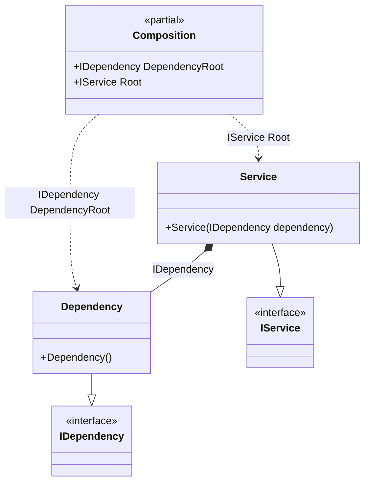

#### Resolve hint

[](../tests/Pure.DI.UsageTests/Hints/ResolveHintScenario.cs)

Hints are used to fine-tune code generation. The _Resolve_ hint determines whether to generate _Resolve_ methods. By default a set of four _Resolve_ methods are generated. Set this hint to _Off_ to disable the generation of resolve methods. This will reduce class composition generation time and no private composition roots will be generated in this case. When the _Resolve_ hint is disabled, only the public root properties are available, so be sure to define them explicitly with the `Root<T>(...)` method.
In addition, setup hints can be comments before the _Setup_ method in the form ```hint = value```, for example: `// Resolve = Off`.


```c#
using static Hint;

interface IDependency;

class Dependency : IDependency;

interface IService;

class Service(IDependency dependency) : IService;

DI.Setup(nameof(Composition))
    .Hint(Resolve, "Off")
    .Bind().To<Dependency>()
    .Root<IDependency>("DependencyRoot")
    .Bind().To<Service>()
    .Root<IService>("Root");;

var composition = new Composition();
var service = composition.Root;
var dependencyRoot = composition.DependencyRoot;
```

For more hints, see [this](README.md#setup-hints) page.

The following partial class will be generated:

```c#
partial class Composition
{
  private readonly Composition _root;

  [OrdinalAttribute(20)]
  public Composition()
  {
    _root = this;
  }

  internal Composition(Composition parentScope)
  {
    _root = (parentScope ?? throw new ArgumentNullException(nameof(parentScope)))._root;
  }

  public IDependency DependencyRoot
  {
    [MethodImpl(MethodImplOptions.AggressiveInlining)]
    get
    {
      return new Dependency();
    }
  }

  public IService Root
  {
    [MethodImpl(MethodImplOptions.AggressiveInlining)]
    get
    {
      return new Service(new Dependency());
    }
  }
}
```

Class diagram:



