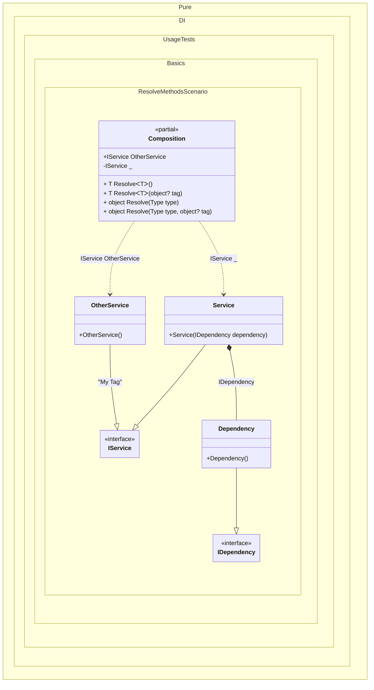

#### Resolve methods

[](../tests/Pure.DI.UsageTests/Basics/ResolveMethodsScenario.cs)

This example shows how to resolve the composition roots using the _Resolve_ methods by _Service Locator_ approach. `Resolve` methods are generated automatically for each registered root.


```c#
using Pure.DI;

DI.Setup(nameof(Composition))
    .Bind<IDependency>().To<Dependency>()
    .Bind<IService>().To<Service>()
    .Bind<IService>("My Tag").To<OtherService>()

    // Specifies to create a private root
    // that is only accessible from _Resolve_ methods
    .Root<IService>()

    // Specifies to create a public root named _OtherService_
    // using the "My Tag" tag
    .Root<IService>("OtherService", "My Tag");

var composition = new Composition();

// The next 3 lines of code do the same thing:
var service1 = composition.Resolve<IService>();
var service2 = composition.Resolve(typeof(IService));
var service3 = composition.Resolve(typeof(IService), null);

// Resolve by "My Tag" tag
// The next 3 lines of code do the same thing too:
var otherService1 = composition.Resolve<IService>("My Tag");
var otherService2 = composition.Resolve(typeof(IService), "My Tag");
var otherService3 = composition.OtherService; // Gets the composition through the public root

interface IDependency;

class Dependency : IDependency;

interface IService;

class Service(IDependency dependency) : IService;

class OtherService : IService;
```

_Resolve_ methods are similar to calls to the roots of a composition. Composition roots are common properties. Their use is efficient and does not cause exceptions. And that is why it is recommended to use them. In contrast, _Resolve_ methods have a number of disadvantages:

- They provide access to an unlimited set of dependencies.

- Their use can potentially lead to runtime exceptions, for example, when the corresponding root has not been defined.

- Lead to performance degradation because they search for the root of a composition based on its type.


Class diagram:



