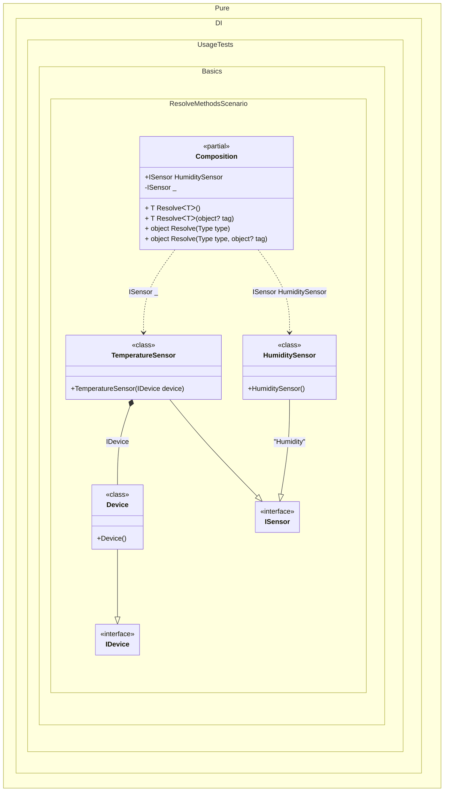

#### Resolve methods

This example shows how to resolve the roots of a composition using `Resolve` methods to use the composition as a _Service Locator_. The `Resolve` methods are generated automatically without additional effort.


```c#
using Pure.DI;

DI.Setup(nameof(Composition))
    .Bind<IDevice>().To<Device>()
    .Bind<ISensor>().To<TemperatureSensor>()
    .Bind<ISensor>("Humidity").To<HumiditySensor>()

    // Specifies to create a private root
    // that is only accessible from _Resolve_ methods
    .Root<ISensor>()

    // Specifies to create a public root named _HumiditySensor_
    // using the "Humidity" tag
    .Root<ISensor>("HumiditySensor", "Humidity");

var composition = new Composition();

// The next 3 lines of code do the same thing:
var sensor1 = composition.Resolve<ISensor>();
var sensor2 = composition.Resolve(typeof(ISensor));
var sensor3 = composition.Resolve(typeof(ISensor), null);

// Resolve by "Humidity" tag
// The next 3 lines of code do the same thing too:
var humiditySensor1 = composition.Resolve<ISensor>("Humidity");
var humiditySensor2 = composition.Resolve(typeof(ISensor), "Humidity");
var humiditySensor3 = composition.HumiditySensor; // Gets the composition through the public root

interface IDevice;

class Device : IDevice;

interface ISensor;

class TemperatureSensor(IDevice device) : ISensor;

class HumiditySensor : ISensor;
```

<details>
<summary>Running this code sample locally</summary>

- Make sure you have the [.NET SDK 10.0](https://dotnet.microsoft.com/en-us/download/dotnet/10.0) or later is installed
```bash
dotnet --list-sdk
```
- Create a net10.0 (or later) console application
```bash
dotnet new console -n Sample
```
- Add reference to NuGet package
  - [Pure.DI](https://www.nuget.org/packages/Pure.DI)
```bash
dotnet add package Pure.DI
```
- Copy the example code into the _Program.cs_ file

You are ready to run the example 🚀
```bash
dotnet run
```

</details>

_Resolve_ methods are similar to calls to composition roots. Composition roots are properties (or methods). Their use is efficient and does not cause exceptions. This is why they are recommended to be used. In contrast, _Resolve_ methods have a number of disadvantages:
- They provide access to an unlimited set of dependencies (_Service Locator_).
- Their use can potentially lead to runtime exceptions. For example, when the corresponding root has not been defined.
- Sometimes cannot be used directly, e.g., for MAUI/WPF/Avalonia binding.

The following partial class will be generated:

```c#
partial class Composition
{
  public ISensor HumiditySensor
  {
    [MethodImpl(MethodImplOptions.AggressiveInlining)]
    get
    {
      return new HumiditySensor();
    }
  }

  private ISensor Root2
  {
    [MethodImpl(MethodImplOptions.AggressiveInlining)]
    get
    {
      return new TemperatureSensor(new Device());
    }
  }

  [MethodImpl(MethodImplOptions.AggressiveInlining)]
  public T Resolve<T>()
  {
    return Resolver<T>.Value.Resolve(this);
  }

  [MethodImpl(MethodImplOptions.AggressiveInlining)]
  public T Resolve<T>(object? tag)
  {
    return Resolver<T>.Value.ResolveByTag(this, tag);
  }

  [MethodImpl(MethodImplOptions.AggressiveInlining)]
  public object Resolve(Type type)
  {
    #if NETCOREAPP3_0_OR_GREATER
    var index = (int)(_bucketSize * (((uint)type.TypeHandle.GetHashCode()) % 1));
    #else
    var index = (int)(_bucketSize * (((uint)RuntimeHelpers.GetHashCode(type)) % 1));
    #endif
    ref var pair = ref _buckets[index];
    return Object.ReferenceEquals(pair.Key, type) ? pair.Value.Resolve(this) : Resolve(type, index);
  }

  [MethodImpl(MethodImplOptions.NoInlining)]
  private object Resolve(Type type, int index)
  {
    var finish = index + _bucketSize;
    while (++index < finish)
    {
      ref var pair = ref _buckets[index];
      if (Object.ReferenceEquals(pair.Key, type))
      {
        return pair.Value.Resolve(this);
      }
    }

    throw new CannotResolveException($"{CannotResolveMessage} {OfTypeMessage} {type}.", type, null);
  }

  [MethodImpl(MethodImplOptions.AggressiveInlining)]
  public object Resolve(Type type, object? tag)
  {
    #if NETCOREAPP3_0_OR_GREATER
    var index = (int)(_bucketSize * (((uint)type.TypeHandle.GetHashCode()) % 1));
    #else
    var index = (int)(_bucketSize * (((uint)RuntimeHelpers.GetHashCode(type)) % 1));
    #endif
    ref var pair = ref _buckets[index];
    return Object.ReferenceEquals(pair.Key, type) ? pair.Value.ResolveByTag(this, tag) : Resolve(type, tag, index);
  }

  [MethodImpl(MethodImplOptions.NoInlining)]
  private object Resolve(Type type, object? tag, int index)
  {
    var finish = index + _bucketSize;
    while (++index < finish)
    {
      ref var pair = ref _buckets[index];
      if (Object.ReferenceEquals(pair.Key, type))
      {
        return pair.Value.ResolveByTag(this, tag);
      }
    }

    throw new CannotResolveException($"{CannotResolveMessage} \"{tag}\" {OfTypeMessage} {type}.", type, tag);
  }

  private readonly static uint _bucketSize;
  private readonly static Pair<IResolver<Composition, object>>[] _buckets;

  static Composition()
  {
    var valResolver_0000 = new Resolver_0000();
    Resolver<ISensor>.Value = valResolver_0000;
    _buckets = Buckets<IResolver<Composition, object>>.Create(
      1,
      out _bucketSize,
      new Pair<IResolver<Composition, object>>[1]
      {
         new Pair<IResolver<Composition, object>>(typeof(ISensor), valResolver_0000)
      });
  }

  private const string CannotResolveMessage = "Cannot resolve composition root ";
  private const string OfTypeMessage = "of type ";

  private class Resolver<T>: IResolver<Composition, T>
  {
    public static IResolver<Composition, T> Value = new Resolver<T>();

    public virtual T Resolve(Composition composite)
    {
      throw new CannotResolveException($"{CannotResolveMessage}{OfTypeMessage}{typeof(T)}.", typeof(T), null);
    }

    public virtual T ResolveByTag(Composition composite, object tag)
    {
      throw new CannotResolveException($"{CannotResolveMessage}\"{tag}\" {OfTypeMessage}{typeof(T)}.", typeof(T), tag);
    }
  }

  private sealed class Resolver_0000: Resolver<ISensor>
  {
    public override ISensor Resolve(Composition composition)
    {
      return composition.Root2;
    }

    public override ISensor ResolveByTag(Composition composition, object tag)
    {
      switch (tag)
      {
        case "Humidity":
          return composition.HumiditySensor;

        case null:
          return composition.Root2;

        default:
          return base.ResolveByTag(composition, tag);
      }
    }
  }
}
```

Class diagram:



