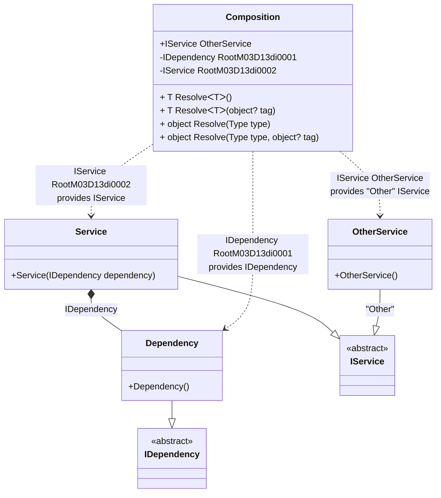

#### Resolve methods

[](../tests/Pure.DI.UsageTests/Basics/ResolveScenario.cs)

This example shows how to resolve the composition roots using the _Resolve_ methods by _Service Locator_ approach. `Resolve` methods are generated automatically for each registered root.

```c#
interface IDependency;

class Dependency : IDependency;

interface IService;

class Service(IDependency dependency) : IService;

class OtherService : IService;

DI.Setup(nameof(Composition))
    .Bind<IDependency>().To<Dependency>()
        // Specifies to create a private composition root
        // of type "IDependency" with the name "Dependency"
        .Root<IDependency>()
    .Bind<IService>().To<Service>()
        // Specifies to create a private root
        // that is only accessible from _Resolve_ methods
        .Root<IService>()
    .Bind<IService>("Other").To<OtherService>()
        // Specifies to create a public root named _OtherService_
        // using the _Other_ tag
        .Root<IService>("OtherService", "Other");

var composition = new Composition();
var dependency = composition.Resolve<IDependency>();
var service1 = composition.Resolve<IService>();
var service2 = composition.Resolve(typeof(IService));
        
// Resolve by tag
var otherService1 = composition.Resolve<IService>("Other");
var otherService2 = composition.Resolve(typeof(IService),"Other");
```

<details open>
<summary>Class Diagram</summary>



</details>

<details>
<summary>Pure.DI-generated partial class Composition</summary><blockquote>

```c#
/// <para>
/// <b>Composition roots</b><br/>
/// <list type="table">
/// <listheader>
/// <term>Root</term>
/// <description>Description</description>
/// </listheader>
/// <item>
/// <term>
/// <see cref="Pure.DI.UsageTests.Basics.ResolveScenario.IService"/> <see cref="OtherService"/><br/>or using <see cref="Resolve{T}(object)"/> method: <c>Resolve&lt;Pure.DI.UsageTests.Basics.ResolveScenario.IService&gt;("Other")</c>
/// </term>
/// <description>
/// Specifies to create a public root named _OtherService_<br/>
/// using the _Other_ tag
/// </description>
/// </item>
/// <item>
/// <term>
/// Private composition root of type <see cref="Pure.DI.UsageTests.Basics.ResolveScenario.IDependency"/>. It can be resolved by <see cref="Resolve{T}()"/> method: <c>Resolve&lt;Pure.DI.UsageTests.Basics.ResolveScenario.IDependency&gt;()</c>
/// </term>
/// <description>
/// Specifies to create a private composition root<br/>
/// of type "IDependency" with the name "Dependency"
/// </description>
/// </item>
/// <item>
/// <term>
/// Private composition root of type <see cref="Pure.DI.UsageTests.Basics.ResolveScenario.IService"/>. It can be resolved by <see cref="Resolve{T}()"/> method: <c>Resolve&lt;Pure.DI.UsageTests.Basics.ResolveScenario.IService&gt;()</c>
/// </term>
/// <description>
/// Specifies to create a private root<br/>
/// that is only accessible from _Resolve_ methods
/// </description>
/// </item>
/// </list>
/// </para>
/// </summary>
/// <example>
/// This shows how to get an instance of type <see cref="Pure.DI.UsageTests.Basics.ResolveScenario.OtherService"/> using the composition root <see cref="OtherService"/>:
/// <code>
/// var composition = new Composition();
/// var instance = composition.OtherService;
/// </code>
/// </example>
/// <a href="https://mermaid.live/view#pako:eNqdVEFuwjAQ_Irlc6UGcqDlBgmVOFSVKEdfTLKibkkcOS4SQvyBv_TS7_CTJjZpNk4CpZeV7d3ZGY3X3tNIxkDHNNrwPA8FXyueMMVSsyeBTDKZCy1kStin542mZa5cDafzV1BbEQF50W-gzpvfdDgPIYM0hjTakYWU-tnzw4EfC8_zBqiqauKUDGsesiQLyOVmC6fj9_J0_DLHDyY-Xi2Tq3eIdLn2n4jm6xbMFlRYC1ruMiC6CP-oDshlylFYrpA51og6jgIDnRHsoDmakPpmnBy-mDrV5ZTlr2zvJ8cVDWacwLTVBBhOrD1u6nGU4Om5QQ41OEaRsFYnrK4xpL222Eau8XUf3-oJ-CrXip8veXaOXZ265fy9TcOYCbaHuCNQuIKEl2D39Q4NhY2Fpxfx7TdrFK8Uu7fwTMmtiCG_kdS5x_7330uHfporXK2BwITuQHSS1WOGaekdTUAlXMTFx7lntChJgNExozFXH4we6OEHt7_KEw">Class diagram</a><br/>
/// This class was created by <a href="https://github.com/DevTeam/Pure.DI">Pure.DI</a> source code generator.
/// <seealso cref="Pure.DI.DI.Setup"/>
/// <seealso cref="Pure.DI.IConfiguration.Bind(object[])"/>
/// <seealso cref="Pure.DI.IConfiguration.Bind{T}(object[])"/>
[global::System.Diagnostics.CodeAnalysis.ExcludeFromCodeCoverage]
partial class Composition
{
  private readonly Composition _rootM03D13di;
  
  /// <summary>
  /// This constructor creates a new instance of <see cref="Composition"/>.
  /// </summary>
  public Composition()
  {
    _rootM03D13di = this;
  }
  
  /// <summary>
  /// This constructor creates a new instance of <see cref="Composition"/> scope based on <paramref name="baseComposition"/>. This allows the <see cref="Lifetime.Scoped"/> life time to be applied.
  /// </summary>
  /// <param name="baseComposition">Base composition.</param>
  internal Composition(Composition baseComposition)
  {
    _rootM03D13di = baseComposition._rootM03D13di;
  }
  
  #region Composition Roots
  /// <summary>
  /// Specifies to create a public root named _OtherService_<br/>
  /// using the _Other_ tag
  /// </summary>
  /// <example>
  /// This shows how to get an instance of type <see cref="Pure.DI.UsageTests.Basics.ResolveScenario.OtherService"/>:
  /// <code>
  /// var composition = new Composition();
  /// var instance = composition.OtherService;
  /// </code>
  /// </example>
  public Pure.DI.UsageTests.Basics.ResolveScenario.IService OtherService
  {
    #if NETSTANDARD2_0_OR_GREATER || NETCOREAPP || NET40_OR_GREATER || NET
    [global::System.Diagnostics.Contracts.Pure]
    #endif
    get
    {
      return new Pure.DI.UsageTests.Basics.ResolveScenario.OtherService();
    }
  }
  
  /// <summary>
  /// Specifies to create a private composition root<br/>
  /// of type "IDependency" with the name "Dependency"
  /// </summary>
  public Pure.DI.UsageTests.Basics.ResolveScenario.IDependency RootM03D13di0001
  {
    #if NETSTANDARD2_0_OR_GREATER || NETCOREAPP || NET40_OR_GREATER || NET
    [global::System.Diagnostics.Contracts.Pure]
    #endif
    get
    {
      return new Pure.DI.UsageTests.Basics.ResolveScenario.Dependency();
    }
  }
  
  /// <summary>
  /// Specifies to create a private root<br/>
  /// that is only accessible from _Resolve_ methods
  /// </summary>
  public Pure.DI.UsageTests.Basics.ResolveScenario.IService RootM03D13di0002
  {
    #if NETSTANDARD2_0_OR_GREATER || NETCOREAPP || NET40_OR_GREATER || NET
    [global::System.Diagnostics.Contracts.Pure]
    #endif
    get
    {
      return new Pure.DI.UsageTests.Basics.ResolveScenario.Service(new Pure.DI.UsageTests.Basics.ResolveScenario.Dependency());
    }
  }
  #endregion
  
  #region API
  /// <summary>
  /// Resolves the composition root.
  /// </summary>
  /// <typeparam name="T">The type of the composition root.</typeparam>
  /// <returns>A composition root.</returns>
  #if NETSTANDARD2_0_OR_GREATER || NETCOREAPP || NET40_OR_GREATER || NET
  [global::System.Diagnostics.Contracts.Pure]
  #endif
  public T Resolve<T>()
  {
    return ResolverM03D13di<T>.Value.Resolve(this);
  }
  
  /// <summary>
  /// Resolves the composition root by tag.
  /// </summary>
  /// <typeparam name="T">The type of the composition root.</typeparam>
  /// <param name="tag">The tag of a composition root.</param>
  /// <returns>A composition root.</returns>
  #if NETSTANDARD2_0_OR_GREATER || NETCOREAPP || NET40_OR_GREATER || NET
  [global::System.Diagnostics.Contracts.Pure]
  #endif
  public T Resolve<T>(object? tag)
  {
    return ResolverM03D13di<T>.Value.ResolveByTag(this, tag);
  }
  
  /// <summary>
  /// Resolves the composition root.
  /// </summary>
  /// <param name="type">The type of the composition root.</param>
  /// <returns>A composition root.</returns>
  #if NETSTANDARD2_0_OR_GREATER || NETCOREAPP || NET40_OR_GREATER || NET
  [global::System.Diagnostics.Contracts.Pure]
  #endif
  public object Resolve(global::System.Type type)
  {
    var index = (int)(_bucketSizeM03D13di * ((uint)global::System.Runtime.CompilerServices.RuntimeHelpers.GetHashCode(type) % 4));
    var finish = index + _bucketSizeM03D13di;
    do {
      ref var pair = ref _bucketsM03D13di[index];
      if (ReferenceEquals(pair.Key, type))
      {
        return pair.Value.Resolve(this);
      }
    } while (++index < finish);
    
    throw new global::System.InvalidOperationException($"Cannot resolve composition root of type {type}.");
  }
  
  /// <summary>
  /// Resolves the composition root by tag.
  /// </summary>
  /// <param name="type">The type of the composition root.</param>
  /// <param name="tag">The tag of a composition root.</param>
  /// <returns>A composition root.</returns>
  #if NETSTANDARD2_0_OR_GREATER || NETCOREAPP || NET40_OR_GREATER || NET
  [global::System.Diagnostics.Contracts.Pure]
  #endif
  public object Resolve(global::System.Type type, object? tag)
  {
    var index = (int)(_bucketSizeM03D13di * ((uint)global::System.Runtime.CompilerServices.RuntimeHelpers.GetHashCode(type) % 4));
    var finish = index + _bucketSizeM03D13di;
    do {
      ref var pair = ref _bucketsM03D13di[index];
      if (ReferenceEquals(pair.Key, type))
      {
        return pair.Value.ResolveByTag(this, tag);
      }
    } while (++index < finish);
    
    throw new global::System.InvalidOperationException($"Cannot resolve composition root \"{tag}\" of type {type}.");
  }
  #endregion
  
  /// <summary>
  /// This method provides a class diagram in mermaid format. To see this diagram, simply call the method and copy the text to this site https://mermaid.live/.
  /// </summary>
  public override string ToString()
  {
    return
      "classDiagram\n" +
        "  class Composition {\n" +
          "    +IService OtherService\n" +
          "    -IDependency RootM03D13di0001\n" +
          "    -IService RootM03D13di0002\n" +
          "    + T ResolveᐸTᐳ()\n" +
          "    + T ResolveᐸTᐳ(object? tag)\n" +
          "    + object Resolve(Type type)\n" +
          "    + object Resolve(Type type, object? tag)\n" +
        "  }\n" +
        "  Dependency --|> IDependency : \n" +
        "  class Dependency {\n" +
          "    +Dependency()\n" +
        "  }\n" +
        "  Service --|> IService : \n" +
        "  class Service {\n" +
          "    +Service(IDependency dependency)\n" +
        "  }\n" +
        "  OtherService --|> IService : \"Other\" \n" +
        "  class OtherService {\n" +
          "    +OtherService()\n" +
        "  }\n" +
        "  class IDependency {\n" +
          "    <<abstract>>\n" +
        "  }\n" +
        "  class IService {\n" +
          "    <<abstract>>\n" +
        "  }\n" +
        "  Service *--  Dependency : IDependency\n" +
        "  Composition ..> Dependency : IDependency RootM03D13di0001<br/>provides IDependency\n" +
        "  Composition ..> Service : IService RootM03D13di0002<br/>provides IService\n" +
        "  Composition ..> OtherService : IService OtherService<br/>provides \"Other\" IService";
  }
  
  private readonly static int _bucketSizeM03D13di;
  private readonly static global::Pure.DI.Pair<global::System.Type, global::Pure.DI.IResolver<Composition, object>>[] _bucketsM03D13di;
  
  static Composition()
  {
    var valResolverM03D13di_0000 = new ResolverM03D13di_0000();
    ResolverM03D13di<Pure.DI.UsageTests.Basics.ResolveScenario.IService>.Value = valResolverM03D13di_0000;
    var valResolverM03D13di_0001 = new ResolverM03D13di_0001();
    ResolverM03D13di<Pure.DI.UsageTests.Basics.ResolveScenario.IDependency>.Value = valResolverM03D13di_0001;
    _bucketsM03D13di = global::Pure.DI.Buckets<global::System.Type, global::Pure.DI.IResolver<Composition, object>>.Create(
      4,
      out _bucketSizeM03D13di,
      new global::Pure.DI.Pair<global::System.Type, global::Pure.DI.IResolver<Composition, object>>[2]
      {
         new global::Pure.DI.Pair<global::System.Type, global::Pure.DI.IResolver<Composition, object>>(typeof(Pure.DI.UsageTests.Basics.ResolveScenario.IService), valResolverM03D13di_0000)
        ,new global::Pure.DI.Pair<global::System.Type, global::Pure.DI.IResolver<Composition, object>>(typeof(Pure.DI.UsageTests.Basics.ResolveScenario.IDependency), valResolverM03D13di_0001)
      });
  }
  
  #region Resolvers
  private sealed class ResolverM03D13di<T>: global::Pure.DI.IResolver<Composition, T>
  {
    public static global::Pure.DI.IResolver<Composition, T> Value = new ResolverM03D13di<T>();
    
    public T Resolve(Composition composite)
    {
      throw new global::System.InvalidOperationException($"Cannot resolve composition root of type {typeof(T)}.");
    }
    
    public T ResolveByTag(Composition composite, object tag)
    {
      throw new global::System.InvalidOperationException($"Cannot resolve composition root \"{tag}\" of type {typeof(T)}.");
    }
  }
  
  private sealed class ResolverM03D13di_0000: global::Pure.DI.IResolver<Composition, Pure.DI.UsageTests.Basics.ResolveScenario.IService>
  {
    public Pure.DI.UsageTests.Basics.ResolveScenario.IService Resolve(Composition composition)
    {
      return composition.RootM03D13di0002;
    }
    
    public Pure.DI.UsageTests.Basics.ResolveScenario.IService ResolveByTag(Composition composition, object tag)
    {
      switch (tag)
      {
        case "Other":
          return composition.OtherService;
        case null:
          return composition.RootM03D13di0002;
      }
      throw new global::System.InvalidOperationException($"Cannot resolve composition root \"{tag}\" of type Pure.DI.UsageTests.Basics.ResolveScenario.IService.");
    }
  }
  
  private sealed class ResolverM03D13di_0001: global::Pure.DI.IResolver<Composition, Pure.DI.UsageTests.Basics.ResolveScenario.IDependency>
  {
    public Pure.DI.UsageTests.Basics.ResolveScenario.IDependency Resolve(Composition composition)
    {
      return composition.RootM03D13di0001;
    }
    
    public Pure.DI.UsageTests.Basics.ResolveScenario.IDependency ResolveByTag(Composition composition, object tag)
    {
      switch (tag)
      {
        case null:
          return composition.RootM03D13di0001;
      }
      throw new global::System.InvalidOperationException($"Cannot resolve composition root \"{tag}\" of type Pure.DI.UsageTests.Basics.ResolveScenario.IDependency.");
    }
  }
  #endregion
}
```

</blockquote></details>

