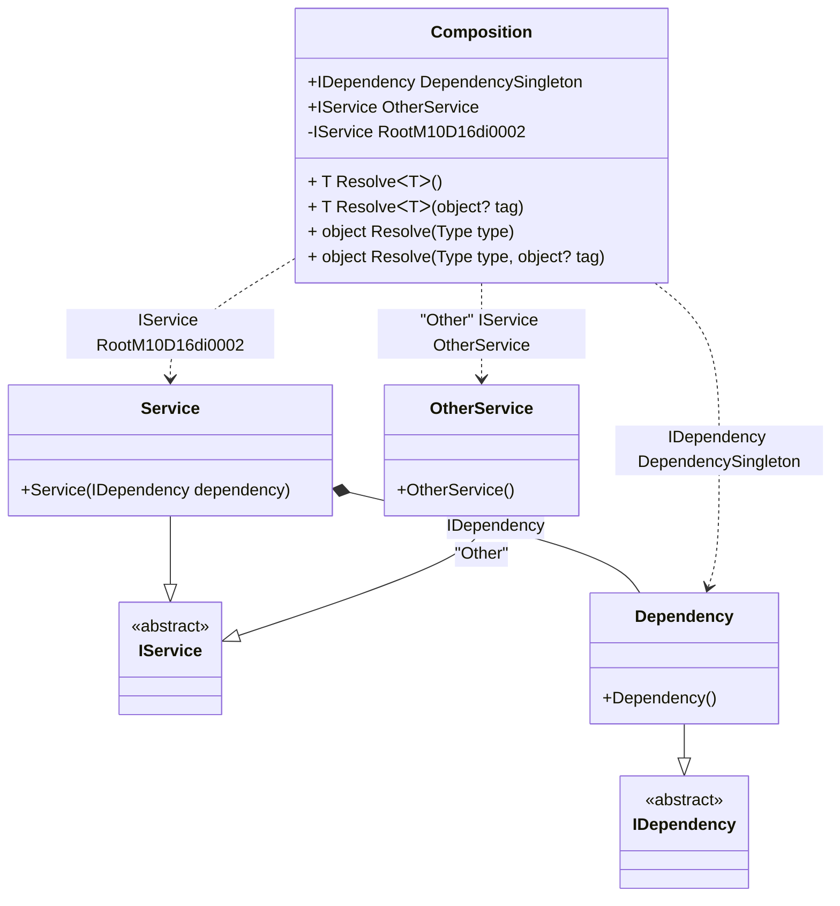

#### Resolve methods

[](../tests/Pure.DI.UsageTests/Basics/ResolveScenario.cs)

This example shows how to resolve the composition roots using the _Resolve_ methods by _Service Locator_ approach. `Resolve` methods are generated automatically for each registered root.

```c#
interface IDependency { }

class Dependency : IDependency { }

interface IService { }

class Service : IService
{
    public Service(IDependency dependency) { }
}

class OtherService : IService
{
}

DI.Setup("Composition")
    .Bind<IDependency>().To<Dependency>()
        // Creates a regular public root
        .Root<IDependency>("DependencySingleton")
    .Bind<IService>().To<Service>()
        // Creates a private root that is only accessible from _Resolve_ methods:
        .Root<IService>()
    .Bind<IService>("Other").To<OtherService>()
        // Creates a public root named _OtherService_ using the _Other_ tag:
        .Root<IService>("OtherService", "Other");

var composition = new Composition();
var dependency = composition.Resolve<IDependency>();
var service1 = composition.Resolve<IService>();
var service2 = composition.Resolve(typeof(IService));
        
// Resolve by tag
var otherService1 = composition.Resolve<IService>("Other");
var otherService2 = composition.Resolve(typeof(IService),"Other");
```

<details open>
<summary>Class Diagram</summary>



</details>

<details>
<summary>Pure.DI-generated partial class Composition</summary><blockquote>

```c#
partial class Composition
{
  private readonly global::System.IDisposable[] _disposableSingletonsM10D16di;
  
  public Composition()
  {
    _disposableSingletonsM10D16di = new global::System.IDisposable[0];
  }
  
  internal Composition(Composition parent)
  {
    _disposableSingletonsM10D16di = new global::System.IDisposable[0];
  }
  
  #region Composition Roots
  public Pure.DI.UsageTests.Basics.ResolveScenario.IDependency DependencySingleton
  {
    [global::System.Runtime.CompilerServices.MethodImpl((global::System.Runtime.CompilerServices.MethodImplOptions)0x300)]
    get
    {
      var transientM10D16di0 = new Pure.DI.UsageTests.Basics.ResolveScenario.Dependency();
      return transientM10D16di0;
    }
  }
  
  public Pure.DI.UsageTests.Basics.ResolveScenario.IService OtherService
  {
    [global::System.Runtime.CompilerServices.MethodImpl((global::System.Runtime.CompilerServices.MethodImplOptions)0x300)]
    get
    {
      var transientM10D16di0 = new Pure.DI.UsageTests.Basics.ResolveScenario.OtherService();
      return transientM10D16di0;
    }
  }
  
  private Pure.DI.UsageTests.Basics.ResolveScenario.IService RootM10D16di0002
  {
    [global::System.Runtime.CompilerServices.MethodImpl((global::System.Runtime.CompilerServices.MethodImplOptions)0x300)]
    get
    {
      var transientM10D16di1 = new Pure.DI.UsageTests.Basics.ResolveScenario.Dependency();
      var transientM10D16di0 = new Pure.DI.UsageTests.Basics.ResolveScenario.Service(transientM10D16di1);
      return transientM10D16di0;
    }
  }
  #endregion
  
  #region API
  #if NETSTANDARD2_0_OR_GREATER || NETCOREAPP || NET40_OR_GREATER
  [global::System.Diagnostics.Contracts.Pure]
  #endif
  [global::System.Runtime.CompilerServices.MethodImpl((global::System.Runtime.CompilerServices.MethodImplOptions)0x300)]
  public T Resolve<T>()
  {
    return ResolverM10D16di<T>.Value.Resolve(this);
  }
  
  #if NETSTANDARD2_0_OR_GREATER || NETCOREAPP || NET40_OR_GREATER
  [global::System.Diagnostics.Contracts.Pure]
  #endif
  [global::System.Runtime.CompilerServices.MethodImpl((global::System.Runtime.CompilerServices.MethodImplOptions)0x300)]
  public T Resolve<T>(object? tag)
  {
    return ResolverM10D16di<T>.Value.ResolveByTag(this, tag);
  }
  
  #if NETSTANDARD2_0_OR_GREATER || NETCOREAPP || NET40_OR_GREATER
  [global::System.Diagnostics.Contracts.Pure]
  #endif
  [global::System.Runtime.CompilerServices.MethodImpl((global::System.Runtime.CompilerServices.MethodImplOptions)0x300)]
  public object Resolve(global::System.Type type)
  {
    var index = (int)(_bucketSizeM10D16di * ((uint)global::System.Runtime.CompilerServices.RuntimeHelpers.GetHashCode(type) % 4));
    var finish = index + _bucketSizeM10D16di;
    do {
      ref var pair = ref _bucketsM10D16di[index];
      if (ReferenceEquals(pair.Key, type))
      {
        return pair.Value.Resolve(this);
      }
    } while (++index < finish);
    
    throw new global::System.InvalidOperationException($"Cannot resolve composition root of type {type}.");
  }
  
  #if NETSTANDARD2_0_OR_GREATER || NETCOREAPP || NET40_OR_GREATER
  [global::System.Diagnostics.Contracts.Pure]
  #endif
  [global::System.Runtime.CompilerServices.MethodImpl((global::System.Runtime.CompilerServices.MethodImplOptions)0x300)]
  public object Resolve(global::System.Type type, object? tag)
  {
    var index = (int)(_bucketSizeM10D16di * ((uint)global::System.Runtime.CompilerServices.RuntimeHelpers.GetHashCode(type) % 4));
    var finish = index + _bucketSizeM10D16di;
    do {
      ref var pair = ref _bucketsM10D16di[index];
      if (ReferenceEquals(pair.Key, type))
      {
        return pair.Value.ResolveByTag(this, tag);
      }
    } while (++index < finish);
    
    throw new global::System.InvalidOperationException($"Cannot resolve composition root \"{tag}\" of type {type}.");
  }
  #endregion
  
  public override string ToString()
  {
    return
      "classDiagram\n" +
        "  class Composition {\n" +
          "    +IDependency DependencySingleton\n" +
          "    +IService OtherService\n" +
          "    -IService RootM10D16di0002\n" +
          "    + T ResolveᐸTᐳ()\n" +
          "    + T ResolveᐸTᐳ(object? tag)\n" +
          "    + object Resolve(Type type)\n" +
          "    + object Resolve(Type type, object? tag)\n" +
        "  }\n" +
        "  Service --|> IService : \n" +
        "  class Service {\n" +
          "    +Service(IDependency dependency)\n" +
        "  }\n" +
        "  Dependency --|> IDependency : \n" +
        "  class Dependency {\n" +
          "    +Dependency()\n" +
        "  }\n" +
        "  OtherService --|> IService : \"Other\" \n" +
        "  class OtherService {\n" +
          "    +OtherService()\n" +
        "  }\n" +
        "  class IService {\n" +
          "    <<abstract>>\n" +
        "  }\n" +
        "  class IDependency {\n" +
          "    <<abstract>>\n" +
        "  }\n" +
        "  Service *--  Dependency : IDependency\n" +
        "  Composition ..> Dependency : IDependency DependencySingleton\n" +
        "  Composition ..> Service : IService RootM10D16di0002\n" +
        "  Composition ..> OtherService : \"Other\" IService OtherService";
  }
  
  private readonly static int _bucketSizeM10D16di;
  private readonly static global::Pure.DI.Pair<global::System.Type, global::Pure.DI.IResolver<Composition, object>>[] _bucketsM10D16di;
  
  static Composition()
  {
    var valResolverM10D16di_0000 = new ResolverM10D16di_0000();
    ResolverM10D16di<Pure.DI.UsageTests.Basics.ResolveScenario.IDependency>.Value = valResolverM10D16di_0000;
    var valResolverM10D16di_0001 = new ResolverM10D16di_0001();
    ResolverM10D16di<Pure.DI.UsageTests.Basics.ResolveScenario.IService>.Value = valResolverM10D16di_0001;
    _bucketsM10D16di = global::Pure.DI.Buckets<global::System.Type, global::Pure.DI.IResolver<Composition, object>>.Create(
      4,
      out _bucketSizeM10D16di,
      new global::Pure.DI.Pair<global::System.Type, global::Pure.DI.IResolver<Composition, object>>[2]
      {
         new global::Pure.DI.Pair<global::System.Type, global::Pure.DI.IResolver<Composition, object>>(typeof(Pure.DI.UsageTests.Basics.ResolveScenario.IDependency), valResolverM10D16di_0000)
        ,new global::Pure.DI.Pair<global::System.Type, global::Pure.DI.IResolver<Composition, object>>(typeof(Pure.DI.UsageTests.Basics.ResolveScenario.IService), valResolverM10D16di_0001)
      });
  }
  
  #region Resolvers
  private sealed class ResolverM10D16di<T>: global::Pure.DI.IResolver<Composition, T>
  {
    public static global::Pure.DI.IResolver<Composition, T> Value = new ResolverM10D16di<T>();
    
    public T Resolve(Composition composite)
    {
      throw new global::System.InvalidOperationException($"Cannot resolve composition root of type {typeof(T)}.");
    }
    
    public T ResolveByTag(Composition composite, object tag)
    {
      throw new global::System.InvalidOperationException($"Cannot resolve composition root \"{tag}\" of type {typeof(T)}.");
    }
  }
  
  private sealed class ResolverM10D16di_0000: global::Pure.DI.IResolver<Composition, Pure.DI.UsageTests.Basics.ResolveScenario.IDependency>
  {
    [global::System.Runtime.CompilerServices.MethodImpl((global::System.Runtime.CompilerServices.MethodImplOptions)0x300)]
    public Pure.DI.UsageTests.Basics.ResolveScenario.IDependency Resolve(Composition composition)
    {
      return composition.DependencySingleton;
    }
    
    [global::System.Runtime.CompilerServices.MethodImpl((global::System.Runtime.CompilerServices.MethodImplOptions)0x300)]
    public Pure.DI.UsageTests.Basics.ResolveScenario.IDependency ResolveByTag(Composition composition, object tag)
    {
      if (Equals(tag, null)) return composition.DependencySingleton;
      throw new global::System.InvalidOperationException($"Cannot resolve composition root \"{tag}\" of type Pure.DI.UsageTests.Basics.ResolveScenario.IDependency.");
    }
  }
  
  private sealed class ResolverM10D16di_0001: global::Pure.DI.IResolver<Composition, Pure.DI.UsageTests.Basics.ResolveScenario.IService>
  {
    [global::System.Runtime.CompilerServices.MethodImpl((global::System.Runtime.CompilerServices.MethodImplOptions)0x300)]
    public Pure.DI.UsageTests.Basics.ResolveScenario.IService Resolve(Composition composition)
    {
      return composition.RootM10D16di0002;
    }
    
    [global::System.Runtime.CompilerServices.MethodImpl((global::System.Runtime.CompilerServices.MethodImplOptions)0x300)]
    public Pure.DI.UsageTests.Basics.ResolveScenario.IService ResolveByTag(Composition composition, object tag)
    {
      if (Equals(tag, "Other")) return composition.OtherService;
      if (Equals(tag, null)) return composition.RootM10D16di0002;
      throw new global::System.InvalidOperationException($"Cannot resolve composition root \"{tag}\" of type Pure.DI.UsageTests.Basics.ResolveScenario.IService.");
    }
  }
  #endregion
}
```

</blockquote></details>

