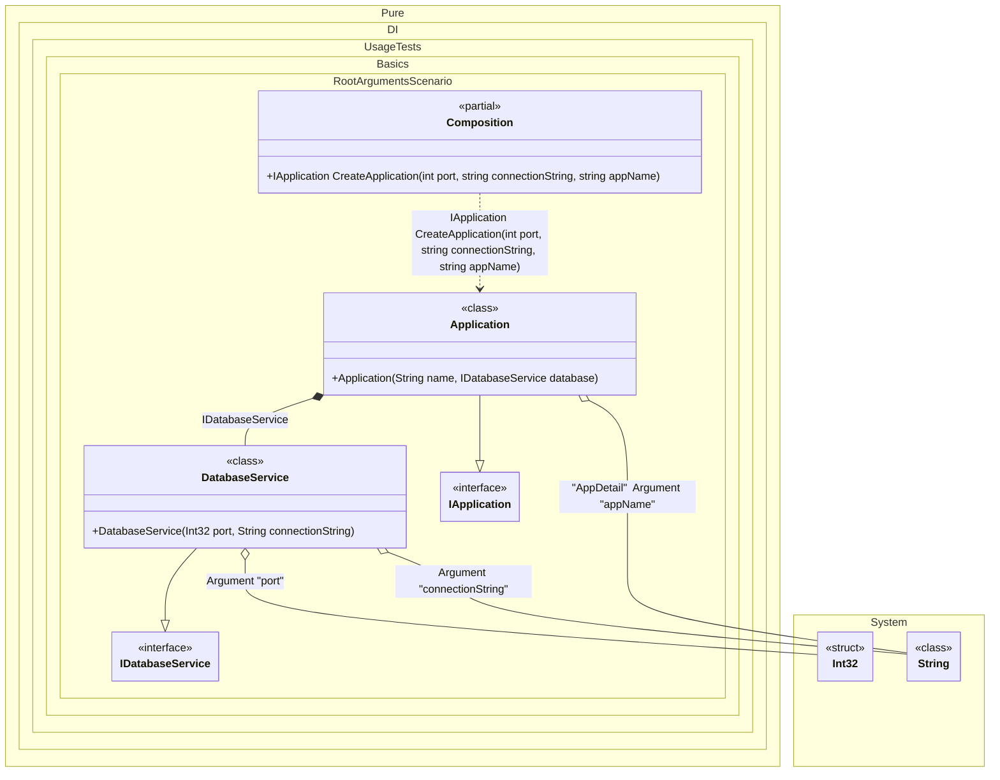

#### Root arguments

Sometimes it is necessary to pass some state to the composition to use it when resolving dependencies. To do this, just use the `RootArg<T>(string argName)` method, specify the type of argument and its name. You can also specify a tag for each argument. You can then use them as dependencies when building the object graph. If you have multiple arguments of the same type, just use tags to distinguish them. The root of a composition that uses at least one root argument is prepended as a method, not a property. It is important to remember that the method will only display arguments that are used in the object graph of that composition root. Arguments that are not involved will not be added to the method arguments. It is best to use unique argument names so that there are no collisions.
> [!NOTE]
> Actually, root arguments work like normal bindings. The difference is that they bind to the values of the arguments. These values will be injected wherever they are required.


```c#
using Shouldly;
using Pure.DI;
using static Pure.DI.Tag;

DI.Setup(nameof(Composition))
    // This hint indicates to not generate methods such as Resolve
    .Hint(Hint.Resolve, "Off")
    .Bind<IDatabaseService>().To<DatabaseService>()
    .Bind<IApplication>().To<Application>()

    // Root arguments serve as values passed
    // to the composition root method
    .RootArg<int>("port")
    .RootArg<string>("connectionString")

    // An argument can be tagged
    // to be injectable by type and this tag
    .RootArg<string>("appName", AppDetail)

    // Composition root
    .Root<IApplication>("CreateApplication");

var composition = new Composition();

// Creates an application with specific arguments
var app = composition.CreateApplication(
    appName: "MySuperApp",
    port: 8080,
    connectionString: "Server=.;Database=MyDb;");

app.Name.ShouldBe("MySuperApp");
app.Database.Port.ShouldBe(8080);
app.Database.ConnectionString.ShouldBe("Server=.;Database=MyDb;");

interface IDatabaseService
{
    int Port { get; }

    string ConnectionString { get; }
}

class DatabaseService(int port, string connectionString) : IDatabaseService
{
    public int Port { get; } = port;

    public string ConnectionString { get; } = connectionString;
}

interface IApplication
{
    string Name { get; }

    IDatabaseService Database { get; }
}

class Application(
    [Tag(AppDetail)] string name,
    IDatabaseService database)
    : IApplication
{
    public string Name { get; } = name;

    public IDatabaseService Database { get; } = database;
}
```

<details>
<summary>Running this code sample locally</summary>

- Make sure you have the [.NET SDK 10.0](https://dotnet.microsoft.com/en-us/download/dotnet/10.0) or later is installed
```bash
dotnet --list-sdk
```
- Create a net10.0 (or later) console application
```bash
dotnet new console -n Sample
```
- Add references to NuGet packages
  - [Pure.DI](https://www.nuget.org/packages/Pure.DI)
  - [Shouldly](https://www.nuget.org/packages/Shouldly)
```bash
dotnet add package Pure.DI
dotnet add package Shouldly
```
- Copy the example code into the _Program.cs_ file

You are ready to run the example 🚀
```bash
dotnet run
```

</details>

When using composition root arguments, compilation warnings are shown if `Resolve` methods are generated, since these methods will not be able to create these roots. You can disable the creation of `Resolve` methods using the `Hint(Hint.Resolve, "Off")` hint, or ignore them but remember the risks of using `Resolve` methods.

The following partial class will be generated:

```c#
partial class Composition
{
#if NET9_0_OR_GREATER
  private readonly Lock _lock = new Lock();
#else
  private readonly Object _lock = new Object();
#endif

  [MethodImpl(MethodImplOptions.AggressiveInlining)]
  public IApplication CreateApplication(int port, string connectionString, string appName)
  {
    if (connectionString is null) throw new ArgumentNullException(nameof(connectionString));
    if (appName is null) throw new ArgumentNullException(nameof(appName));
    return new Application(appName, new DatabaseService(port, connectionString));
  }
}
```

Class diagram:



