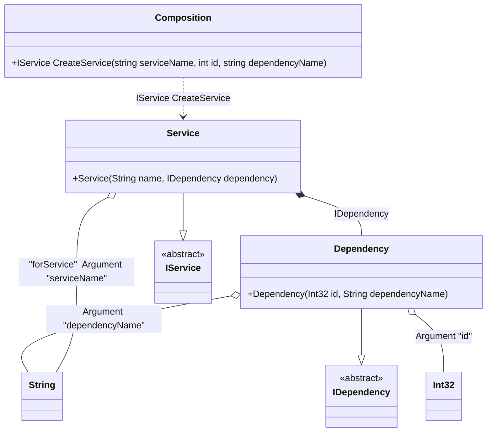

#### Root arguments

[](../tests/Pure.DI.UsageTests/Basics/RootArgumentsScenario.cs)

Sometimes it is necessary to pass some state to the composition root to use it when resolving dependencies. To do this, just use the `RootArg<T>(string argName)` method, specify the type of argument and its name. You can also specify a tag for each argument. You can then use them as dependencies when building the object graph. If you have multiple arguments of the same type, just use tags to distinguish them. The root of a composition that uses at least one root argument is prepended as a method, not a property. It is important to remember that the method will only display arguments that are used in the object graph of that composition root. Arguments that are not involved will not be added to the method arguments. It is best to use unique argument names so that there are no collisions.

```c#
interface IDependency
{
    int Id { get; }

    public string DependencyName { get; }
}

class Dependency : IDependency
{
    public Dependency(int id, string dependencyName)
    {
        Id = id;
        DependencyName = dependencyName;
    }

    public int Id { get; }

    public string DependencyName { get; }
}

interface IService
{
    string Name { get; }

    IDependency Dependency { get; }
}

class Service : IService
{
    public Service(
        [Tag("forService")] string name,
        IDependency dependency)
    {
        Name = name;
        Dependency = dependency;
    }

    public string Name { get; }

    public IDependency Dependency { get; }
}

DI.Setup("Composition")
    .Hint(Hint.Resolve, "Off")
    .Bind<IDependency>().To<Dependency>()
    .Bind<IService>().To<Service>().Root<IService>("CreateService")
    // Some argument
    .RootArg<int>("id")
    .RootArg<string>("dependencyName")
    // An argument can be tagged (e.g., tag "forService")
    // to be injectable by type and this tag
    .RootArg<string>("serviceName", "forService");

var composition = new Composition();
var service = composition.CreateService(serviceName: "Abc", id: 123, dependencyName: "dependency 123");
service.Name.ShouldBe("Abc");
service.Dependency.Id.ShouldBe(123);
service.Dependency.DependencyName.ShouldBe("dependency 123");
```

<details open>
<summary>Class Diagram</summary>



</details>

<details>
<summary>Pure.DI-generated partial class Composition</summary><blockquote>

```c#
partial class Composition
{
  private readonly global::System.IDisposable[] _disposableSingletonsM10D26di;
  
  public Composition()
  {
    _disposableSingletonsM10D26di = new global::System.IDisposable[0];
  }
  
  internal Composition(Composition parent)
  {
    _disposableSingletonsM10D26di = new global::System.IDisposable[0];
  }
  
  #region Composition Roots
  [global::System.Runtime.CompilerServices.MethodImpl((global::System.Runtime.CompilerServices.MethodImplOptions)0x300)]
  public Pure.DI.UsageTests.Basics.RootArgumentsScenario.IService CreateService(string serviceName, int id, string dependencyName)
  {
    var transientM10D26di1 = new Pure.DI.UsageTests.Basics.RootArgumentsScenario.Dependency(id, dependencyName);
    var transientM10D26di0 = new Pure.DI.UsageTests.Basics.RootArgumentsScenario.Service(serviceName, transientM10D26di1);
    return transientM10D26di0;
  }
  #endregion
  
  
  public override string ToString()
  {
    return
      "classDiagram\n" +
        "  class Composition {\n" +
          "    +IService CreateService(string serviceName, int id, string dependencyName)\n" +
        "  }\n" +
        "  Dependency --|> IDependency : \n" +
        "  class Dependency {\n" +
          "    +Dependency(Int32 id, String dependencyName)\n" +
        "  }\n" +
        "  Service --|> IService : \n" +
        "  class Service {\n" +
          "    +Service(String name, IDependency dependency)\n" +
        "  }\n" +
        "  class Int32\n" +
        "  class String\n" +
        "  class IDependency {\n" +
          "    <<abstract>>\n" +
        "  }\n" +
        "  class IService {\n" +
          "    <<abstract>>\n" +
        "  }\n" +
        "  Dependency o-- Int32 : Argument \"id\"\n" +
        "  Dependency o-- String : Argument \"dependencyName\"\n" +
        "  Service o-- String : \"forService\"  Argument \"serviceName\"\n" +
        "  Service *--  Dependency : IDependency\n" +
        "  Composition ..> Service : IService CreateService";
  }
}
```

</blockquote></details>


When using composition root arguments, compilation warnings are shown if `Resolve` methods are generated, since these methods will not be able to create these roots. You can disable the creation of `Resolve` methods using the `Hint(Hint.Resolve, "Off")` hint, or ignore them but remember the risks of using `Resolve` methods.
