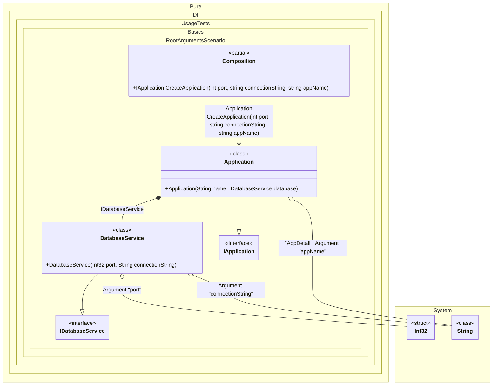

#### Root arguments

Use root arguments when you need to pass state into a specific root. Define them with `RootArg<T>(string argName)` (optionally with tags) and use them like any other dependency. A root that uses at least one root argument becomes a method, and only arguments used in that root's object graph appear in the method signature. Use unique argument names to avoid collisions.
Root arguments are useful when runtime values belong to one entry point, not to the whole composition.
>[!NOTE]
>Actually, root arguments work like normal bindings. The difference is that they bind to the values of the arguments. These values will be injected wherever they are required.


```c#
using Shouldly;
using Pure.DI;
using static Pure.DI.Tag;

DI.Setup(nameof(Composition))
    // Disable Resolve methods because root arguments are not compatible
    .Hint(Hint.Resolve, "Off")
    .Bind<IDatabaseService>().To<DatabaseService>()
    .Bind<IApplication>().To<Application>()

    // Root arguments serve as values passed
    // to the composition root method
    .RootArg<int>("port")
    .RootArg<string>("connectionString")

    // An argument can be tagged
    // to be injectable by type and this tag
    .RootArg<string>("appName", AppDetail)

    // Composition root
    .Root<IApplication>("CreateApplication");

var composition = new Composition();

// Creates an application with specific arguments
var app = composition.CreateApplication(
    appName: "MySuperApp",
    port: 8080,
    connectionString: "Server=.;Database=MyDb;");

app.Name.ShouldBe("MySuperApp");
app.Database.Port.ShouldBe(8080);
app.Database.ConnectionString.ShouldBe("Server=.;Database=MyDb;");

interface IDatabaseService
{
    int Port { get; }

    string ConnectionString { get; }
}

class DatabaseService(int port, string connectionString) : IDatabaseService
{
    public int Port { get; } = port;

    public string ConnectionString { get; } = connectionString;
}

interface IApplication
{
    string Name { get; }

    IDatabaseService Database { get; }
}

class Application(
    [Tag(AppDetail)] string name,
    IDatabaseService database)
    : IApplication
{
    public string Name { get; } = name;

    public IDatabaseService Database { get; } = database;
}
```

<details>
<summary>Running this code sample locally</summary>

- Make sure you have the [.NET SDK 10.0](https://dotnet.microsoft.com/en-us/download/dotnet/10.0) or later installed
```bash
dotnet --list-sdk
```
- Create a net10.0 (or later) console application
```bash
dotnet new console -n Sample
```
- Add references to the NuGet packages
  - [Pure.DI](https://www.nuget.org/packages/Pure.DI)
  - [Shouldly](https://www.nuget.org/packages/Shouldly)
```bash
dotnet add package Pure.DI
dotnet add package Shouldly
```
- Copy the example code into the _Program.cs_ file

You are ready to run the example 🚀
```bash
dotnet run
```

</details>

When using root arguments, compilation warnings are emitted if `Resolve` methods are generated because these methods cannot create such roots. Disable `Resolve` via `Hint(Hint.Resolve, "Off")`, or ignore the warnings and accept the risks.
Limitations: roots with root arguments become methods and are incompatible with generated `Resolve` methods.
Common pitfalls:
- Reusing ambiguous argument names for different concepts.
- Forgetting to disable or avoid `Resolve` usage in these setups.
See also: [Composition arguments](composition-arguments.md), [Resolve hint](resolve-hint.md).

The following partial class will be generated:

```c#
partial class Composition
{
#if NET9_0_OR_GREATER
  private readonly Lock _lock = new Lock();
#else
  private readonly Object _lock = new Object();
#endif

  [MethodImpl(MethodImplOptions.AggressiveInlining)]
  public IApplication CreateApplication(int port, string connectionString, string appName)
  {
    if (connectionString is null) throw new ArgumentNullException(nameof(connectionString));
    if (appName is null) throw new ArgumentNullException(nameof(appName));
    return new Application(appName, new DatabaseService(port, connectionString));
  }
}
```

Class diagram:


```mermaid
---
 config:
  maxTextSize: 2147483647
  maxEdges: 2147483647
  class:
   hideEmptyMembersBox: true
---
classDiagram
	DatabaseService --|> IDatabaseService
	Application --|> IApplication
	Composition ..> Application : IApplication CreateApplication(int port, string connectionString, string appName)
	DatabaseService o-- Int32 : Argument "port"
	DatabaseService o-- String : Argument "connectionString"
	Application *--  DatabaseService : IDatabaseService
	Application o-- String : "AppDetail"  Argument "appName"
	namespace Pure.DI.UsageTests.Basics.RootArgumentsScenario {
		class Application {
				<<class>>
			+Application(String name, IDatabaseService database)
		}
		class Composition {
		<<partial>>
		+IApplication CreateApplication(int port, string connectionString, string appName)
		}
		class DatabaseService {
				<<class>>
			+DatabaseService(Int32 port, String connectionString)
		}
		class IApplication {
			<<interface>>
		}
		class IDatabaseService {
			<<interface>>
		}
	}
	namespace System {
		class Int32 {
				<<struct>>
		}
		class String {
				<<class>>
		}
	}
```

