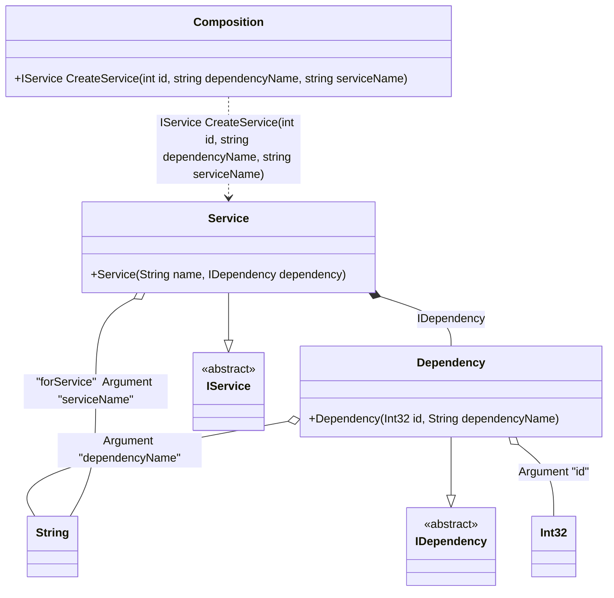

#### Root arguments

[](../tests/Pure.DI.UsageTests/Basics/RootArgumentsScenario.cs)

Sometimes it is necessary to pass some state to the composition root to use it when resolving dependencies. To do this, just use the `RootArg<T>(string argName)` method, specify the type of argument and its name. You can also specify a tag for each argument. You can then use them as dependencies when building the object graph. If you have multiple arguments of the same type, just use tags to distinguish them. The root of a composition that uses at least one root argument is prepended as a method, not a property. It is important to remember that the method will only display arguments that are used in the object graph of that composition root. Arguments that are not involved will not be added to the method arguments. It is best to use unique argument names so that there are no collisions.

```c#
interface IDependency
{
    int Id { get; }

    public string DependencyName { get; }
}

class Dependency(int id, string dependencyName) : IDependency
{
    public int Id { get; } = id;

    public string DependencyName { get; } = dependencyName;
}

interface IService
{
    string Name { get; }

    IDependency Dependency { get; }
}

class Service(
    [Tag("forService")] string name,
    IDependency dependency)
    : IService
{
    public string Name { get; } = name;

    public IDependency Dependency { get; } = dependency;
}

DI.Setup(nameof(Composition))
    .Hint(Hint.Resolve, "Off")
    .Bind<IDependency>().To<Dependency>()
    .Bind<IService>().To<Service>().Root<IService>("CreateService")
    // Some argument
    .RootArg<int>("id")
    .RootArg<string>("dependencyName")
    // An argument can be tagged (e.g., tag "forService")
    // to be injectable by type and this tag
    .RootArg<string>("serviceName", "forService");

var composition = new Composition();
        
// service = new Service("Abc", new Dependency(123, "dependency 123"));
var service = composition.CreateService(serviceName: "Abc", id: 123, dependencyName: "dependency 123");
        
service.Name.ShouldBe("Abc");
service.Dependency.Id.ShouldBe(123);
service.Dependency.DependencyName.ShouldBe("dependency 123");
```

When using composition root arguments, compilation warnings are shown if `Resolve` methods are generated, since these methods will not be able to create these roots. You can disable the creation of `Resolve` methods using the `Hint(Hint.Resolve, "Off")` hint, or ignore them but remember the risks of using `Resolve` methods.

<details open>
<summary>Class Diagram</summary>



</details>

<details>
<summary>Pure.DI-generated partial class Composition</summary><blockquote>

```c#
/// <para>
/// <b>Composition roots</b><br/>
/// <list type="table">
/// <listheader>
/// <term>Root</term>
/// <description>Description</description>
/// </listheader>
/// <item>
/// <term>
/// <see cref="Pure.DI.UsageTests.Basics.RootArgumentsScenario.IService"/> <see cref="CreateService(int, string, string)"/>
/// </term>
/// <description>
/// Provides a composition root of type <see cref="Pure.DI.UsageTests.Basics.RootArgumentsScenario.Service"/>.
/// </description>
/// </item>
/// </list>
/// </para>
/// </summary>
/// <example>
/// This shows how to get an instance of type <see cref="Pure.DI.UsageTests.Basics.RootArgumentsScenario.Service"/> using the composition root <see cref="CreateService(int, string, string)"/>:
/// <code>
/// var composition = new Composition();
/// var instance = composition.CreateService(id, dependencyName, serviceName);
/// </code>
/// </example>
/// <a href="https://mermaid.live/view#pako:eNq1VD1vgzAQ_SvWzR0iGNJmI9CBpQurFxeu1GqxI-NUqqL89_oDYuMG1KXLyafne7x7d-YCrewQDtB-snGsOOsVG6iiwuWklMNJjlxzKQg973b7o8XsKTvWDaov3iIpFTKNU-awRy404Z07l2TUiouedHhC0aFov1_YgEts9MU34Gn-zL4KYmqh8yykjSu1eXVjdiKzKsR9aWP-TOrkUl6QQJVgcZcB8p05EaG3ZrW3pIXZrHWB8Y2FuhiIpS0cn4SIYG3ccdC3Ye-qC7nXWLJXMy7Waq94iveY7iv-O02kRMaG-RWYHSpUfx7QbBoFMw_YLJzs-V2ZTM6xzPK3KCi8STVPAEhMGS_zgs8RFQvSdPUMczQHW5w-wcw55qNZm2Rr_v1RwgMMqAbGO_PTuFDQ72jbPBgnmfqgcIXrD4xfdeY">Class diagram</a><br/>
/// This class was created by <a href="https://github.com/DevTeam/Pure.DI">Pure.DI</a> source code generator.
/// <seealso cref="Pure.DI.DI.Setup"/>
/// <seealso cref="Pure.DI.IConfiguration.Bind(object[])"/>
/// <seealso cref="Pure.DI.IConfiguration.Bind{T}(object[])"/>
[global::System.Diagnostics.CodeAnalysis.ExcludeFromCodeCoverage]
partial class Composition
{
  private readonly Composition _rootM03D15di;
  
  /// <summary>
  /// This parameterized constructor creates a new instance of <see cref="Composition"/> with arguments.
  /// </summary>
  public Composition()
  {
    _rootM03D15di = this;
  }
  
  /// <summary>
  /// This constructor creates a new instance of <see cref="Composition"/> scope based on <paramref name="baseComposition"/>. This allows the <see cref="Lifetime.Scoped"/> life time to be applied.
  /// </summary>
  /// <param name="baseComposition">Base composition.</param>
  internal Composition(Composition baseComposition)
  {
    _rootM03D15di = baseComposition._rootM03D15di;
  }
  
  #region Composition Roots
  /// <summary>
  /// Provides a composition root of type <see cref="Pure.DI.UsageTests.Basics.RootArgumentsScenario.Service"/>.
  /// </summary>
  /// <example>
  /// This shows how to get an instance of type <see cref="Pure.DI.UsageTests.Basics.RootArgumentsScenario.Service"/>:
  /// <code>
  /// var composition = new Composition();
  /// var instance = composition.CreateService(id, dependencyName, serviceName);
  /// </code>
  /// </example>
  #if NETSTANDARD2_0_OR_GREATER || NETCOREAPP || NET40_OR_GREATER || NET
  [global::System.Diagnostics.Contracts.Pure]
  #endif
  public Pure.DI.UsageTests.Basics.RootArgumentsScenario.IService CreateService(int id, string dependencyName, string serviceName)
  {
    return new Pure.DI.UsageTests.Basics.RootArgumentsScenario.Service(serviceName, new Pure.DI.UsageTests.Basics.RootArgumentsScenario.Dependency(id, dependencyName));
  }
  #endregion
  
  /// <summary>
  /// This method provides a class diagram in mermaid format. To see this diagram, simply call the method and copy the text to this site https://mermaid.live/.
  /// </summary>
  public override string ToString()
  {
    return
      "classDiagram\n" +
        "  class Composition {\n" +
          "    +IService CreateService(int id, string dependencyName, string serviceName)\n" +
        "  }\n" +
        "  class Int32\n" +
        "  class String\n" +
        "  Dependency --|> IDependency : \n" +
        "  class Dependency {\n" +
          "    +Dependency(Int32 id, String dependencyName)\n" +
        "  }\n" +
        "  Service --|> IService : \n" +
        "  class Service {\n" +
          "    +Service(String name, IDependency dependency)\n" +
        "  }\n" +
        "  class IDependency {\n" +
          "    <<abstract>>\n" +
        "  }\n" +
        "  class IService {\n" +
          "    <<abstract>>\n" +
        "  }\n" +
        "  Dependency o-- Int32 : Argument \"id\"\n" +
        "  Dependency o-- String : Argument \"dependencyName\"\n" +
        "  Service o-- String : \"forService\"  Argument \"serviceName\"\n" +
        "  Service *--  Dependency : IDependency\n" +
        "  Composition ..> Service : IService CreateService(int id, string dependencyName, string serviceName)";
  }
}
```

</blockquote></details>

