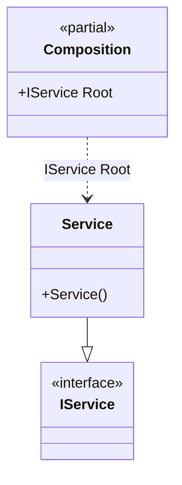

#### Root binding

[](../tests/Pure.DI.UsageTests/Basics/RootBindScenario.cs)

You might want to register some services as roots. You can use `RootBind<T>()` method in order to reduce repetitions. The registration `composition.RootBind<IDependency>().To<Dependency>()` is an equivalent to `composition.Bind<IDependency>().To<Dependency>().Root<IDependency>()`.


```c#
interface IService;

class Service : IService;

DI.Setup(nameof(Composition))
    .RootBind<IService>("Root").To<Service>();

var composition = new Composition();
composition.Root.ShouldBeOfType<Service>();
```

The following partial class will be generated:

```c#
partial class Composition
{
  private readonly Composition _root;

  public Composition()
  {
    _root = this;
  }

  internal Composition(Composition parentScope)
  {
    _root = (parentScope ?? throw new ArgumentNullException(nameof(parentScope)))._root;
  }

  public IService Root
  {
    [MethodImpl(MethodImplOptions.AggressiveInlining)]
    get
    {
      return new Service();
    }
  }
}
```

Class diagram:



