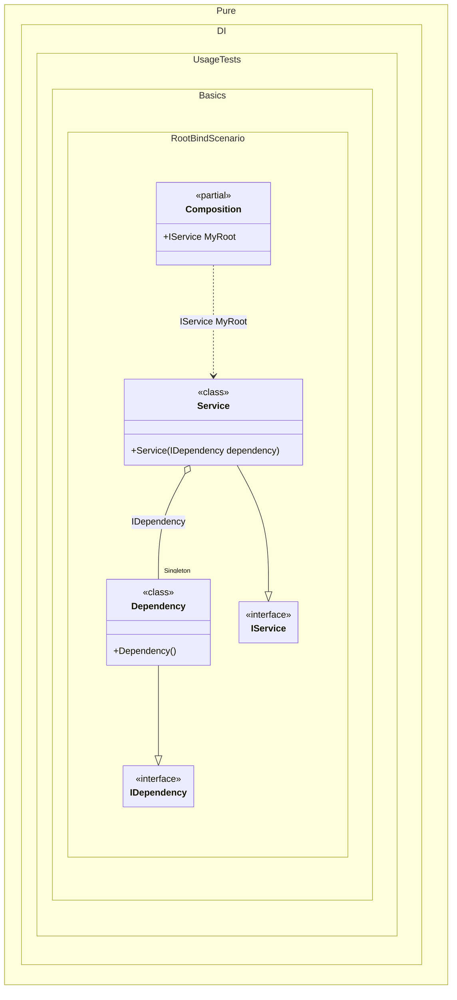

#### Root binding

In general, it is recommended to define one composition root for the entire application. But sometimes it is necessary to have multiple roots. To simplify the definition of composition roots, a "hybrid" API method `RootBind<T>(string rootName)` was added. It allows you to define a binding and at the same time the root of the composition. You can it in order to reduce repetitions. The registration `composition.RootBind<IDependency>().To<Dependency>()` is an equivalent to `composition.Bind<IDependency>().To<Dependency>().Root<IDependency>()`.


```c#
using Shouldly;
using Pure.DI;

DI.Setup(nameof(Composition))
    .Bind().As(Lifetime.Singleton).To<Dependency>()
    .RootBind<IService>("MyRoot").To<Service>();
// It's the same as:
//  .Bind<IService>().To<Service>()
//  .Root<IService>("MyRoot")

var composition = new Composition();
composition.MyRoot.ShouldBeOfType<Service>();

interface IDependency;

class Dependency : IDependency;

interface IService;

class Service(IDependency dependency) : IService;
```

<details>
<summary>Running this code sample locally</summary>

- Make sure you have the [.NET SDK 9.0](https://dotnet.microsoft.com/en-us/download/dotnet/9.0) or later is installed
```bash
dotnet --list-sdk
```
- Create a net9.0 (or later) console application
```bash
dotnet new console -n Sample
```
- Add references to NuGet packages
  - [Pure.DI](https://www.nuget.org/packages/Pure.DI)
  - [Shouldly](https://www.nuget.org/packages/Shouldly)
```bash
dotnet add package Pure.DI
dotnet add package Shouldly
```
- Copy the example code into the _Program.cs_ file

You are ready to run the example 🚀
```bash
dotnet run
```

</details>

The following partial class will be generated:

```c#
partial class Composition
{
  private readonly Composition _root;
  private readonly Lock _lock;

  private Dependency? _singletonDependency51;

  [OrdinalAttribute(256)]
  public Composition()
  {
    _root = this;
    _lock = new Lock();
  }

  internal Composition(Composition parentScope)
  {
    _root = (parentScope ?? throw new ArgumentNullException(nameof(parentScope)))._root;
    _lock = _root._lock;
  }

  public IService MyRoot
  {
    [MethodImpl(MethodImplOptions.AggressiveInlining)]
    get
    {
      if (_root._singletonDependency51 is null)
      {
        using (_lock.EnterScope())
        {
          if (_root._singletonDependency51 is null)
          {
            _root._singletonDependency51 = new Dependency();
          }
        }
      }

      return new Service(_root._singletonDependency51);
    }
  }
}
```

Class diagram:



