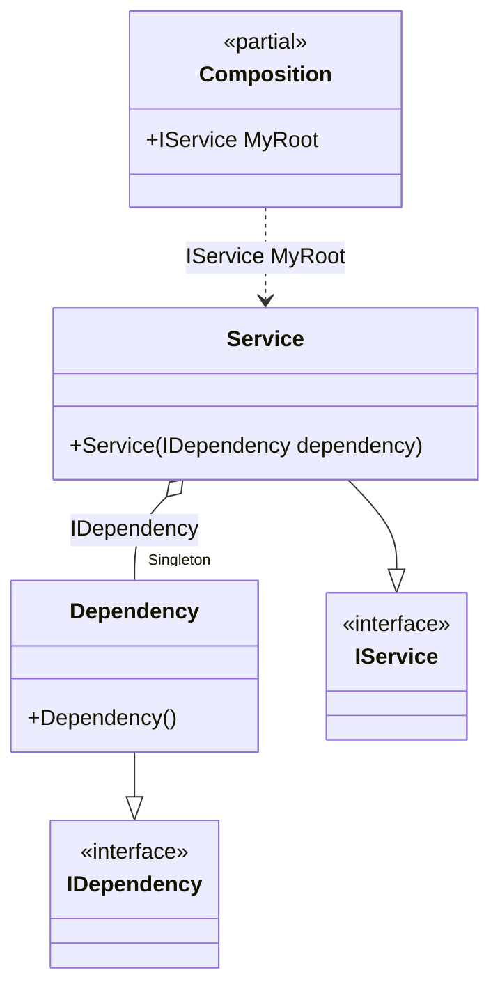

#### Root binding

[](../tests/Pure.DI.UsageTests/Basics/RootBindScenario.cs)

In general, it is recommended to define one composition root for the entire application. But sometimes it is necessary to have multiple roots. To simplify the definition of composition roots, a "hybrid" API method `RootBind<T>(string rootName)` was added. It allows you to define a binding and at the same time the root of the composition. You can it in order to reduce repetitions. The registration `composition.RootBind<IDependency>().To<Dependency>()` is an equivalent to `composition.Bind<IDependency>().To<Dependency>().Root<IDependency>()`.


```c#
interface IDependency;

class Dependency: IDependency;

interface IService;

class Service(IDependency dependency) : IService;

DI.Setup(nameof(Composition))
    .Bind().As(Lifetime.Singleton).To<Dependency>()
    .RootBind<IService>("MyRoot").To<Service>();
    // It's the same as:
    //   .Bind<IService>().To<Service>()
    //   .Root<IService>("MyRoot")

var composition = new Composition();
composition.MyRoot.ShouldBeOfType<Service>();
```

The following partial class will be generated:

```c#
partial class Composition
{
  private readonly Composition _root;
  private readonly object _lock;

  private Dependency? _singletonDependency39;

  public Composition()
  {
    _root = this;
    _lock = new object();
  }

  internal Composition(Composition parentScope)
  {
    _root = (parentScope ?? throw new ArgumentNullException(nameof(parentScope)))._root;
    _lock = _root._lock;
  }

  public IService MyRoot
  {
    [MethodImpl(MethodImplOptions.AggressiveInlining)]
    get
    {
      if (_root._singletonDependency39 == null)
      {
          lock (_lock)
          {
              if (_root._singletonDependency39 == null)
              {
                  _root._singletonDependency39 = new Dependency();
              }
          }
      }

      return new Service(_root._singletonDependency39!);
    }
  }
}
```

Class diagram:



