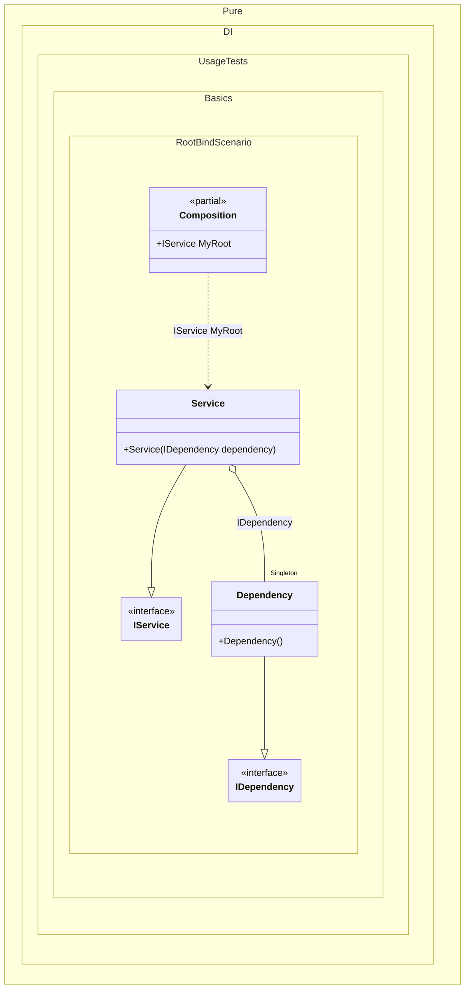

#### Root binding

[](../tests/Pure.DI.UsageTests/Basics/RootBindScenario.cs)

In general, it is recommended to define one composition root for the entire application. But sometimes it is necessary to have multiple roots. To simplify the definition of composition roots, a "hybrid" API method `RootBind<T>(string rootName)` was added. It allows you to define a binding and at the same time the root of the composition. You can it in order to reduce repetitions. The registration `composition.RootBind<IDependency>().To<Dependency>()` is an equivalent to `composition.Bind<IDependency>().To<Dependency>().Root<IDependency>()`.


```c#
using Shouldly;
using Pure.DI;

DI.Setup(nameof(Composition))
    .Bind().As(Lifetime.Singleton).To<Dependency>()
    .RootBind<IService>("MyRoot").To<Service>();
// It's the same as:
//  .Bind<IService>().To<Service>()
//  .Root<IService>("MyRoot")

var composition = new Composition();
composition.MyRoot.ShouldBeOfType<Service>();

interface IDependency;

class Dependency : IDependency;

interface IService;

class Service(IDependency dependency) : IService;
```

<details>
<summary>Running this code sample locally</summary>

- Make sure you have the [.NET SDK 9.0](https://dotnet.microsoft.com/en-us/download/dotnet/9.0) or later is installed
- Create a net9.0 (or later) console application
- Add references to NuGet packages
  - [Pure.DI](https://www.nuget.org/packages/Pure.DI)
  - [Shouldly](https://www.nuget.org/packages/Shouldly)
- Copy the example code into the _Program.cs_ file

You are ready to run the example!

</details>


Class diagram:



