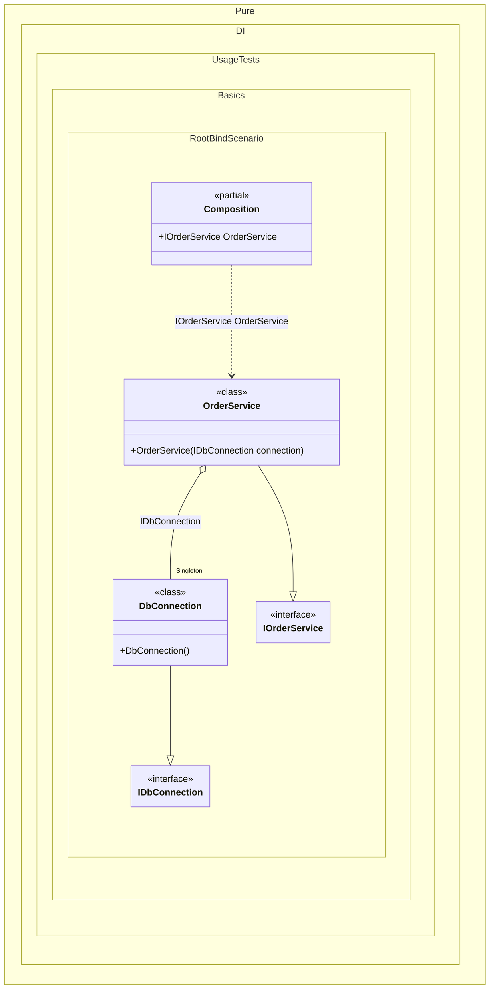

#### Root binding

In general, it is recommended to define one composition root for the entire application. But sometimes it is necessary to have multiple roots. To simplify the definition of composition roots, a "hybrid" API method `RootBind<T>(string rootName)` was added. It allows you to define a binding and at the same time the root of the composition. You can it in order to reduce repetitions. The registration `composition.RootBind<IDependency>().To<Dependency>()` is an equivalent to `composition.Bind<IDependency>().To<Dependency>().Root<IDependency>()`.


```c#
using Shouldly;
using Pure.DI;

DI.Setup(nameof(Composition))
    .Bind().As(Lifetime.Singleton).To<DbConnection>()
    // RootBind allows you to define a binding and a composition root
    // simultaneously. This is useful for creating public entry points
    // for your application components while keeping the configuration concise.
    .RootBind<IOrderService>("OrderService").To<OrderService>();

// The line above is functionally equivalent to:
//  .Bind<IOrderService>().To<OrderService>()
//  .Root<IOrderService>("OrderService")

var composition = new Composition();
var orderService = composition.OrderService;
orderService.ShouldBeOfType<OrderService>();

interface IDbConnection;

class DbConnection : IDbConnection;

interface IOrderService;

class OrderService(IDbConnection connection) : IOrderService;
```

<details>
<summary>Running this code sample locally</summary>

- Make sure you have the [.NET SDK 10.0](https://dotnet.microsoft.com/en-us/download/dotnet/10.0) or later is installed
```bash
dotnet --list-sdk
```
- Create a net10.0 (or later) console application
```bash
dotnet new console -n Sample
```
- Add references to NuGet packages
  - [Pure.DI](https://www.nuget.org/packages/Pure.DI)
  - [Shouldly](https://www.nuget.org/packages/Shouldly)
```bash
dotnet add package Pure.DI
dotnet add package Shouldly
```
- Copy the example code into the _Program.cs_ file

You are ready to run the example 🚀
```bash
dotnet run
```

</details>

The following partial class will be generated:

```c#
partial class Composition
{
  private readonly Composition _root;
#if NET9_0_OR_GREATER
  private readonly Lock _lock;
#else
  private readonly Object _lock;
#endif

  private DbConnection? _singletonDbConnection51;

  [OrdinalAttribute(256)]
  public Composition()
  {
    _root = this;
#if NET9_0_OR_GREATER
    _lock = new Lock();
#else
    _lock = new Object();
#endif
  }

  internal Composition(Composition parentScope)
  {
    _root = (parentScope ?? throw new ArgumentNullException(nameof(parentScope)))._root;
    _lock = parentScope._lock;
  }

  public IOrderService OrderService
  {
    [MethodImpl(MethodImplOptions.AggressiveInlining)]
    get
    {
      if (_root._singletonDbConnection51 is null)
        lock (_lock)
          if (_root._singletonDbConnection51 is null)
          {
            _root._singletonDbConnection51 = new DbConnection();
          }

      return new OrderService(_root._singletonDbConnection51);
    }
  }
}
```

Class diagram:



