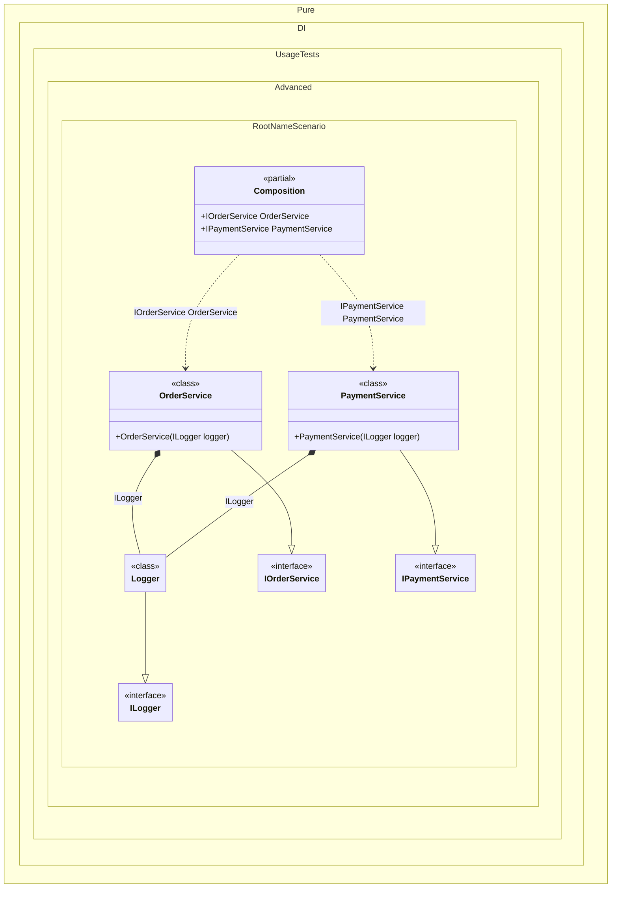

#### Root Name

`RootName` provides the name of the composition root being resolved. This property is useful for logging, diagnostics, or implementing root-specific behavior.
Use this when infrastructure behavior should include root-level context (for example, logging prefixes).


```c#
using Shouldly;
using Pure.DI;

var composition = new Composition();
var orderService = composition.OrderService;
orderService.Logger.Log("Processing order").ShouldContain("OrderService");

var paymentService = composition.PaymentService;
paymentService.Logger.Log("Processing payment").ShouldContain("PaymentService");

interface ILogger
{
    string Log(string message);
}

interface IOrderService
{
    ILogger Logger { get; }
}

interface IPaymentService
{
    ILogger Logger { get; }
}

class Logger(string rootName) : ILogger
{
    public string Log(string message) => $"[{rootName}] {message}";
}

class OrderService(ILogger logger) : IOrderService
{
    public ILogger Logger => logger;
}

class PaymentService(ILogger logger) : IPaymentService
{
    public ILogger Logger => logger;
}

partial class Composition
{
    private void Setup() =>

        DI.Setup(nameof(Composition))
            .Bind().To(ctx => new Logger(ctx.RootName))
            .Bind().To<OrderService>()
            .Root<IOrderService>("OrderService")
            .Bind().To<PaymentService>()
            .Root<IPaymentService>("PaymentService");
}
```

<details>
<summary>Running this code sample locally</summary>

- Make sure you have the [.NET SDK 10.0](https://dotnet.microsoft.com/en-us/download/dotnet/10.0) or later installed
```bash
dotnet --list-sdk
```
- Create a net10.0 (or later) console application
```bash
dotnet new console -n Sample
```
- Add references to the NuGet packages
  - [Pure.DI](https://www.nuget.org/packages/Pure.DI)
  - [Shouldly](https://www.nuget.org/packages/Shouldly)
```bash
dotnet add package Pure.DI
dotnet add package Shouldly
```
- Copy the example code into the _Program.cs_ file

You are ready to run the example 🚀
```bash
dotnet run
```

</details>

Limitations: root-name-dependent behavior couples logic to API naming; avoid it in domain services.
See also: [Composition roots](composition-roots.md), [Root Type](root-type.md).

The following partial class will be generated:

```c#
partial class Composition
{
  public IOrderService OrderService
  {
    [MethodImpl(MethodImplOptions.AggressiveInlining)]
    get
    {
      Logger transientLogger99 = new Logger("OrderService");
      return new OrderService(transientLogger99);
    }
  }

  public IPaymentService PaymentService
  {
    [MethodImpl(MethodImplOptions.AggressiveInlining)]
    get
    {
      Logger transientLogger97 = new Logger("PaymentService");
      return new PaymentService(transientLogger97);
    }
  }
}
```

Class diagram:



