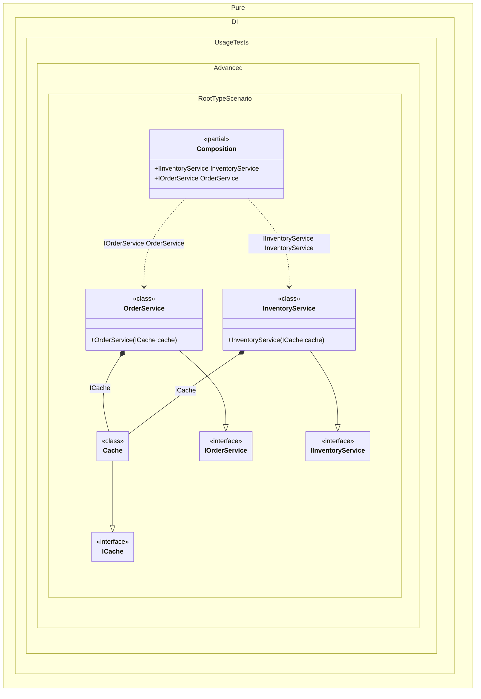

#### Root Type

`RootType` provides the type of the composition root being resolved. This property is useful for implementing root-specific behavior like different caching strategies per root type.
Use this when infrastructure dependencies must vary by root contract type.


```c#
using Shouldly;
using Pure.DI;

var composition = new Composition();
var orderService = composition.OrderService;
orderService.Cache.Set("order_123", "Order Data");
orderService.Cache.Get("order_123").ShouldBe("Order Data");
orderService.Cache.KeyPrefix.ShouldBe("IOrderService");

var inventoryService = composition.InventoryService;
inventoryService.Cache.Set("item_456", "Item Data");
inventoryService.Cache.Get("item_456").ShouldBe("Item Data");
inventoryService.Cache.KeyPrefix.ShouldBe("IInventoryService");

interface ICache
{
    string KeyPrefix { get; }

    void Set(string key, string value);

    string Get(string key);
}

interface IOrderService
{
    ICache Cache { get; }
}

interface IInventoryService
{
    ICache Cache { get; }
}

class Cache(Type rootType) : ICache
{
    private readonly Dictionary<string, string> _data = new();

    public string KeyPrefix => rootType.Name;

    public void Set(string key, string value) => _data[key] = value;

    public string Get(string key) => _data.TryGetValue(key, out var value) ? value : string.Empty;
}

class OrderService(ICache cache) : IOrderService
{
    public ICache Cache => cache;
}

class InventoryService(ICache cache) : IInventoryService
{
    public ICache Cache => cache;
}

partial class Composition
{
    private void Setup() =>

        DI.Setup(nameof(Composition))
            .Bind().To(ctx => new Cache(ctx.RootType))
            .Bind().To<OrderService>()
            .Root<IOrderService>("OrderService")
            .Bind().To<InventoryService>()
            .Root<IInventoryService>("InventoryService");
}
```

<details>
<summary>Running this code sample locally</summary>

- Make sure you have the [.NET SDK 10.0](https://dotnet.microsoft.com/en-us/download/dotnet/10.0) or later installed
```bash
dotnet --list-sdk
```
- Create a net10.0 (or later) console application
```bash
dotnet new console -n Sample
```
- Add references to the NuGet packages
  - [Pure.DI](https://www.nuget.org/packages/Pure.DI)
  - [Shouldly](https://www.nuget.org/packages/Shouldly)
```bash
dotnet add package Pure.DI
dotnet add package Shouldly
```
- Copy the example code into the _Program.cs_ file

You are ready to run the example 🚀
```bash
dotnet run
```

</details>

Limitations: root-type-specific rules can become hidden policy; keep this logic centralized and observable.
See also: [Composition roots](composition-roots.md), [Root Name](root-name.md).

The following partial class will be generated:

```c#
partial class Composition
{
  public IOrderService OrderService
  {
    [MethodImpl(MethodImplOptions.AggressiveInlining)]
    get
    {
      Cache transientCache103 = new Cache(typeof(IOrderService));
      return new OrderService(transientCache103);
    }
  }

  public IInventoryService InventoryService
  {
    [MethodImpl(MethodImplOptions.AggressiveInlining)]
    get
    {
      Cache transientCache101 = new Cache(typeof(IInventoryService));
      return new InventoryService(transientCache101);
    }
  }
}
```

Class diagram:



