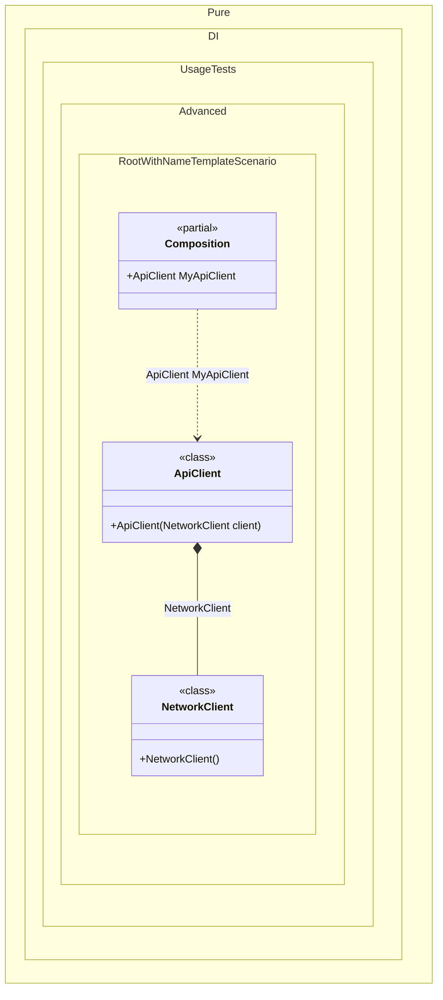

#### Root with name template


```c#
using Shouldly;
using Pure.DI;

DI.Setup("Composition")
    // The name template "My{type}" specifies that the root property name
    // will be formed by adding the prefix "My" to the type name "ApiClient".
    .Root<ApiClient>("My{type}");

var composition = new Composition();

// The property name is "MyApiClient" instead of "ApiClient"
// thanks to the name template "My{type}"
var apiClient = composition.MyApiClient;

apiClient.GetProfile().ShouldBe("Content from https://example.com/profile");

class NetworkClient
{
    public string Get(string uri) => $"Content from {uri}";
}

class ApiClient(NetworkClient client)
{
    public string GetProfile() => client.Get("https://example.com/profile");
}
```

<details>
<summary>Running this code sample locally</summary>

- Make sure you have the [.NET SDK 10.0](https://dotnet.microsoft.com/en-us/download/dotnet/10.0) or later is installed
```bash
dotnet --list-sdk
```
- Create a net10.0 (or later) console application
```bash
dotnet new console -n Sample
```
- Add references to NuGet packages
  - [Pure.DI](https://www.nuget.org/packages/Pure.DI)
  - [Shouldly](https://www.nuget.org/packages/Shouldly)
```bash
dotnet add package Pure.DI
dotnet add package Shouldly
```
- Copy the example code into the _Program.cs_ file

You are ready to run the example 🚀
```bash
dotnet run
```

</details>

The following partial class will be generated:

```c#
partial class Composition
{
  public ApiClient MyApiClient
  {
    [MethodImpl(MethodImplOptions.AggressiveInlining)]
    get
    {
      return new ApiClient(new NetworkClient());
    }
  }
}
```

Class diagram:



