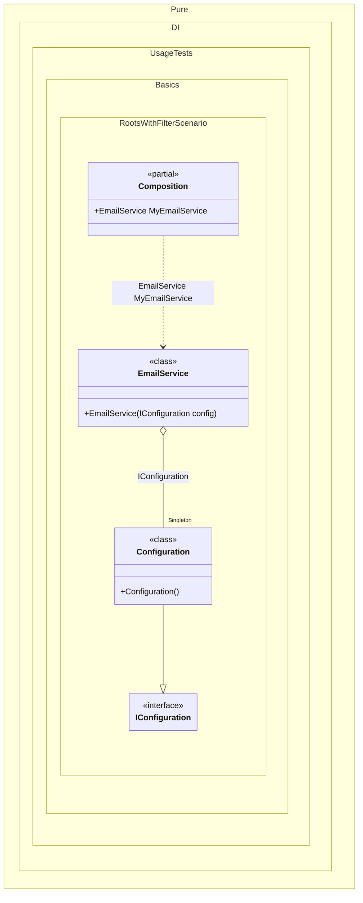

#### Roots with filter


```c#
using Shouldly;
using Pure.DI;

DI.Setup(nameof(Composition))
    .Bind().As(Lifetime.Singleton).To<Configuration>()
    .Roots<INotificationService>("My{type}", filter: "*Email*");

var composition = new Composition();
composition.MyEmailService.ShouldBeOfType<EmailService>();

interface IConfiguration;

class Configuration : IConfiguration;

interface INotificationService;

// This service requires an API key which is not bound,
// so it cannot be resolved and should be filtered out.
class SmsService(string apiKey) : INotificationService;

class EmailService(IConfiguration config) : INotificationService;
```

<details>
<summary>Running this code sample locally</summary>

- Make sure you have the [.NET SDK 10.0](https://dotnet.microsoft.com/en-us/download/dotnet/10.0) or later is installed
```bash
dotnet --list-sdk
```
- Create a net10.0 (or later) console application
```bash
dotnet new console -n Sample
```
- Add references to NuGet packages
  - [Pure.DI](https://www.nuget.org/packages/Pure.DI)
  - [Shouldly](https://www.nuget.org/packages/Shouldly)
```bash
dotnet add package Pure.DI
dotnet add package Shouldly
```
- Copy the example code into the _Program.cs_ file

You are ready to run the example 🚀
```bash
dotnet run
```

</details>

The following partial class will be generated:

```c#
partial class Composition
{
#if NET9_0_OR_GREATER
  private readonly Lock _lock = new Lock();
#else
  private readonly Object _lock = new Object();
#endif

  private Configuration? _singletonConfiguration51;

  public EmailService MyEmailService
  {
    [MethodImpl(MethodImplOptions.AggressiveInlining)]
    get
    {
      if (_singletonConfiguration51 is null)
        lock (_lock)
          if (_singletonConfiguration51 is null)
          {
            _singletonConfiguration51 = new Configuration();
          }

      return new EmailService(_singletonConfiguration51);
    }
  }
}
```

Class diagram:



