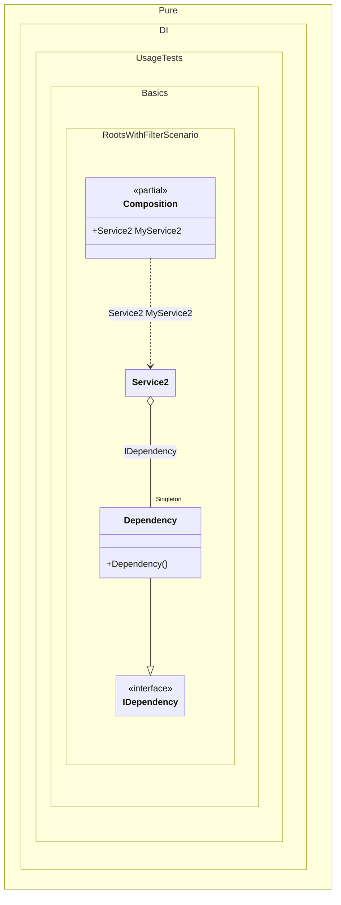

#### Roots with filter

[](../tests/Pure.DI.UsageTests/Basics/RootsWithFilterScenario.cs)


```c#
using Shouldly;
using Pure.DI;

DI.Setup(nameof(Composition))
    .Bind().As(Lifetime.Singleton).To<Dependency>()
    .Roots<IService>("My{type}", filter: "*2");

var composition = new Composition();
composition.MyService2.ShouldBeOfType<Service2>();

interface IDependency;

class Dependency : IDependency;

interface IService;

class Service1(int dependency) : IService;

class Service2(IDependency dependency) : IService;
```

<details>
<summary>Running this code sample locally</summary>

- Make sure you have the [.NET SDK 9.0](https://dotnet.microsoft.com/en-us/download/dotnet/9.0) or later is installed
```bash
dotnet --list-sdk
```
- Create a net9.0 (or later) console application
```bash
dotnet new console -n Sample
```
- Add references to NuGet packages
  - [Pure.DI](https://www.nuget.org/packages/Pure.DI)
  - [Shouldly](https://www.nuget.org/packages/Shouldly)
```bash
dotnet add package Pure.DI
dotnet add package Shouldly
```
- Copy the example code into the _Program.cs_ file

You are ready to run the example 🚀
```bash
dotnet run
```

</details>

The following partial class will be generated:

```c#
partial class Composition
{
  private readonly Composition _root;
  private readonly Lock _lock;

  private Dependency? _singletonDependency43;

  [OrdinalAttribute(256)]
  public Composition()
  {
    _root = this;
    _lock = new Lock();
  }

  internal Composition(Composition parentScope)
  {
    _root = (parentScope ?? throw new ArgumentNullException(nameof(parentScope)))._root;
    _lock = _root._lock;
  }

  public Service2 MyService2
  {
    [MethodImpl(MethodImplOptions.AggressiveInlining)]
    get
    {
      if (_root._singletonDependency43 is null)
      {
        using (_lock.EnterScope())
        {
          if (_root._singletonDependency43 is null)
          {
            _root._singletonDependency43 = new Dependency();
          }
        }
      }

      return new Service2(_root._singletonDependency43);
    }
  }
}
```

Class diagram:



