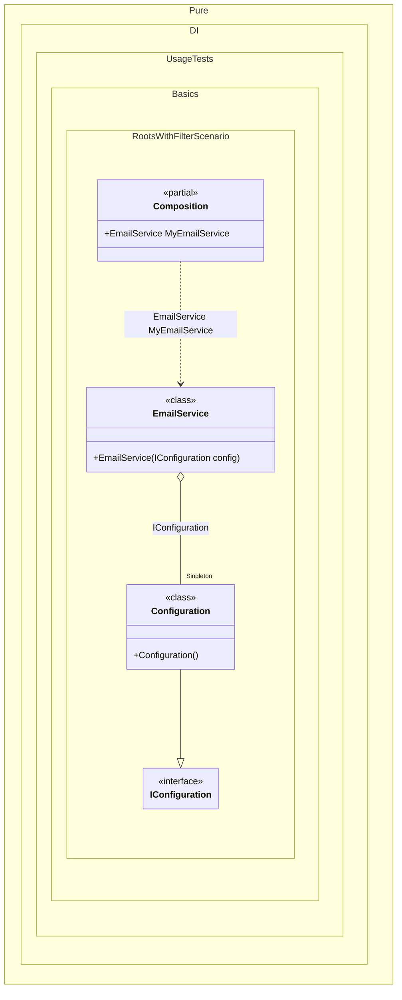

#### Roots with filter

`Roots<T>(name, filter)` creates a composition root for every implementation of `T` whose type name matches a wildcard filter, with `{type}` in the name template replaced by each type's name.
Filtering matters when some implementations should not be exposed: here `filter: "*Email*"` picks up `EmailService` but skips `SmsService`, whose `string apiKey` dependency has no binding and therefore cannot be resolved.


```c#
using Shouldly;
using Pure.DI;

DI.Setup(nameof(Composition))
    .Bind().As(Lifetime.Singleton).To<Configuration>()
    .Roots<INotificationService>("My{type}", filter: "*Email*");

var composition = new Composition();
composition.MyEmailService.ShouldBeOfType<EmailService>();

interface IConfiguration;

class Configuration : IConfiguration;

interface INotificationService;

// This service requires an API key which is not bound,
// so it cannot be resolved and should be filtered out.
class SmsService(string apiKey) : INotificationService;

class EmailService(IConfiguration config) : INotificationService;
```

<details>
<summary>Running this code sample locally</summary>

- Make sure you have the [.NET SDK 10.0](https://dotnet.microsoft.com/en-us/download/dotnet/10.0) or later installed
```bash
dotnet --list-sdk
```
- Create a net10.0 (or later) console application
```bash
dotnet new console -n Sample
```
- Add references to the NuGet packages
  - [Pure.DI](https://www.nuget.org/packages/Pure.DI)
  - [Shouldly](https://www.nuget.org/packages/Shouldly)
```bash
dotnet add package Pure.DI
dotnet add package Shouldly
```
- Copy the example code into the _Program.cs_ file

You are ready to run the example 🚀
```bash
dotnet run
```

</details>

>[!NOTE]
>Filtering roots provides fine-grained control over which implementations are exposed, useful for conditional feature activation.

<details>
<summary>The following partial class will be generated</summary>

```c#
partial class Composition
{
#if NET9_0_OR_GREATER
  private readonly Lock _lock = new Lock();
#else
  private readonly Object _lock = new Object();
#endif

  private Configuration? _singletonCompositionInOtherProject;

  public EmailService MyEmailService
  {
    [MethodImpl(MethodImplOptions.AggressiveInlining)]
    get
    {
      if (_singletonCompositionInOtherProject is null)
        lock (_lock)
          if (_singletonCompositionInOtherProject is null)
          {
            _singletonCompositionInOtherProject = new Configuration();
          }

      return new EmailService(_singletonCompositionInOtherProject);
    }
  }
}
```

</details>

Class diagram:


```mermaid
---
 config:
  class:
   hideEmptyMembersBox: true
---
classDiagram
	Configuration --|> IConfiguration
	Composition ..> EmailService : EmailService MyEmailService
	EmailService o-- "Singleton" Configuration : IConfiguration
	namespace Pure.DI.UsageTests.Basics.RootsWithFilterScenario {
		class Composition {
		<<partial>>
		+EmailService MyEmailService
		}
		class Configuration {
				<<class>>
			+Configuration()
		}
		class EmailService {
				<<class>>
			+EmailService(IConfiguration config)
		}
		class IConfiguration {
			<<interface>>
		}
	}
```

See also:

- [Roots](roots.md)

