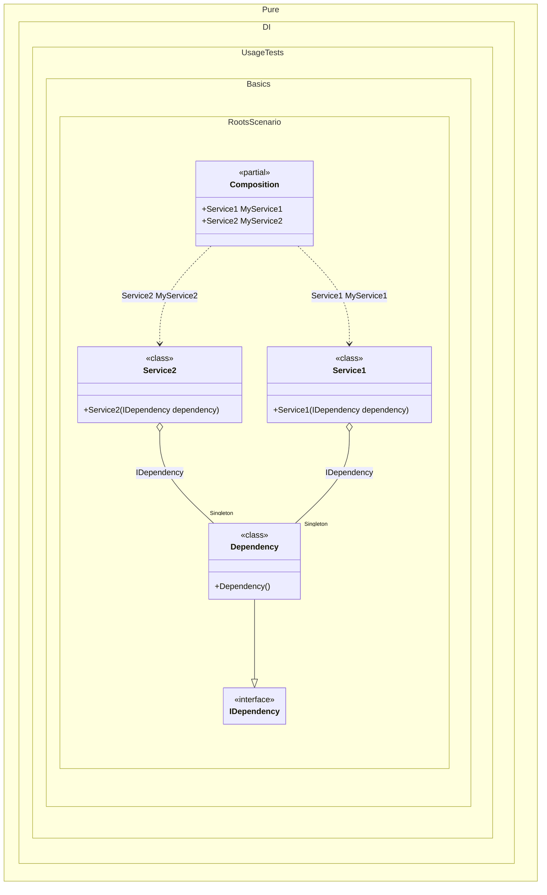

#### Roots

Sometimes you need roots for all types inherited from <see cref="T"/> available at compile time at the point where the method is called.


```c#
using Shouldly;
using Pure.DI;

DI.Setup(nameof(Composition))
    .Bind().As(Lifetime.Singleton).To<Dependency>()
    .Roots<IService>("My{type}");

var composition = new Composition();
composition.MyService1.ShouldBeOfType<Service1>();
composition.MyService2.ShouldBeOfType<Service2>();

interface IDependency;

class Dependency : IDependency;

interface IService;

class Service1(IDependency dependency) : IService;

class Service2(IDependency dependency) : IService;
```

<details>
<summary>Running this code sample locally</summary>

- Make sure you have the [.NET SDK 9.0](https://dotnet.microsoft.com/en-us/download/dotnet/9.0) or later is installed
```bash
dotnet --list-sdk
```
- Create a net9.0 (or later) console application
```bash
dotnet new console -n Sample
```
- Add references to NuGet packages
  - [Pure.DI](https://www.nuget.org/packages/Pure.DI)
  - [Shouldly](https://www.nuget.org/packages/Shouldly)
```bash
dotnet add package Pure.DI
dotnet add package Shouldly
```
- Copy the example code into the _Program.cs_ file

You are ready to run the example 🚀
```bash
dotnet run
```

</details>

The following partial class will be generated:

```c#
partial class Composition
{
  private readonly Composition _root;
#if NET9_0_OR_GREATER
  private readonly Lock _lock;
#else
  private readonly Object _lock;
#endif

  private Dependency? _singleDependency52;

  [OrdinalAttribute(256)]
  public Composition()
  {
    _root = this;
#if NET9_0_OR_GREATER
    _lock = new Lock();
#else
    _lock = new Object();
#endif
  }

  internal Composition(Composition parentScope)
  {
    _root = (parentScope ?? throw new ArgumentNullException(nameof(parentScope)))._root;
    _lock = parentScope._lock;
  }

  public Service2 MyService2
  {
    [MethodImpl(MethodImplOptions.AggressiveInlining)]
    get
    {
      EnsureDependencyExists0();
      void EnsureDependencyExists0()
      {
        if (_root._singleDependency52 is null)
        {
          lock (_lock)
          {
            _root._singleDependency52 = new Dependency();
          }
        }
      }

      return new Service2(_root._singleDependency52);
    }
  }

  public Service1 MyService1
  {
    [MethodImpl(MethodImplOptions.AggressiveInlining)]
    get
    {
      EnsureDependencyExists1();
      void EnsureDependencyExists1()
      {
        if (_root._singleDependency52 is null)
        {
          lock (_lock)
          {
            _root._singleDependency52 = new Dependency();
          }
        }
      }

      return new Service1(_root._singleDependency52);
    }
  }
}
```

Class diagram:



