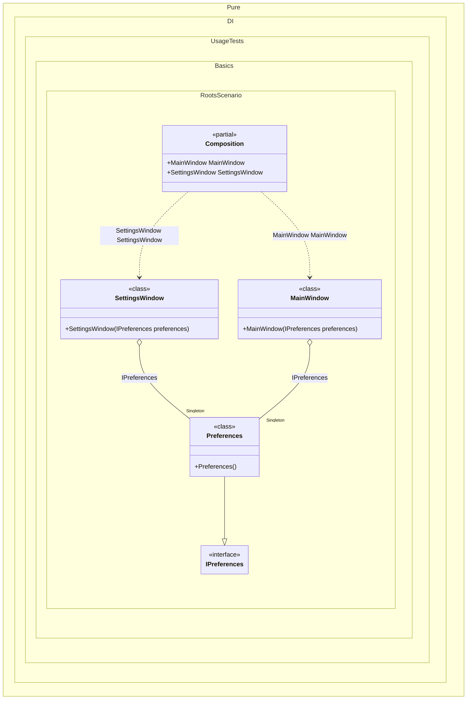

#### Roots

Sometimes you need roots for all types inherited from <see cref="T"/> available at compile time at the point where the method is called.


```c#
using Shouldly;
using Pure.DI;

DI.Setup(nameof(Composition))
    .Bind().As(Lifetime.Singleton).To<Preferences>()
    // Roots can be used to register all descendants of a type as roots.
    .Roots<IWindow>("{type}");

var composition = new Composition();
composition.MainWindow.ShouldBeOfType<MainWindow>();
composition.SettingsWindow.ShouldBeOfType<SettingsWindow>();

interface IPreferences;

class Preferences : IPreferences;

interface IWindow;

class MainWindow(IPreferences preferences) : IWindow;

class SettingsWindow(IPreferences preferences) : IWindow;
```

<details>
<summary>Running this code sample locally</summary>

- Make sure you have the [.NET SDK 10.0](https://dotnet.microsoft.com/en-us/download/dotnet/10.0) or later is installed
```bash
dotnet --list-sdk
```
- Create a net10.0 (or later) console application
```bash
dotnet new console -n Sample
```
- Add references to NuGet packages
  - [Pure.DI](https://www.nuget.org/packages/Pure.DI)
  - [Shouldly](https://www.nuget.org/packages/Shouldly)
```bash
dotnet add package Pure.DI
dotnet add package Shouldly
```
- Copy the example code into the _Program.cs_ file

You are ready to run the example 🚀
```bash
dotnet run
```

</details>

The following partial class will be generated:

```c#
partial class Composition
{
#if NET9_0_OR_GREATER
  private readonly Lock _lock = new Lock();
#else
  private readonly Object _lock = new Object();
#endif

  private Preferences? _singletonPreferences51;

  public SettingsWindow SettingsWindow
  {
    [MethodImpl(MethodImplOptions.AggressiveInlining)]
    get
    {
      EnsurePreferencesExists();
      return new SettingsWindow(_singletonPreferences51);
      [MethodImpl(MethodImplOptions.AggressiveInlining)]
      void EnsurePreferencesExists()
      {
        if (_singletonPreferences51 is null)
          lock (_lock)
            if (_singletonPreferences51 is null)
            {
              _singletonPreferences51 = new Preferences();
            }
      }
    }
  }

  public MainWindow MainWindow
  {
    [MethodImpl(MethodImplOptions.AggressiveInlining)]
    get
    {
      EnsurePreferencesExists();
      return new MainWindow(_singletonPreferences51);
      [MethodImpl(MethodImplOptions.AggressiveInlining)]
      void EnsurePreferencesExists()
      {
        if (_singletonPreferences51 is null)
          lock (_lock)
            if (_singletonPreferences51 is null)
            {
              _singletonPreferences51 = new Preferences();
            }
      }
    }
  }
}
```

Class diagram:



