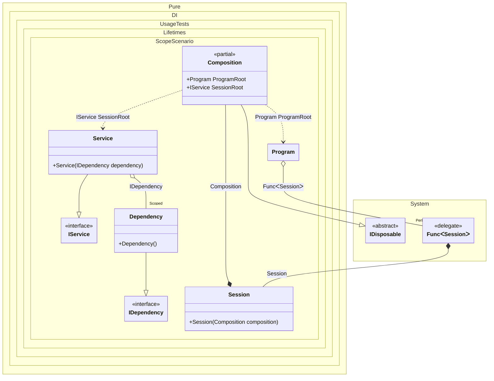

#### Scope

[](../tests/Pure.DI.UsageTests/Lifetimes/ScopeScenario.cs)

The _Scoped_ lifetime ensures that there will be a single instance of the dependency for each scope.


```c#
using Shouldly;
using Pure.DI;
using static Pure.DI.Lifetime;

var composition = new Composition();
var program = composition.ProgramRoot;

// Creates session #1
var session1 = program.CreateSession();
var dependency1 = session1.SessionRoot.Dependency;
var dependency12 = session1.SessionRoot.Dependency;

// Checks the identity of scoped instances in the same session
dependency1.ShouldBe(dependency12);

// Creates session #2
var session2 = program.CreateSession();
var dependency2 = session2.SessionRoot.Dependency;

// Checks that the scoped instances are not identical in different sessions
dependency1.ShouldNotBe(dependency2);

// Disposes of session #1
session1.Dispose();
// Checks that the scoped instance is finalized
dependency1.IsDisposed.ShouldBeTrue();

// Disposes of session #2
session2.Dispose();
// Checks that the scoped instance is finalized
dependency2.IsDisposed.ShouldBeTrue();

interface IDependency
{
    bool IsDisposed { get; }
}

class Dependency : IDependency, IDisposable
{
    public bool IsDisposed { get; private set; }

    public void Dispose() => IsDisposed = true;
}

interface IService
{
    IDependency Dependency { get; }
}

class Service(IDependency dependency) : IService
{
    public IDependency Dependency => dependency;
}

// Implements a session
class Session(Composition composition) : Composition(composition);

partial class Program(Func<Session> sessionFactory)
{
    public Session CreateSession() => sessionFactory();
}

partial class Composition
{
    static void Setup() =>
        DI.Setup()
            // This hint indicates to not generate methods such as Resolve
            .Hint(Hint.Resolve, "Off")
            .Bind().As(Scoped).To<Dependency>()
            .Bind().To<Service>()

            // Session composition root
            .Root<IService>("SessionRoot")

            // Program composition root
            .Root<Program>("ProgramRoot");
}
```

<details>
<summary>Running this code sample locally</summary>

- Make sure you have the [.NET SDK 9.0](https://dotnet.microsoft.com/en-us/download/dotnet/9.0) or later is installed
- Create a net9.0 (or later) console application
- Add references to NuGet packages
  - [Pure.DI](https://www.nuget.org/packages/Pure.DI)
  - [Shouldly](https://www.nuget.org/packages/Shouldly)
- Copy the example code into the _Program.cs_ file

You are ready to run the example!

</details>


Class diagram:



