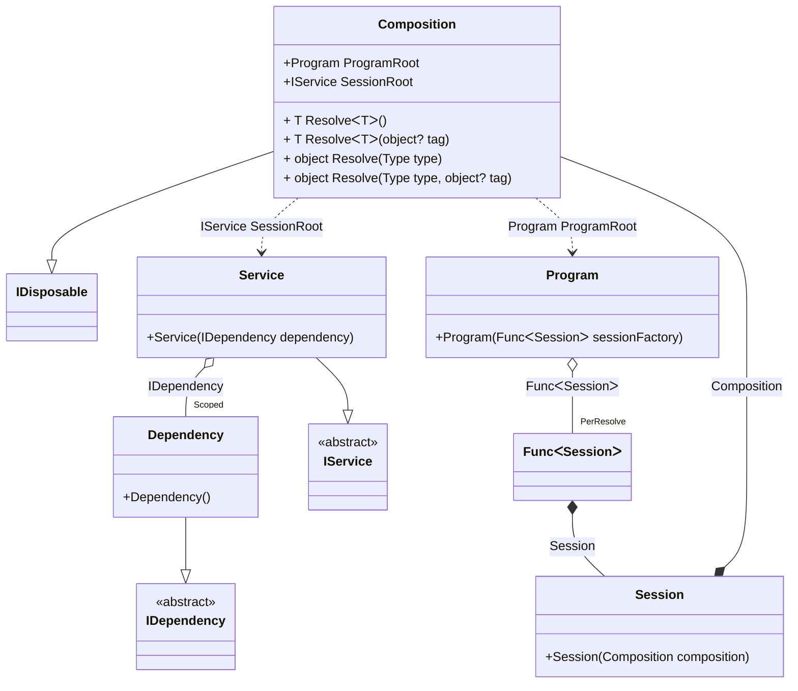

#### Scope

[](../tests/Pure.DI.UsageTests/Lifetimes/ScopeScenario.cs)

The _Scoped_ lifetime ensures that there will be a single instance of the dependency for each scope.

```c#
interface IDependency
{
    bool IsDisposed { get; }
}

class Dependency : IDependency, IDisposable
{
    public bool IsDisposed { get; private set; }

    public void Dispose() => IsDisposed = true;
}

interface IService
{
    IDependency Dependency { get; }
}

class Service(IDependency dependency) : IService
{
    public IDependency Dependency => dependency;
}

// Implements a session
class Session(Composition composition) : Composition(composition);

class Program(Func<Session> sessionFactory)
{
    public Session CreateSession() => sessionFactory();
}

partial class Composition
{
    private static void Setup() =>
        DI.Setup(nameof(Composition))
            .Bind<IDependency>().As(Scoped).To<Dependency>()
            .Bind<IService>().To<Service>()
            // Session composition root
            .Root<IService>("SessionRoot")
            // Program composition root
            .Root<Program>("ProgramRoot");
}

var composition = new Composition();
var program = composition.ProgramRoot;
        
// Creates session #1
var session1 = program.CreateSession();
var dependency1 = session1.SessionRoot.Dependency;
var dependency12 = session1.SessionRoot.Dependency;
        
// Checks the identity of scoped instances in the same session
dependency1.ShouldBe(dependency12);
        
// Creates session #2
var session2 = program.CreateSession();
var dependency2 = session2.SessionRoot.Dependency;
        
// Checks that the scoped instances are not identical in different sessions
dependency1.ShouldNotBe(dependency2);
        
// Disposes of session #1
session1.Dispose();
// Checks that the scoped instance is finalized
dependency1.IsDisposed.ShouldBeTrue();
        
// Disposes of session #2
session2.Dispose();
// Checks that the scoped instance is finalized
dependency2.IsDisposed.ShouldBeTrue();
```

<details open>
<summary>Class Diagram</summary>



</details>

<details>
<summary>Pure.DI-generated partial class Composition</summary><blockquote>

```c#
partial class Composition: global::System.IDisposable
{
  private readonly Composition _rootM03D15di;
  private readonly object _lockM03D15di;
  private readonly global::System.IDisposable[] _disposablesM03D15di;
  private int _disposeIndexM03D15di;
  private Pure.DI.UsageTests.Lifetimes.ScopeScenario.Dependency _scopedM03D15di34_Dependency;
  
  public Composition()
  {
    _rootM03D15di = this;
    _lockM03D15di = new object();
    _disposablesM03D15di = new global::System.IDisposable[1];
  }
  
  internal Composition(Composition baseComposition)
  {
    _rootM03D15di = baseComposition._rootM03D15di;
    _lockM03D15di = _rootM03D15di._lockM03D15di;
    _disposablesM03D15di = new global::System.IDisposable[1];
  }
  
  public Pure.DI.UsageTests.Lifetimes.ScopeScenario.IService SessionRoot
  {
    get
    {
      if (ReferenceEquals(_scopedM03D15di34_Dependency, null))
      {
          lock (_lockM03D15di)
          {
              if (ReferenceEquals(_scopedM03D15di34_Dependency, null))
              {
                  _scopedM03D15di34_Dependency = new Pure.DI.UsageTests.Lifetimes.ScopeScenario.Dependency();
                  _disposablesM03D15di[_disposeIndexM03D15di++] = _scopedM03D15di34_Dependency;
              }
          }
      }
      return new Pure.DI.UsageTests.Lifetimes.ScopeScenario.Service(_scopedM03D15di34_Dependency);
    }
  }
  
  public Pure.DI.UsageTests.Lifetimes.ScopeScenario.Program ProgramRoot
  {
    get
    {
      var perResolveM03D15di40_Func = default(System.Func<Pure.DI.UsageTests.Lifetimes.ScopeScenario.Session>);
      perResolveM03D15di40_Func = new global::System.Func<Pure.DI.UsageTests.Lifetimes.ScopeScenario.Session>(
      [global::System.Runtime.CompilerServices.MethodImpl((global::System.Runtime.CompilerServices.MethodImplOptions)768)]
      () =>
      {
          var transientM03D15di2_Composition = this;
          var factory_M03D15di1 = new Pure.DI.UsageTests.Lifetimes.ScopeScenario.Session(transientM03D15di2_Composition);
          return factory_M03D15di1;
      });
      return new Pure.DI.UsageTests.Lifetimes.ScopeScenario.Program(perResolveM03D15di40_Func);
    }
  }
  
  public T Resolve<T>()
  {
    return ResolverM03D15di<T>.Value.Resolve(this);
  }
  
  public T Resolve<T>(object? tag)
  {
    return ResolverM03D15di<T>.Value.ResolveByTag(this, tag);
  }
  
  public object Resolve(global::System.Type type)
  {
    var index = (int)(_bucketSizeM03D15di * ((uint)global::System.Runtime.CompilerServices.RuntimeHelpers.GetHashCode(type) % 4));
    var finish = index + _bucketSizeM03D15di;
    do {
      ref var pair = ref _bucketsM03D15di[index];
      if (ReferenceEquals(pair.Key, type))
      {
        return pair.Value.Resolve(this);
      }
    } while (++index < finish);
    
    throw new global::System.InvalidOperationException($"Cannot resolve composition root of type {type}.");
  }
  
  public object Resolve(global::System.Type type, object? tag)
  {
    var index = (int)(_bucketSizeM03D15di * ((uint)global::System.Runtime.CompilerServices.RuntimeHelpers.GetHashCode(type) % 4));
    var finish = index + _bucketSizeM03D15di;
    do {
      ref var pair = ref _bucketsM03D15di[index];
      if (ReferenceEquals(pair.Key, type))
      {
        return pair.Value.ResolveByTag(this, tag);
      }
    } while (++index < finish);
    
    throw new global::System.InvalidOperationException($"Cannot resolve composition root \"{tag}\" of type {type}.");
  }
  
  
  public void Dispose()
  {
    lock (_lockM03D15di)
    {
      while (_disposeIndexM03D15di > 0)
      {
        var disposableInstance = _disposablesM03D15di[--_disposeIndexM03D15di];
        try
        {
          disposableInstance.Dispose();
        }
        catch(Exception exception)
        {
          OnDisposeException(disposableInstance, exception);
        }
      }
      
      _scopedM03D15di34_Dependency = null;
    }
  }
  
  partial void OnDisposeException<T>(T disposableInstance, Exception exception) where T : global::System.IDisposable;
  
  public override string ToString()
  {
    return
      "classDiagram\n" +
        "  class Composition {\n" +
          "    +Program ProgramRoot\n" +
          "    +IService SessionRoot\n" +
          "    + T ResolveᐸTᐳ()\n" +
          "    + T ResolveᐸTᐳ(object? tag)\n" +
          "    + object Resolve(Type type)\n" +
          "    + object Resolve(Type type, object? tag)\n" +
        "  }\n" +
        "  Composition --|> IDisposable\n" +
        "  class Composition\n" +
        "  class Session {\n" +
          "    +Session(Composition composition)\n" +
        "  }\n" +
        "  class Program {\n" +
          "    +Program(FuncᐸSessionᐳ sessionFactory)\n" +
        "  }\n" +
        "  Dependency --|> IDependency : \n" +
        "  class Dependency {\n" +
          "    +Dependency()\n" +
        "  }\n" +
        "  Service --|> IService : \n" +
        "  class Service {\n" +
          "    +Service(IDependency dependency)\n" +
        "  }\n" +
        "  class FuncᐸSessionᐳ\n" +
        "  class IDependency {\n" +
          "    <<abstract>>\n" +
        "  }\n" +
        "  class IService {\n" +
          "    <<abstract>>\n" +
        "  }\n" +
        "  Session *--  Composition : Composition\n" +
        "  Program o--  \"PerResolve\" FuncᐸSessionᐳ : FuncᐸSessionᐳ\n" +
        "  Service o--  \"Scoped\" Dependency : IDependency\n" +
        "  Composition ..> Service : IService SessionRoot\n" +
        "  Composition ..> Program : Program ProgramRoot\n" +
        "  FuncᐸSessionᐳ *--  Session : Session";
  }
  
  private readonly static int _bucketSizeM03D15di;
  private readonly static global::Pure.DI.Pair<global::System.Type, global::Pure.DI.IResolver<Composition, object>>[] _bucketsM03D15di;
  
  static Composition()
  {
    var valResolverM03D15di_0000 = new ResolverM03D15di_0000();
    ResolverM03D15di<Pure.DI.UsageTests.Lifetimes.ScopeScenario.IService>.Value = valResolverM03D15di_0000;
    var valResolverM03D15di_0001 = new ResolverM03D15di_0001();
    ResolverM03D15di<Pure.DI.UsageTests.Lifetimes.ScopeScenario.Program>.Value = valResolverM03D15di_0001;
    _bucketsM03D15di = global::Pure.DI.Buckets<global::System.Type, global::Pure.DI.IResolver<Composition, object>>.Create(
      4,
      out _bucketSizeM03D15di,
      new global::Pure.DI.Pair<global::System.Type, global::Pure.DI.IResolver<Composition, object>>[2]
      {
         new global::Pure.DI.Pair<global::System.Type, global::Pure.DI.IResolver<Composition, object>>(typeof(Pure.DI.UsageTests.Lifetimes.ScopeScenario.IService), valResolverM03D15di_0000)
        ,new global::Pure.DI.Pair<global::System.Type, global::Pure.DI.IResolver<Composition, object>>(typeof(Pure.DI.UsageTests.Lifetimes.ScopeScenario.Program), valResolverM03D15di_0001)
      });
  }
  
  private sealed class ResolverM03D15di<T>: global::Pure.DI.IResolver<Composition, T>
  {
    public static global::Pure.DI.IResolver<Composition, T> Value = new ResolverM03D15di<T>();
    
    public T Resolve(Composition composite)
    {
      throw new global::System.InvalidOperationException($"Cannot resolve composition root of type {typeof(T)}.");
    }
    
    public T ResolveByTag(Composition composite, object tag)
    {
      throw new global::System.InvalidOperationException($"Cannot resolve composition root \"{tag}\" of type {typeof(T)}.");
    }
  }
  
  private sealed class ResolverM03D15di_0000: global::Pure.DI.IResolver<Composition, Pure.DI.UsageTests.Lifetimes.ScopeScenario.IService>
  {
    public Pure.DI.UsageTests.Lifetimes.ScopeScenario.IService Resolve(Composition composition)
    {
      return composition.SessionRoot;
    }
    
    public Pure.DI.UsageTests.Lifetimes.ScopeScenario.IService ResolveByTag(Composition composition, object tag)
    {
      switch (tag)
      {
        case null:
          return composition.SessionRoot;
      }
      throw new global::System.InvalidOperationException($"Cannot resolve composition root \"{tag}\" of type Pure.DI.UsageTests.Lifetimes.ScopeScenario.IService.");
    }
  }
  
  private sealed class ResolverM03D15di_0001: global::Pure.DI.IResolver<Composition, Pure.DI.UsageTests.Lifetimes.ScopeScenario.Program>
  {
    public Pure.DI.UsageTests.Lifetimes.ScopeScenario.Program Resolve(Composition composition)
    {
      return composition.ProgramRoot;
    }
    
    public Pure.DI.UsageTests.Lifetimes.ScopeScenario.Program ResolveByTag(Composition composition, object tag)
    {
      switch (tag)
      {
        case null:
          return composition.ProgramRoot;
      }
      throw new global::System.InvalidOperationException($"Cannot resolve composition root \"{tag}\" of type Pure.DI.UsageTests.Lifetimes.ScopeScenario.Program.");
    }
  }
}
```

</blockquote></details>

