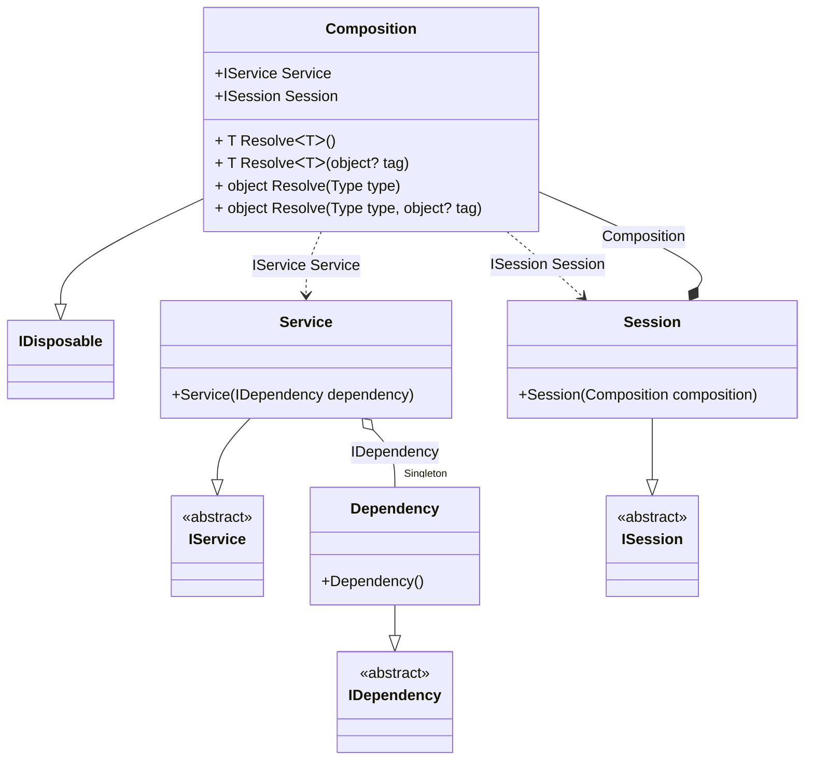

#### Scope

[](../tests/Pure.DI.UsageTests/Lifetimes/ScopeScenario.cs)

A _scope_ scenario can be easily implemented with singleton instances and child composition:

```c#
interface IDependency
{
    bool IsDisposed { get; }
}

class Dependency : IDependency, IDisposable
{
    public bool IsDisposed { get; private set; }

    public void Dispose() => IsDisposed = true;
}

interface IService
{
    public IDependency Dependency { get; }
}

class Service : IService
{
    public Service(IDependency dependency) =>
        Dependency = dependency;

    public IDependency Dependency { get; }
}

interface ISession: IDisposable
{
    IService Service { get; }
}

class Session : ISession
{
    private readonly Composition _composition;

    // To make a composition type injectable, don't forget to create a partial class for composition
    public Session(Composition composition)
    {
        // Creates child container that represents a "scope" for this session
        _composition = new Composition(composition);

        // You must be careful not to use the "Service" root before the session is created
        // otherwise one instance will be shared across all sessions
        Service = _composition.Service;
    }

    public IService Service { get; }

    public void Dispose() => _composition.Dispose();
}

partial class Composition
{
}

DI.Setup("Composition")
    // In a fact it is "scoped" singleton here
    .Bind<IDependency>().As(Lifetime.Singleton).To<Dependency>()
    .Bind<IService>().To<Service>().Root<IService>("Service")
    .Bind<ISession>().To<Session>().Root<ISession>("Session");

using var composition = new Composition();
        
var session1 = composition.Session;
session1.Service.Dependency.ShouldBe(session1.Service.Dependency);
        
using var session2 = composition.Session;
session1.Service.Dependency.ShouldNotBe(session2.Service.Dependency);
        
session1.Dispose();
session1.Service.Dependency.IsDisposed.ShouldBeTrue();
session2.Service.Dependency.IsDisposed.ShouldBeFalse();
```

<details open>
<summary>Class Diagram</summary>



</details>

<details>
<summary>Pure.DI-generated partial class Composition</summary><blockquote>

```c#
partial class Composition: System.IDisposable
{
  private readonly System.IDisposable[] _disposableSingletonsM09D25di;
  private int _disposeIndexM09D25di;
  private Pure.DI.UsageTests.Lifetimes.ScopeScenario.Dependency _singletonM09D25di21;
  
  public Composition()
  {
    _disposableSingletonsM09D25di = new System.IDisposable[1];
  }
  
  internal Composition(Composition parent)
  {
    lock (parent._disposableSingletonsM09D25di)
    {
      _disposableSingletonsM09D25di = new System.IDisposable[1 - parent._disposeIndexM09D25di];
      _singletonM09D25di21 = parent._singletonM09D25di21;
    }
  }
  
  #region Composition Roots
  public Pure.DI.UsageTests.Lifetimes.ScopeScenario.IService Service
  {
    [global::System.Runtime.CompilerServices.MethodImpl((global::System.Runtime.CompilerServices.MethodImplOptions)0x300)]
    get
    {
      if (global::System.Object.ReferenceEquals(_singletonM09D25di21, null))
      {
          lock (_disposableSingletonsM09D25di)
          {
              if (global::System.Object.ReferenceEquals(_singletonM09D25di21, null))
              {
                  _singletonM09D25di21 = new Pure.DI.UsageTests.Lifetimes.ScopeScenario.Dependency();
                  _disposableSingletonsM09D25di[_disposeIndexM09D25di++] = _singletonM09D25di21;
              }
          }
      }
      var transientM09D25di133 = new Pure.DI.UsageTests.Lifetimes.ScopeScenario.Service(_singletonM09D25di21);
      return transientM09D25di133;
    }
  }
  
  public Pure.DI.UsageTests.Lifetimes.ScopeScenario.ISession Session
  {
    [global::System.Runtime.CompilerServices.MethodImpl((global::System.Runtime.CompilerServices.MethodImplOptions)0x300)]
    get
    {
      var transientM09D25di135 = this;
      var transientM09D25di134 = new Pure.DI.UsageTests.Lifetimes.ScopeScenario.Session(transientM09D25di135);
      return transientM09D25di134;
    }
  }
  #endregion
  
  #region API
  #if NETSTANDARD2_0_OR_GREATER || NETCOREAPP || NET40_OR_GREATER
  [global::System.Diagnostics.Contracts.Pure]
  #endif
  [global::System.Runtime.CompilerServices.MethodImpl((global::System.Runtime.CompilerServices.MethodImplOptions)0x300)]
  public T Resolve<T>()
  {
    return ResolverM09D25di<T>.Value.Resolve(this);
  }
  
  #if NETSTANDARD2_0_OR_GREATER || NETCOREAPP || NET40_OR_GREATER
  [global::System.Diagnostics.Contracts.Pure]
  #endif
  [global::System.Runtime.CompilerServices.MethodImpl((global::System.Runtime.CompilerServices.MethodImplOptions)0x300)]
  public T Resolve<T>(object? tag)
  {
    return ResolverM09D25di<T>.Value.ResolveByTag(this, tag);
  }
  
  #if NETSTANDARD2_0_OR_GREATER || NETCOREAPP || NET40_OR_GREATER
  [global::System.Diagnostics.Contracts.Pure]
  #endif
  [global::System.Runtime.CompilerServices.MethodImpl((global::System.Runtime.CompilerServices.MethodImplOptions)0x300)]
  public object Resolve(global::System.Type type)
  {
    var index = (int)(_bucketSizeM09D25di * ((uint)global::System.Runtime.CompilerServices.RuntimeHelpers.GetHashCode(type) % 4));
    var finish = index + _bucketSizeM09D25di;
    do {
      ref var pair = ref _bucketsM09D25di[index];
      if (ReferenceEquals(pair.Key, type))
      {
        return pair.Value.Resolve(this);
      }
    } while (++index < finish);
    
    throw new global::System.InvalidOperationException($"Cannot resolve composition root of type {type}.");
  }
  
  #if NETSTANDARD2_0_OR_GREATER || NETCOREAPP || NET40_OR_GREATER
  [global::System.Diagnostics.Contracts.Pure]
  #endif
  [global::System.Runtime.CompilerServices.MethodImpl((global::System.Runtime.CompilerServices.MethodImplOptions)0x300)]
  public object Resolve(global::System.Type type, object? tag)
  {
    var index = (int)(_bucketSizeM09D25di * ((uint)global::System.Runtime.CompilerServices.RuntimeHelpers.GetHashCode(type) % 4));
    var finish = index + _bucketSizeM09D25di;
    do {
      ref var pair = ref _bucketsM09D25di[index];
      if (ReferenceEquals(pair.Key, type))
      {
        return pair.Value.ResolveByTag(this, tag);
      }
    } while (++index < finish);
    
    throw new global::System.InvalidOperationException($"Cannot resolve composition root \"{tag}\" of type {type}.");
  }
  #endregion
  
  public void Dispose()
  {
    lock (_disposableSingletonsM09D25di)
    {
      while (_disposeIndexM09D25di > 0)
      {
        try
        {
          _disposableSingletonsM09D25di[--_disposeIndexM09D25di].Dispose();
        }
        catch
        {
          // ignored
        }
      }
      
      _singletonM09D25di21 = null;
    }
  }
  
  public override string ToString()
  {
    return
      "classDiagram\n" +
        "  class Composition {\n" +
          "    +IService Service\n" +
          "    +ISession Session\n" +
          "    + T ResolveᐸTᐳ()\n" +
          "    + T ResolveᐸTᐳ(object? tag)\n" +
          "    + object Resolve(Type type)\n" +
          "    + object Resolve(Type type, object? tag)\n" +
        "  }\n" +
        "  Composition --|> IDisposable\n" +
        "  class Composition\n" +
        "  Service --|> IService : \n" +
        "  class Service {\n" +
          "    +Service(IDependency dependency)\n" +
        "  }\n" +
        "  Session --|> ISession : \n" +
        "  class Session {\n" +
          "    +Session(Composition composition)\n" +
        "  }\n" +
        "  Dependency --|> IDependency : \n" +
        "  class Dependency {\n" +
          "    +Dependency()\n" +
        "  }\n" +
        "  class IService {\n" +
          "    <<abstract>>\n" +
        "  }\n" +
        "  class ISession {\n" +
          "    <<abstract>>\n" +
        "  }\n" +
        "  class IDependency {\n" +
          "    <<abstract>>\n" +
        "  }\n" +
        "  Service o--  \"Singleton\" Dependency : IDependency\n" +
        "  Session *--  Composition : Composition\n" +
        "  Composition ..> Service : IService Service\n" +
        "  Composition ..> Session : ISession Session";
  }
  
  private readonly static int _bucketSizeM09D25di;
  private readonly static global::Pure.DI.Pair<global::System.Type, global::Pure.DI.IResolver<Composition, object>>[] _bucketsM09D25di;
  
  static Composition()
  {
    var valResolverM09D25di_0000 = new ResolverM09D25di_0000();
    ResolverM09D25di<Pure.DI.UsageTests.Lifetimes.ScopeScenario.IService>.Value = valResolverM09D25di_0000;
    var valResolverM09D25di_0001 = new ResolverM09D25di_0001();
    ResolverM09D25di<Pure.DI.UsageTests.Lifetimes.ScopeScenario.ISession>.Value = valResolverM09D25di_0001;
    _bucketsM09D25di = global::Pure.DI.Buckets<global::System.Type, global::Pure.DI.IResolver<Composition, object>>.Create(
      4,
      out _bucketSizeM09D25di,
      new global::Pure.DI.Pair<global::System.Type, global::Pure.DI.IResolver<Composition, object>>[2]
      {
         new global::Pure.DI.Pair<global::System.Type, global::Pure.DI.IResolver<Composition, object>>(typeof(Pure.DI.UsageTests.Lifetimes.ScopeScenario.IService), valResolverM09D25di_0000)
        ,new global::Pure.DI.Pair<global::System.Type, global::Pure.DI.IResolver<Composition, object>>(typeof(Pure.DI.UsageTests.Lifetimes.ScopeScenario.ISession), valResolverM09D25di_0001)
      });
  }
  
  #region Resolvers
  private sealed class ResolverM09D25di<T>: global::Pure.DI.IResolver<Composition, T>
  {
    public static global::Pure.DI.IResolver<Composition, T> Value = new ResolverM09D25di<T>();
    
    public T Resolve(Composition composite)
    {
      throw new global::System.InvalidOperationException($"Cannot resolve composition root of type {typeof(T)}.");
    }
    
    public T ResolveByTag(Composition composite, object tag)
    {
      throw new global::System.InvalidOperationException($"Cannot resolve composition root \"{tag}\" of type {typeof(T)}.");
    }
  }
  
  private sealed class ResolverM09D25di_0000: global::Pure.DI.IResolver<Composition, Pure.DI.UsageTests.Lifetimes.ScopeScenario.IService>
  {
    [global::System.Runtime.CompilerServices.MethodImpl((global::System.Runtime.CompilerServices.MethodImplOptions)0x300)]
    public Pure.DI.UsageTests.Lifetimes.ScopeScenario.IService Resolve(Composition composition)
    {
      return composition.Service;
    }
    
    [global::System.Runtime.CompilerServices.MethodImpl((global::System.Runtime.CompilerServices.MethodImplOptions)0x300)]
    public Pure.DI.UsageTests.Lifetimes.ScopeScenario.IService ResolveByTag(Composition composition, object tag)
    {
      if (Equals(tag, null)) return composition.Service;
      throw new global::System.InvalidOperationException($"Cannot resolve composition root \"{tag}\" of type Pure.DI.UsageTests.Lifetimes.ScopeScenario.IService.");
    }
  }
  
  private sealed class ResolverM09D25di_0001: global::Pure.DI.IResolver<Composition, Pure.DI.UsageTests.Lifetimes.ScopeScenario.ISession>
  {
    [global::System.Runtime.CompilerServices.MethodImpl((global::System.Runtime.CompilerServices.MethodImplOptions)0x300)]
    public Pure.DI.UsageTests.Lifetimes.ScopeScenario.ISession Resolve(Composition composition)
    {
      return composition.Session;
    }
    
    [global::System.Runtime.CompilerServices.MethodImpl((global::System.Runtime.CompilerServices.MethodImplOptions)0x300)]
    public Pure.DI.UsageTests.Lifetimes.ScopeScenario.ISession ResolveByTag(Composition composition, object tag)
    {
      if (Equals(tag, null)) return composition.Session;
      throw new global::System.InvalidOperationException($"Cannot resolve composition root \"{tag}\" of type Pure.DI.UsageTests.Lifetimes.ScopeScenario.ISession.");
    }
  }
  #endregion
}
```

</blockquote></details>

