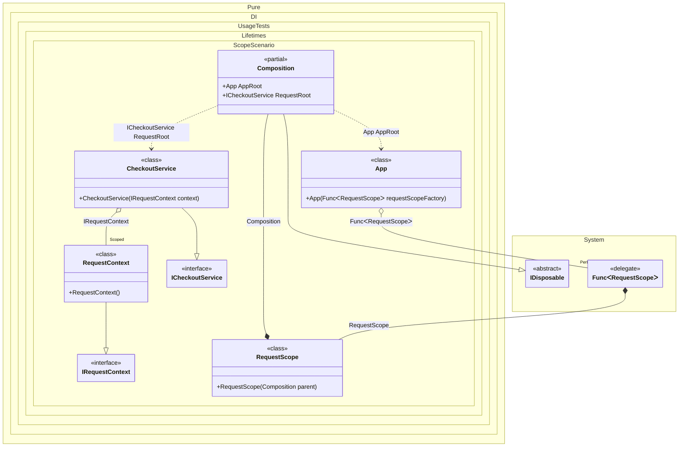

#### Scope

The _Scoped_ lifetime ensures that there will be a single instance of the dependency for each scope.


```c#
using Shouldly;
using Pure.DI;
using static Pure.DI.Lifetime;

var composition = new Composition();
var app = composition.AppRoot;

// Real-world analogy:
// each HTTP request (or message consumer handling) creates its own scope.
// Scoped services live exactly as long as the request is being processed.

// Request #1
var request1 = app.CreateRequestScope();
var checkout1 = request1.RequestRoot;

var ctx11 = checkout1.Context;
var ctx12 = checkout1.Context;

// Same request => same scoped instance
ctx11.ShouldBe(ctx12);

// Request #2
var request2 = app.CreateRequestScope();
var checkout2 = request2.RequestRoot;

var ctx2 = checkout2.Context;

// Different request => different scoped instance
ctx11.ShouldNotBe(ctx2);

// End of Request #1 => scoped instance is disposed
request1.Dispose();
ctx11.IsDisposed.ShouldBeTrue();

// End of Request #2 => scoped instance is disposed
request2.Dispose();
ctx2.IsDisposed.ShouldBeTrue();

interface IRequestContext
{
    Guid CorrelationId { get; }

    bool IsDisposed { get; }
}

// Typically: DbContext / UnitOfWork / RequestTelemetry / Activity, etc.
sealed class RequestContext : IRequestContext, IDisposable
{
    public Guid CorrelationId { get; } = Guid.NewGuid();

    public bool IsDisposed { get; private set; }

    public void Dispose() => IsDisposed = true;
}

interface ICheckoutService
{
    IRequestContext Context { get; }
}

// "Controller/service" that participates in request processing.
// It depends on a scoped context (per-request resource).
sealed class CheckoutService(IRequestContext context) : ICheckoutService
{
    public IRequestContext Context => context;
}

// Implements a request scope (per-request container)
sealed class RequestScope(Composition parent) : Composition(parent);

partial class App(Func<RequestScope> requestScopeFactory)
{
    // In a web app this would roughly map to: "create scope for request"
    public RequestScope CreateRequestScope() => requestScopeFactory();
}

partial class Composition
{
    static void Setup() =>

        DI.Setup()
            // Per-request lifetime
            .Bind().As(Scoped).To<RequestContext>()

            // Regular service that consumes scoped context
            .Bind().To<CheckoutService>()

            // "Request root" (what your controller/handler resolves)
            .Root<ICheckoutService>("RequestRoot")

            // "Application root" (what creates request scopes)
            .Root<App>("AppRoot");
}
```

<details>
<summary>Running this code sample locally</summary>

- Make sure you have the [.NET SDK 10.0](https://dotnet.microsoft.com/en-us/download/dotnet/10.0) or later is installed
```bash
dotnet --list-sdk
```
- Create a net10.0 (or later) console application
```bash
dotnet new console -n Sample
```
- Add references to NuGet packages
  - [Pure.DI](https://www.nuget.org/packages/Pure.DI)
  - [Shouldly](https://www.nuget.org/packages/Shouldly)
```bash
dotnet add package Pure.DI
dotnet add package Shouldly
```
- Copy the example code into the _Program.cs_ file

You are ready to run the example 🚀
```bash
dotnet run
```

</details>

The following partial class will be generated:

```c#
partial class Composition: IDisposable
{
  private readonly Composition _root;
#if NET9_0_OR_GREATER
  private readonly Lock _lock;
#else
  private readonly Object _lock;
#endif
  private object[] _disposables;
  private int _disposeIndex;

  private RequestContext? _scopedRequestContext51;

  [OrdinalAttribute(256)]
  public Composition()
  {
    _root = this;
#if NET9_0_OR_GREATER
    _lock = new Lock();
#else
    _lock = new Object();
#endif
    _disposables = new object[1];
  }

  internal Composition(Composition parentScope)
  {
    _root = (parentScope ?? throw new ArgumentNullException(nameof(parentScope)))._root;
    _lock = parentScope._lock;
    _disposables = new object[1];
  }

  public ICheckoutService RequestRoot
  {
    [MethodImpl(MethodImplOptions.AggressiveInlining)]
    get
    {
      if (_scopedRequestContext51 is null)
        lock (_lock)
          if (_scopedRequestContext51 is null)
          {
            _scopedRequestContext51 = new RequestContext();
            _disposables[_disposeIndex++] = _scopedRequestContext51;
          }

      return new CheckoutService(_scopedRequestContext51);
    }
  }

  public App AppRoot
  {
    [MethodImpl(MethodImplOptions.AggressiveInlining)]
    get
    {
      Func<RequestScope> transientFunc1 = new Func<RequestScope>(
      [MethodImpl(MethodImplOptions.AggressiveInlining)]
      () =>
      {
        RequestScope localValue33 = new RequestScope(this);
        return localValue33;
      });
      return new App(transientFunc1);
    }
  }

  public void Dispose()
  {
    int disposeIndex;
    object[] disposables;
    lock (_lock)
    {
      disposeIndex = _disposeIndex;
      _disposeIndex = 0;
      disposables = _disposables;
      _disposables = new object[1];
      _scopedRequestContext51 = null;
    }

    while (disposeIndex-- > 0)
    {
      switch (disposables[disposeIndex])
      {
        case IDisposable disposableInstance:
          try
          {
            disposableInstance.Dispose();
          }
          catch (Exception exception)
          {
            OnDisposeException(disposableInstance, exception);
          }
          break;
      }
    }
  }

  partial void OnDisposeException<T>(T disposableInstance, Exception exception) where T : IDisposable;
}
```

Class diagram:



