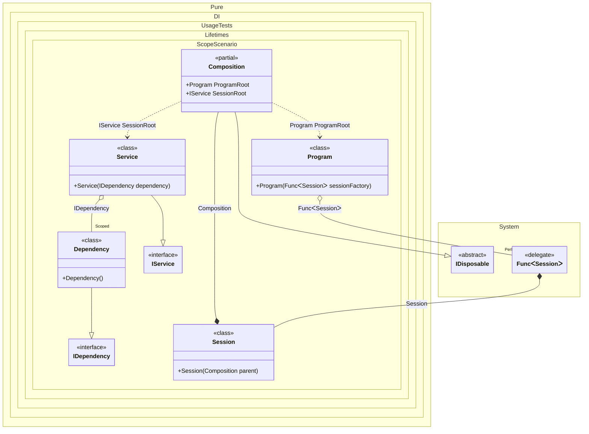

#### Scope

The _Scoped_ lifetime ensures that there will be a single instance of the dependency for each scope.


```c#
using Shouldly;
using Pure.DI;
using static Pure.DI.Lifetime;

var composition = new Composition();
var program = composition.ProgramRoot;

// Creates session #1
var session1 = program.CreateSession();
var dependency1 = session1.SessionRoot.Dependency;
var dependency12 = session1.SessionRoot.Dependency;

// Checks the identity of scoped instances in the same session
dependency1.ShouldBe(dependency12);

// Creates session #2
var session2 = program.CreateSession();
var dependency2 = session2.SessionRoot.Dependency;

// Checks that the scoped instances are not identical in different sessions
dependency1.ShouldNotBe(dependency2);

// Disposes of session #1
session1.Dispose();
// Checks that the scoped instance is finalized
dependency1.IsDisposed.ShouldBeTrue();

// Disposes of session #2
session2.Dispose();
// Checks that the scoped instance is finalized
dependency2.IsDisposed.ShouldBeTrue();

interface IDependency
{
    bool IsDisposed { get; }
}

class Dependency : IDependency, IDisposable
{
    public bool IsDisposed { get; private set; }

    public void Dispose() => IsDisposed = true;
}

interface IService
{
    IDependency Dependency { get; }
}

class Service(IDependency dependency) : IService
{
    public IDependency Dependency => dependency;
}

// Implements a session
class Session(Composition parent) : Composition(parent);

partial class Program(Func<Session> sessionFactory)
{
    public Session CreateSession() => sessionFactory();
}

partial class Composition
{
    static void Setup() =>

        DI.Setup()
            .Bind().As(Scoped).To<Dependency>()
            .Bind().To<Service>()

            // Session composition root
            .Root<IService>("SessionRoot")

            // Composition root
            .Root<Program>("ProgramRoot");
}
```

<details>
<summary>Running this code sample locally</summary>

- Make sure you have the [.NET SDK 9.0](https://dotnet.microsoft.com/en-us/download/dotnet/9.0) or later is installed
```bash
dotnet --list-sdk
```
- Create a net9.0 (or later) console application
```bash
dotnet new console -n Sample
```
- Add references to NuGet packages
  - [Pure.DI](https://www.nuget.org/packages/Pure.DI)
  - [Shouldly](https://www.nuget.org/packages/Shouldly)
```bash
dotnet add package Pure.DI
dotnet add package Shouldly
```
- Copy the example code into the _Program.cs_ file

You are ready to run the example 🚀
```bash
dotnet run
```

</details>

The following partial class will be generated:

```c#
partial class Composition: IDisposable
{
  private readonly Composition _root;
#if NET9_0_OR_GREATER
  private readonly Lock _lock;
#else
  private readonly Object _lock;
#endif
  private object[] _disposables;
  private int _disposeIndex;

  private Dependency? _scopedDependency52;

  [OrdinalAttribute(256)]
  public Composition()
  {
    _root = this;
#if NET9_0_OR_GREATER
    _lock = new Lock();
#else
    _lock = new Object();
#endif
    _disposables = new object[1];
  }

  internal Composition(Composition parentScope)
  {
    _root = (parentScope ?? throw new ArgumentNullException(nameof(parentScope)))._root;
    _lock = parentScope._lock;
    _disposables = new object[1];
  }

  public IService SessionRoot
  {
    [MethodImpl(MethodImplOptions.AggressiveInlining)]
    get
    {
      if (_scopedDependency52 is null)
        lock (_lock)
          if (_scopedDependency52 is null)
          {
            _scopedDependency52 = new Dependency();
            _disposables[_disposeIndex++] = _scopedDependency52;
          }

      return new Service(_scopedDependency52);
    }
  }

  public Program ProgramRoot
  {
    [MethodImpl(MethodImplOptions.AggressiveInlining)]
    get
    {
      Func<Session> blockFunc1 = new Func<Session>(
      [MethodImpl(MethodImplOptions.AggressiveInlining)]
      () =>
      {
        var transComposition3 = this;
        Session localValue32 = new Session(transComposition3);
        return localValue32;
      });
      return new Program(blockFunc1);
    }
  }

  public void Dispose()
  {
    int disposeIndex;
    object[] disposables;
    lock (_lock)
    {
      disposeIndex = _disposeIndex;
      _disposeIndex = 0;
      disposables = _disposables;
      _disposables = new object[1];
      _scopedDependency52 = null;
    }

    while (disposeIndex-- > 0)
    {
      switch (disposables[disposeIndex])
      {
        case IDisposable disposableInstance:
          try
          {
            disposableInstance.Dispose();
          }
          catch (Exception exception)
          {
            OnDisposeException(disposableInstance, exception);
          }
          break;
      }
    }
  }

  partial void OnDisposeException<T>(T disposableInstance, Exception exception) where T : IDisposable;
}
```

Class diagram:



