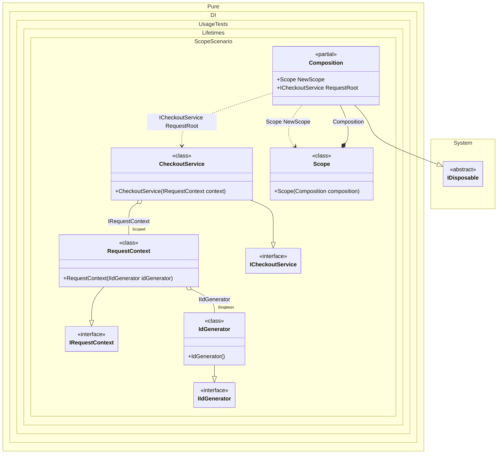

#### Scope


```c#
using Shouldly;
using Pure.DI;
using static Pure.DI.Lifetime;

var composition = new Composition();
IRequestContext ctx1;
IRequestContext ctx2;

// Scope #1
using (var scope1 = composition.NewScope)
{
    var checkout11 = scope1.Checkout;
    var checkout12 = scope1.Checkout;
    ctx1 = checkout11.Context;

    // Same request => same scoped instance
    ctx1.ShouldBe(checkout12.Context);
    ctx1.IsDisposed.ShouldBeFalse();
}

// End of request #1 => scoped instance is disposed
ctx1.IsDisposed.ShouldBeTrue();

// Request #2
using (var scope1 = composition.NewScope)
{
    var checkout2 = scope1.Checkout;
    ctx2 = checkout2.Context;
}

// Different request => different scoped instance
ctx1.ShouldNotBe(ctx2);

// End of request #2 => scoped instance is disposed
ctx2.IsDisposed.ShouldBeTrue();

interface IIdGenerator
{
    Guid Generate();
}

class IdGenerator : IIdGenerator
{
    public Guid Generate() => Guid.NewGuid();
}

interface IRequestContext
{
    Guid CorrelationId { get; }

    bool IsDisposed { get; }
}

// Typically: DbContext / UnitOfWork / RequestTelemetry / Activity, etc.
sealed class RequestContext(IIdGenerator idGenerator)
    : IRequestContext, IDisposable
{
    public Guid CorrelationId { get; } = idGenerator.Generate();

    public bool IsDisposed { get; private set; }

    public void Dispose() => IsDisposed = true;
}

interface ICheckoutService
{
    IRequestContext Context { get; }
}

// "Controller/service" that participates in request processing.
// It depends on a scoped context (per-request resource).
sealed class CheckoutService(IRequestContext context)
    : ICheckoutService
{
    public IRequestContext Context => context;
}

// Represents a scope
class Scope(Composition composition): IDisposable
{
    private readonly Composition _scope = Composition.SetupScope(composition, new Composition());

    public ICheckoutService Checkout => _scope.RequestRoot;

    public void Dispose() => _scope.Dispose();
}

partial class Composition
{
    static void Setup() =>

        DI.Setup()
            .Hint(Hint.ScopeMethodName, "SetupScope")
            // Per-request lifetime
            .Bind().As(Scoped).To<RequestContext>()

            .Bind().As(Singleton).To<IdGenerator>()

            // Regular service that consumes scoped context
            .Bind().To<CheckoutService>()

            // "Request root" (what your controller/handler resolves)
            .Root<ICheckoutService>("RequestRoot")
            .Root<Scope>("NewScope");
}
```

<details>
<summary>Running this code sample locally</summary>

- Make sure you have the [.NET SDK 10.0](https://dotnet.microsoft.com/en-us/download/dotnet/10.0) or later installed
```bash
dotnet --list-sdk
```
- Create a net10.0 (or later) console application
```bash
dotnet new console -n Sample
```
- Add references to the NuGet packages
  - [Pure.DI](https://www.nuget.org/packages/Pure.DI)
  - [Shouldly](https://www.nuget.org/packages/Shouldly)
```bash
dotnet add package Pure.DI
dotnet add package Shouldly
```
- Copy the example code into the _Program.cs_ file

You are ready to run the example 🚀
```bash
dotnet run
```

</details>

The following partial class will be generated:

```c#
partial class Composition: IDisposable
{
  private Composition _root;
#if NET9_0_OR_GREATER
  private Lock _lock = new Lock();
#else
  private Object _lock = new Object();
#endif
  private object[] _disposables = new object[1];
  private int _disposeIndex;

  private RequestContext? _scopedRequestContext62;
  private IdGenerator? _singletonIdGenerator63;

  internal static Composition SetupScope(Composition parentScope, Composition childScope)
  {
    if (Object.ReferenceEquals(parentScope, null)) throw new ArgumentNullException(nameof(parentScope));
    if (Object.ReferenceEquals(childScope, null)) throw new ArgumentNullException(nameof(childScope));
    childScope._root = parentScope._root ?? parentScope;
    childScope._lock = parentScope._lock;
    childScope._disposables = new object[1];
    return childScope;
  }

  public ICheckoutService RequestRoot
  {
    [MethodImpl(MethodImplOptions.AggressiveInlining)]
    get
    {
      var root = _root ?? this;
      if (_scopedRequestContext62 is null)
        lock (_lock)
          if (_scopedRequestContext62 is null)
          {
            if (root._singletonIdGenerator63 is null)
            {
              root._singletonIdGenerator63 = new IdGenerator();
            }

            _scopedRequestContext62 = new RequestContext(root._singletonIdGenerator63);
            _disposables[_disposeIndex++] = _scopedRequestContext62;
          }

      return new CheckoutService(_scopedRequestContext62);
    }
  }

  public Scope NewScope
  {
    [MethodImpl(MethodImplOptions.AggressiveInlining)]
    get
    {
      return new Scope(this);
    }
  }

  public void Dispose()
  {
    int disposeIndex;
    object[] disposables;
    lock (_lock)
    {
      disposeIndex = _disposeIndex;
      _disposeIndex = 0;
      disposables = _disposables;
      _disposables = new object[1];
      _scopedRequestContext62 = null;
      _singletonIdGenerator63 = null;
    }

    while (disposeIndex-- > 0)
    {
      switch (disposables[disposeIndex])
      {
        case IDisposable disposableInstance:
          try
          {
            disposableInstance.Dispose();
          }
          catch (Exception exception)
          {
            OnDisposeException(disposableInstance, exception);
          }
          break;
      }
    }
  }

  partial void OnDisposeException<T>(T disposableInstance, Exception exception) where T : IDisposable;
}
```

Class diagram:


```mermaid
---
 config:
  maxTextSize: 2147483647
  maxEdges: 2147483647
  class:
   hideEmptyMembersBox: true
---
classDiagram
	Composition --|> IDisposable
	RequestContext --|> IRequestContext
	IdGenerator --|> IIdGenerator
	CheckoutService --|> ICheckoutService
	Composition ..> Scope : Scope NewScope
	Composition ..> CheckoutService : ICheckoutService RequestRoot
	RequestContext o-- "Singleton" IdGenerator : IIdGenerator
	CheckoutService o-- "Scoped" RequestContext : IRequestContext
	Scope *--  Composition : Composition
	namespace Pure.DI.UsageTests.Lifetimes.ScopeScenario {
		class CheckoutService {
				<<class>>
			+CheckoutService(IRequestContext context)
		}
		class Composition {
		<<partial>>
		+Scope NewScope
		+ICheckoutService RequestRoot
		}
		class ICheckoutService {
			<<interface>>
		}
		class IdGenerator {
				<<class>>
			+IdGenerator()
		}
		class IIdGenerator {
			<<interface>>
		}
		class IRequestContext {
			<<interface>>
		}
		class RequestContext {
				<<class>>
			+RequestContext(IIdGenerator idGenerator)
		}
		class Scope {
				<<class>>
			+Scope(Composition composition)
		}
	}
	namespace System {
		class IDisposable {
			<<abstract>>
		}
	}
```

