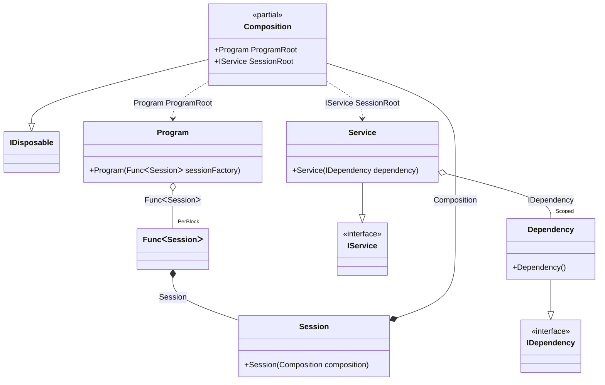

#### Scope

[](../tests/Pure.DI.UsageTests/Lifetimes/ScopeScenario.cs)

The _Scoped_ lifetime ensures that there will be a single instance of the dependency for each scope.


```c#
interface IDependency
{
    bool IsDisposed { get; }
}

class Dependency : IDependency, IDisposable
{
    public bool IsDisposed { get; private set; }

    public void Dispose() => IsDisposed = true;
}

interface IService
{
    IDependency Dependency { get; }
}

class Service(IDependency dependency) : IService
{
    public IDependency Dependency => dependency;
}

// Implements a session
class Session(Composition composition) : Composition(composition);

class Program(Func<Session> sessionFactory)
{
    public Session CreateSession() => sessionFactory();
}

partial class Composition
{
    static void Setup() =>
        DI.Setup()
            // This hint indicates to not generate methods such as Resolve
            .Hint(Hint.Resolve, "Off")
            .Bind().As(Scoped).To<Dependency>()
            .Bind().To<Service>()

            // Session composition root
            .Root<IService>("SessionRoot")

            // Program composition root
            .Root<Program>("ProgramRoot");
}

var composition = new Composition();
var program = composition.ProgramRoot;
        
// Creates session #1
var session1 = program.CreateSession();
var dependency1 = session1.SessionRoot.Dependency;
var dependency12 = session1.SessionRoot.Dependency;
        
// Checks the identity of scoped instances in the same session
dependency1.ShouldBe(dependency12);
        
// Creates session #2
var session2 = program.CreateSession();
var dependency2 = session2.SessionRoot.Dependency;
        
// Checks that the scoped instances are not identical in different sessions
dependency1.ShouldNotBe(dependency2);
        
// Disposes of session #1
session1.Dispose();
// Checks that the scoped instance is finalized
dependency1.IsDisposed.ShouldBeTrue();
        
// Disposes of session #2
session2.Dispose();
// Checks that the scoped instance is finalized
dependency2.IsDisposed.ShouldBeTrue();
```

The following partial class will be generated:

```c#
partial class Composition: IDisposable
{
  private readonly Composition _root;
  private readonly object _lock;
  private object[] _disposables;
  private int _disposeIndex;

  private Dependency? _scopedDependency39;

  [OrdinalAttribute(20)]
  public Composition()
  {
    _root = this;
    _lock = new object();
    _disposables = new object[1];
  }

  internal Composition(Composition parentScope)
  {
    _root = (parentScope ?? throw new ArgumentNullException(nameof(parentScope)))._root;
    _lock = _root._lock;
    _disposables = new object[1];
  }

  public IService SessionRoot
  {
    [MethodImpl(MethodImplOptions.AggressiveInlining)]
    get
    {
      if (_scopedDependency39 == null)
      {
        lock (_lock)
        {
          if (_scopedDependency39 == null)
          {
            _scopedDependency39 = new Dependency();
            _disposables[_disposeIndex++] = _scopedDependency39;
          }
        }
      }

      return new Service(_scopedDependency39!);
    }
  }

  public Program ProgramRoot
  {
    [MethodImpl(MethodImplOptions.AggressiveInlining)]
    get
    {
      var perBlockFunc1 = default(Func<Session> );
      perBlockFunc1 = new Func<Session>([MethodImpl(MethodImplOptions.AggressiveInlining)] () =>
      {
        Composition transientComposition3 = this;
        Session localValue67 = new Session(transientComposition3);
        return localValue67;
      });
      return new Program(perBlockFunc1);
    }
  }

  public void Dispose()
  {
    int disposeIndex;
    object[] disposables;
    lock (_lock)
    {
      disposeIndex = _disposeIndex;
      _disposeIndex = 0;
      disposables = _disposables;
      _disposables = new object[1];
      _scopedDependency39 = null;
    }

    while (disposeIndex-- > 0)
    {
      switch (disposables[disposeIndex])
      {
        case IDisposable disposableInstance:
          try
          {
            disposableInstance.Dispose();
          }
          catch (Exception exception)
          {
            OnDisposeException(disposableInstance, exception);
          }
          break;
      }
    }
  }

  partial void OnDisposeException<T>(T disposableInstance, Exception exception) where T : IDisposable;
}
```

Class diagram:



