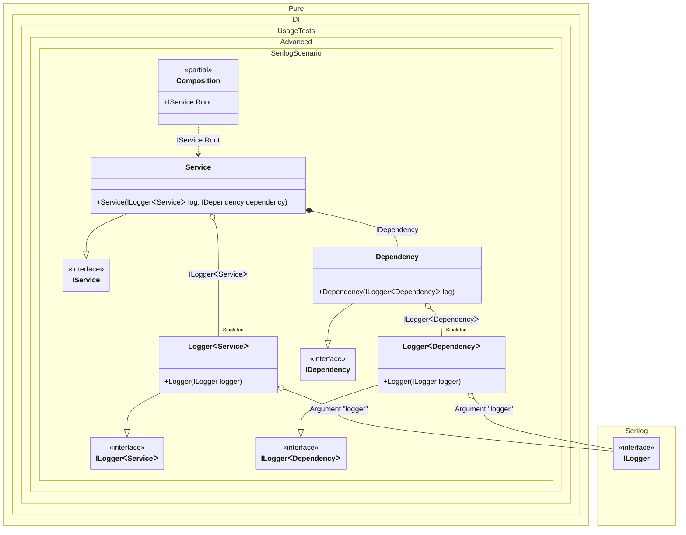

#### Serilog

[](../tests/Pure.DI.UsageTests/Advanced/SerilogScenario.cs)


```c#
interface IDependency;

class Dependency : IDependency
{
    public Dependency(ILogger<Dependency> log)
    {
        log.Information("created");
    }
}

interface IService
{
    IDependency Dependency { get; }
}

class Service : IService
{
    public Service(
        ILogger<Service> log,
        IDependency dependency)
    {
        Dependency = dependency;
        log.Information("created");
    }

    public IDependency Dependency { get; }
}

interface ILogger<T>: Serilog.ILogger;

class Logger<T>(Serilog.ILogger logger) : ILogger<T>
{
    private readonly Serilog.ILogger _logger =
        logger.ForContext(typeof(T));

    public void Write(LogEvent logEvent) =>
        _logger.Write(logEvent);
}

partial class Composition
{
    private void Setup() =>
        DI.Setup(nameof(Composition))

            .Arg<Serilog.ILogger>("logger")
            .Bind().As(Lifetime.Singleton).To<Logger<TT>>()

            .Bind().To<Dependency>()
            .Bind().To<Service>()
            .Root<IService>(nameof(Root));
}

Serilog.ILogger serilogLogger = CreateLogger();
var composition = new Composition(logger: serilogLogger);
var service = composition.Root;
```

The following partial class will be generated:

```c#
partial class Composition
{
  private readonly Composition _root;
  private readonly Lock _lock;

  private Logger<Service>? _singletonLogger47;
  private Logger<Dependency>? _singletonLogger48;

  private readonly Serilog.ILogger _argLogger;

  [OrdinalAttribute(128)]
  public Composition(Serilog.ILogger logger)
  {
    _argLogger = logger ?? throw new ArgumentNullException(nameof(logger));
    _root = this;
    _lock = new Lock();
  }

  internal Composition(Composition parentScope)
  {
    _root = (parentScope ?? throw new ArgumentNullException(nameof(parentScope)))._root;
    _argLogger = _root._argLogger;
    _lock = _root._lock;
  }

  public IService Root
  {
    [MethodImpl(MethodImplOptions.AggressiveInlining)]
    get
    {
      if (_root._singletonLogger48 is null)
      {
        using (_lock.EnterScope())
        {
          if (_root._singletonLogger48 is null)
          {
            _root._singletonLogger48 = new Logger<Dependency>(_argLogger);
          }
        }
      }

      if (_root._singletonLogger47 is null)
      {
        using (_lock.EnterScope())
        {
          if (_root._singletonLogger47 is null)
          {
            _root._singletonLogger47 = new Logger<Service>(_argLogger);
          }
        }
      }

      return new Service(_root._singletonLogger47!, new Dependency(_root._singletonLogger48!));
    }
  }
}
```

Class diagram:



