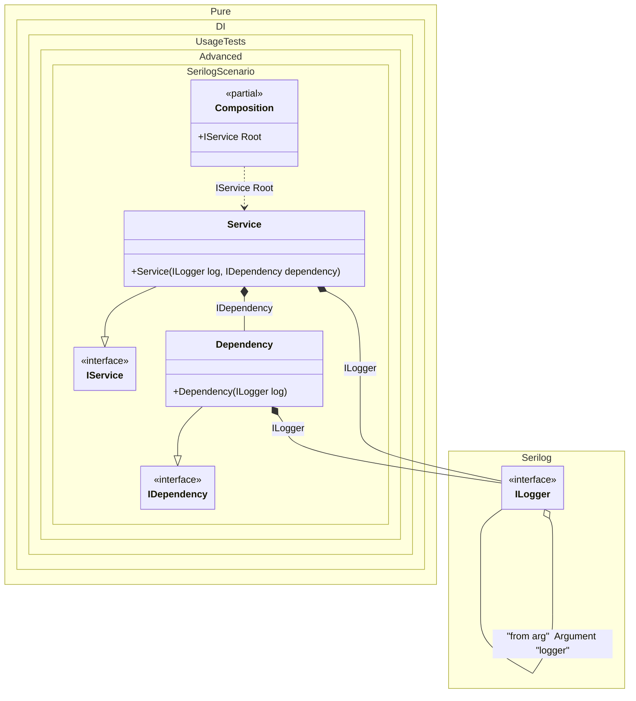

#### Serilog

[](../tests/Pure.DI.UsageTests/Advanced/SerilogScenario.cs)


```c#
interface IDependency;

class Dependency : IDependency
{
    public Dependency(Serilog.ILogger log)
    {
        log.Information("created");
    }
}

interface IService
{
    IDependency Dependency { get; }
}

class Service : IService
{
    public Service(
        Serilog.ILogger log,
        IDependency dependency)
    {
        Dependency = dependency;
        log.Information("created");
    }

    public IDependency Dependency { get; }
}

partial class Composition
{
    private void Setup() =>
        DI.Setup(nameof(Composition))

            .Arg<Serilog.ILogger>("logger", "from arg")
            .Bind().To(ctx =>
            {
                ctx.Inject<Serilog.ILogger>("from arg", out var logger);
                var consumers = ctx.ConsumerTypes;
                return consumers.Length == 1 ? logger.ForContext(consumers[0]) : logger;
            })

            .Bind().To<Dependency>()
            .Bind().To<Service>()
            .Root<IService>(nameof(Root));
}

Serilog.ILogger serilogLogger = CreateLogger();
var composition = new Composition(logger: serilogLogger);
var service = composition.Root;
```

The following partial class will be generated:

```c#
partial class Composition
{
  private readonly Composition _root;

  private readonly Serilog.ILogger _argLogger;

  [OrdinalAttribute(128)]
  public Composition(Serilog.ILogger logger)
  {
    _argLogger = logger ?? throw new ArgumentNullException(nameof(logger));
    _root = this;
  }

  internal Composition(Composition parentScope)
  {
    _root = (parentScope ?? throw new ArgumentNullException(nameof(parentScope)))._root;
    _argLogger = _root._argLogger;
  }

  public IService Root
  {
    [MethodImpl(MethodImplOptions.AggressiveInlining)]
    get
    {
      Serilog.ILogger transientILogger3;
      Serilog.ILogger localLogger11 = _argLogger;
      var localConsumers12= new Type[1]{typeof(Dependency)};
      transientILogger3 = localConsumers12.Length == 1 ? localLogger11.ForContext(localConsumers12[0]) : localLogger11;
      Serilog.ILogger transientILogger1;
      Serilog.ILogger localLogger13 = _argLogger;
      var localConsumers14= new Type[1]{typeof(Service)};
      transientILogger1 = localConsumers14.Length == 1 ? localLogger13.ForContext(localConsumers14[0]) : localLogger13;
      return new Service(transientILogger1, new Dependency(transientILogger3));
    }
  }
}
```

Class diagram:



