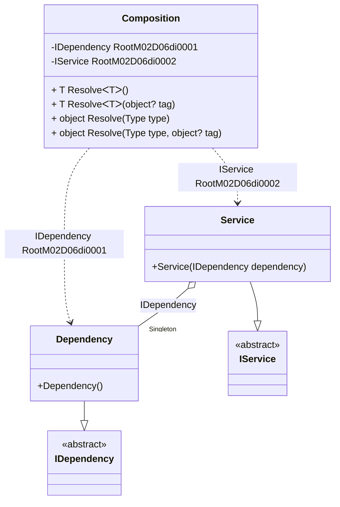

#### Service collection

[](../tests/Pure.DI.UsageTests/BaseClassLibrary/ServiceCollectionScenario.cs)

The `// OnNewRoot = On` hint specifies to create a static method that will be called for each registered composition root. This method can be used, for example, to create an _IServiceCollection_ object:

```c#
interface IDependency;

class Dependency : IDependency;

interface IService
{
    IDependency Dependency { get; }
}

class Service(IDependency dependency) : IService
{
    public IDependency Dependency { get; } = dependency;
}

partial class Composition: ServiceProviderFactory<Composition>
{
    public IServiceCollection ServiceCollection =>
        CreateServiceCollection(this);

    private void Setup() =>
        DI.Setup(nameof(Composition))
            .DependsOn(Base)
            .Bind<IDependency>().As(Lifetime.Singleton).To<Dependency>()
            .Bind<IService>().To<Service>()
            .Root<IDependency>()
            .Root<IService>();
}

var composition = new Composition();
var serviceCollection = composition.ServiceCollection;
var serviceProvider = serviceCollection.BuildServiceProvider();
var service = (IService)serviceProvider.GetService(typeof(IService))!;
var dependency = serviceProvider.GetService(typeof(IDependency));
service.Dependency.ShouldBe(dependency);
```

<details open>
<summary>Class Diagram</summary>



</details>

<details>
<summary>Pure.DI-generated partial class Composition</summary><blockquote>

```c#
partial class Composition
{
  private readonly global::System.IDisposable[] _disposableSingletonsM02D06di;
  private Pure.DI.UsageTests.BCL.ServiceCollectionScenario.Dependency _singletonM02D06di34_Dependency;
  
  public Composition()
  {
    _disposableSingletonsM02D06di = new global::System.IDisposable[0];
  }
  
  internal Composition(Composition parent)
  {
    _disposableSingletonsM02D06di = new global::System.IDisposable[0];
    lock (parent._disposableSingletonsM02D06di)
    {
      _singletonM02D06di34_Dependency = parent._singletonM02D06di34_Dependency;
    }
  }
  
  #region Composition Roots
  public Pure.DI.UsageTests.BCL.ServiceCollectionScenario.IDependency RootM02D06di0001
  {
    #if NETSTANDARD2_0_OR_GREATER || NETCOREAPP || NET40_OR_GREATER || NET
    [global::System.Diagnostics.Contracts.Pure]
    #endif
    get
    {
      if (object.ReferenceEquals(_singletonM02D06di34_Dependency, null))
      {
          lock (_disposableSingletonsM02D06di)
          {
              if (object.ReferenceEquals(_singletonM02D06di34_Dependency, null))
              {
                  _singletonM02D06di34_Dependency = new Pure.DI.UsageTests.BCL.ServiceCollectionScenario.Dependency();
              }
          }
      }
      return _singletonM02D06di34_Dependency;
    }
  }
  
  public Pure.DI.UsageTests.BCL.ServiceCollectionScenario.IService RootM02D06di0002
  {
    #if NETSTANDARD2_0_OR_GREATER || NETCOREAPP || NET40_OR_GREATER || NET
    [global::System.Diagnostics.Contracts.Pure]
    #endif
    get
    {
      if (object.ReferenceEquals(_singletonM02D06di34_Dependency, null))
      {
          lock (_disposableSingletonsM02D06di)
          {
              if (object.ReferenceEquals(_singletonM02D06di34_Dependency, null))
              {
                  _singletonM02D06di34_Dependency = new Pure.DI.UsageTests.BCL.ServiceCollectionScenario.Dependency();
              }
          }
      }
      return new Pure.DI.UsageTests.BCL.ServiceCollectionScenario.Service(_singletonM02D06di34_Dependency);
    }
  }
  #endregion
  
  #region API
  #if NETSTANDARD2_0_OR_GREATER || NETCOREAPP || NET40_OR_GREATER || NET
  [global::System.Diagnostics.Contracts.Pure]
  #endif
  public T Resolve<T>()
  {
    return ResolverM02D06di<T>.Value.Resolve(this);
  }
  
  #if NETSTANDARD2_0_OR_GREATER || NETCOREAPP || NET40_OR_GREATER || NET
  [global::System.Diagnostics.Contracts.Pure]
  #endif
  public T Resolve<T>(object? tag)
  {
    return ResolverM02D06di<T>.Value.ResolveByTag(this, tag);
  }
  
  #if NETSTANDARD2_0_OR_GREATER || NETCOREAPP || NET40_OR_GREATER || NET
  [global::System.Diagnostics.Contracts.Pure]
  #endif
  public object Resolve(global::System.Type type)
  {
    var index = (int)(_bucketSizeM02D06di * ((uint)global::System.Runtime.CompilerServices.RuntimeHelpers.GetHashCode(type) % 4));
    var finish = index + _bucketSizeM02D06di;
    do {
      ref var pair = ref _bucketsM02D06di[index];
      if (ReferenceEquals(pair.Key, type))
      {
        return pair.Value.Resolve(this);
      }
    } while (++index < finish);
    
    throw new global::System.InvalidOperationException($"Cannot resolve composition root of type {type}.");
  }
  
  #if NETSTANDARD2_0_OR_GREATER || NETCOREAPP || NET40_OR_GREATER || NET
  [global::System.Diagnostics.Contracts.Pure]
  #endif
  public object Resolve(global::System.Type type, object? tag)
  {
    var index = (int)(_bucketSizeM02D06di * ((uint)global::System.Runtime.CompilerServices.RuntimeHelpers.GetHashCode(type) % 4));
    var finish = index + _bucketSizeM02D06di;
    do {
      ref var pair = ref _bucketsM02D06di[index];
      if (ReferenceEquals(pair.Key, type))
      {
        return pair.Value.ResolveByTag(this, tag);
      }
    } while (++index < finish);
    
    throw new global::System.InvalidOperationException($"Cannot resolve composition root \"{tag}\" of type {type}.");
  }
  #endregion
  
  public override string ToString()
  {
    return
      "classDiagram\n" +
        "  class Composition {\n" +
          "    -IDependency RootM02D06di0001\n" +
          "    -IService RootM02D06di0002\n" +
          "    + T ResolveᐸTᐳ()\n" +
          "    + T ResolveᐸTᐳ(object? tag)\n" +
          "    + object Resolve(Type type)\n" +
          "    + object Resolve(Type type, object? tag)\n" +
        "  }\n" +
        "  Dependency --|> IDependency : \n" +
        "  class Dependency {\n" +
          "    +Dependency()\n" +
        "  }\n" +
        "  Service --|> IService : \n" +
        "  class Service {\n" +
          "    +Service(IDependency dependency)\n" +
        "  }\n" +
        "  class IDependency {\n" +
          "    <<abstract>>\n" +
        "  }\n" +
        "  class IService {\n" +
          "    <<abstract>>\n" +
        "  }\n" +
        "  Service o--  \"Singleton\" Dependency : IDependency\n" +
        "  Composition ..> Dependency : IDependency RootM02D06di0001\n" +
        "  Composition ..> Service : IService RootM02D06di0002";
  }
  
  private readonly static int _bucketSizeM02D06di;
  private readonly static global::Pure.DI.Pair<global::System.Type, global::Pure.DI.IResolver<Composition, object>>[] _bucketsM02D06di;
  
  static Composition()
  {
    var valResolverM02D06di_0000 = new ResolverM02D06di_0000();
    OnNewRoot<Pure.DI.UsageTests.BCL.ServiceCollectionScenario.IDependency, Pure.DI.UsageTests.BCL.ServiceCollectionScenario.Dependency>(valResolverM02D06di_0000, "RootM02D06di0001", null, Pure.DI.Lifetime.Singleton);
    ResolverM02D06di<Pure.DI.UsageTests.BCL.ServiceCollectionScenario.IDependency>.Value = valResolverM02D06di_0000;
    var valResolverM02D06di_0001 = new ResolverM02D06di_0001();
    OnNewRoot<Pure.DI.UsageTests.BCL.ServiceCollectionScenario.IService, Pure.DI.UsageTests.BCL.ServiceCollectionScenario.Service>(valResolverM02D06di_0001, "RootM02D06di0002", null, Pure.DI.Lifetime.Transient);
    ResolverM02D06di<Pure.DI.UsageTests.BCL.ServiceCollectionScenario.IService>.Value = valResolverM02D06di_0001;
    _bucketsM02D06di = global::Pure.DI.Buckets<global::System.Type, global::Pure.DI.IResolver<Composition, object>>.Create(
      4,
      out _bucketSizeM02D06di,
      new global::Pure.DI.Pair<global::System.Type, global::Pure.DI.IResolver<Composition, object>>[2]
      {
         new global::Pure.DI.Pair<global::System.Type, global::Pure.DI.IResolver<Composition, object>>(typeof(Pure.DI.UsageTests.BCL.ServiceCollectionScenario.IDependency), valResolverM02D06di_0000)
        ,new global::Pure.DI.Pair<global::System.Type, global::Pure.DI.IResolver<Composition, object>>(typeof(Pure.DI.UsageTests.BCL.ServiceCollectionScenario.IService), valResolverM02D06di_0001)
      });
  }
  
  #region Resolvers
  private sealed class ResolverM02D06di<T>: global::Pure.DI.IResolver<Composition, T>
  {
    public static global::Pure.DI.IResolver<Composition, T> Value = new ResolverM02D06di<T>();
    
    public T Resolve(Composition composite)
    {
      throw new global::System.InvalidOperationException($"Cannot resolve composition root of type {typeof(T)}.");
    }
    
    public T ResolveByTag(Composition composite, object tag)
    {
      throw new global::System.InvalidOperationException($"Cannot resolve composition root \"{tag}\" of type {typeof(T)}.");
    }
  }
  
  private sealed class ResolverM02D06di_0000: global::Pure.DI.IResolver<Composition, Pure.DI.UsageTests.BCL.ServiceCollectionScenario.IDependency>
  {
    public Pure.DI.UsageTests.BCL.ServiceCollectionScenario.IDependency Resolve(Composition composition)
    {
      return composition.RootM02D06di0001;
    }
    
    public Pure.DI.UsageTests.BCL.ServiceCollectionScenario.IDependency ResolveByTag(Composition composition, object tag)
    {
      switch (tag)
      {
        case null:
          return composition.RootM02D06di0001;
      }
      throw new global::System.InvalidOperationException($"Cannot resolve composition root \"{tag}\" of type Pure.DI.UsageTests.BCL.ServiceCollectionScenario.IDependency.");
    }
  }
  
  private sealed class ResolverM02D06di_0001: global::Pure.DI.IResolver<Composition, Pure.DI.UsageTests.BCL.ServiceCollectionScenario.IService>
  {
    public Pure.DI.UsageTests.BCL.ServiceCollectionScenario.IService Resolve(Composition composition)
    {
      return composition.RootM02D06di0002;
    }
    
    public Pure.DI.UsageTests.BCL.ServiceCollectionScenario.IService ResolveByTag(Composition composition, object tag)
    {
      switch (tag)
      {
        case null:
          return composition.RootM02D06di0002;
      }
      throw new global::System.InvalidOperationException($"Cannot resolve composition root \"{tag}\" of type Pure.DI.UsageTests.BCL.ServiceCollectionScenario.IService.");
    }
  }
  #endregion
}
```

</blockquote></details>

