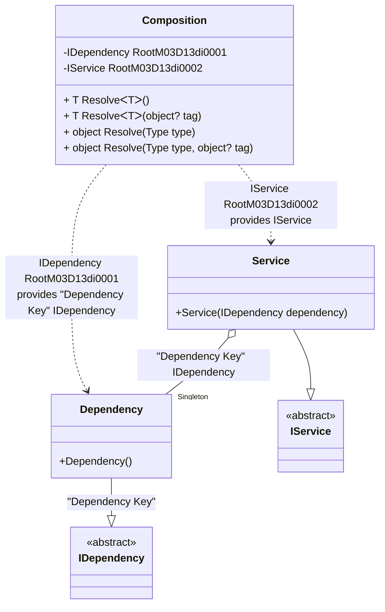

#### Service collection

[](../tests/Pure.DI.UsageTests/BaseClassLibrary/ServiceCollectionScenario.cs)

The `// OnNewRoot = On` hint specifies to create a static method that will be called for each registered composition root. This method can be used, for example, to create an _IServiceCollection_ object:

```c#
interface IDependency;

class Dependency : IDependency;

interface IService
{
    IDependency Dependency { get; }
}

class Service([Tag("Dependency Key")] IDependency dependency) : IService
{
    public IDependency Dependency { get; } = dependency;
}

partial class Composition: ServiceProviderFactory<Composition>
{
    public IServiceCollection ServiceCollection =>
        CreateServiceCollection(this);

    private void Setup() =>
        DI.Setup(nameof(Composition))
            .DependsOn(Base)
            .Bind<IDependency>("Dependency Key").As(Lifetime.Singleton).To<Dependency>()
            .Bind<IService>().To<Service>()
            .Root<IDependency>(tag: "Dependency Key")
            .Root<IService>();
}

var composition = new Composition();
var serviceCollection = composition.ServiceCollection;
var serviceProvider = serviceCollection.BuildServiceProvider();
var service = serviceProvider.GetRequiredService<IService>();
var dependency = serviceProvider.GetRequiredKeyedService<IDependency>("Dependency Key");
service.Dependency.ShouldBe(dependency);
```

<details open>
<summary>Class Diagram</summary>



</details>

<details>
<summary>Pure.DI-generated partial class Composition</summary><blockquote>

```c#
/// <para>
/// <b>Composition roots</b><br/>
/// <list type="table">
/// <listheader>
/// <term>Root</term>
/// <description>Description</description>
/// </listheader>
/// <item>
/// <term>
/// <see cref="Pure.DI.UsageTests.BCL.ServiceCollectionScenario.IDependency"/> is a private composition root that can be resolved by methods like <see cref="Resolve{T}()"/>.<br/>or using <see cref="Resolve{T}(object)"/> method: <c>Resolve&lt;Pure.DI.UsageTests.BCL.ServiceCollectionScenario.IDependency&gt;("Dependency Key")</c>
/// </term>
/// <description>
/// Provides a composition root of type <see cref="Pure.DI.UsageTests.BCL.ServiceCollectionScenario.Dependency"/>.
/// </description>
/// </item>
/// <item>
/// <term>
/// <see cref="Pure.DI.UsageTests.BCL.ServiceCollectionScenario.IService"/> is a private composition root that can be resolved by methods like <see cref="Resolve{T}()"/>.<br/>or using <see cref="Resolve{T}()"/> method: <c>Resolve&lt;Pure.DI.UsageTests.BCL.ServiceCollectionScenario.IService&gt;()</c>
/// </term>
/// <description>
/// Provides a composition root of type <see cref="Pure.DI.UsageTests.BCL.ServiceCollectionScenario.Service"/>.
/// </description>
/// </item>
/// </list>
/// </para>
/// </summary>
/// <a href="https://mermaid.live/view#pako:eNqdVEFugzAQ_Irlc6USOKTNrUAqVVUvSY6-GLxK3QaMjIuEovwhf-ml38lPim0ILiFp2svKrGd3Z2dktjgVDPAMpxtaljGna0kzIkluvlEkskKUXHGRI_LhedNQ3-mTHz_FUEDOIE9rtBBCvXhBPAkY9zxv4qCWICuewhDiHyEhWqEFlGJTwWH_tTrsP036zsT7X2EieYNU6XPwiBRdn5RZQFdri1Z1AUg14R_oCF0eOY31yRHHCtHHaWRK58hV0KQeEMFO7hlqglHvxgDumBH2V2PiWUqdE-f5uAhN5jjZvXDHtnk7012H_eQzYGKbDtfvGweWUUSTUknaSj1v41incX7Xt-nqhasNatxY8ny9ASXyxoir3HK30p2HL8g3821sJD_tefFZmXUSSW5teSFFxRmUY0T-xmPg_PlXe45BV6Fn4RucgcwoZ82PZUuweoUMCJ4RzKh8J3iHd9_eXH6y">Class diagram</a><br/>
/// This class was created by <a href="https://github.com/DevTeam/Pure.DI">Pure.DI</a> source code generator.
/// <seealso cref="Pure.DI.DI.Setup"/>
/// <seealso cref="Pure.DI.IConfiguration.Bind(object[])"/>
/// <seealso cref="Pure.DI.IConfiguration.Bind{T}(object[])"/>
[global::System.Diagnostics.CodeAnalysis.ExcludeFromCodeCoverage]
partial class Composition
{
  private readonly Composition _rootM03D13di;
  private readonly object _lockM03D13di;
  private Pure.DI.UsageTests.BCL.ServiceCollectionScenario.Dependency _singletonM03D13di34_Dependency;
  
  /// <summary>
  /// This constructor creates a new instance of <see cref="Composition"/>.
  /// </summary>
  public Composition()
  {
    _rootM03D13di = this;
    _lockM03D13di = new object();
  }
  
  /// <summary>
  /// This constructor creates a new instance of <see cref="Composition"/> scope based on <paramref name="baseComposition"/>. This allows the <see cref="Lifetime.Scoped"/> life time to be applied.
  /// </summary>
  /// <param name="baseComposition">Base composition.</param>
  internal Composition(Composition baseComposition)
  {
    _rootM03D13di = baseComposition._rootM03D13di;
    _lockM03D13di = _rootM03D13di._lockM03D13di;
  }
  
  #region Composition Roots
  /// <summary>
  /// Provides a composition root of type <see cref="Pure.DI.UsageTests.BCL.ServiceCollectionScenario.Dependency"/>.
  /// </summary>
  public Pure.DI.UsageTests.BCL.ServiceCollectionScenario.IDependency RootM03D13di0001
  {
    #if NETSTANDARD2_0_OR_GREATER || NETCOREAPP || NET40_OR_GREATER || NET
    [global::System.Diagnostics.Contracts.Pure]
    #endif
    get
    {
      if (ReferenceEquals(_rootM03D13di._singletonM03D13di34_Dependency, null))
      {
          lock (_lockM03D13di)
          {
              if (ReferenceEquals(_rootM03D13di._singletonM03D13di34_Dependency, null))
              {
                  _singletonM03D13di34_Dependency = new Pure.DI.UsageTests.BCL.ServiceCollectionScenario.Dependency();
                  _rootM03D13di._singletonM03D13di34_Dependency = _singletonM03D13di34_Dependency;
              }
          }
      }
      return _rootM03D13di._singletonM03D13di34_Dependency;
    }
  }
  
  /// <summary>
  /// Provides a composition root of type <see cref="Pure.DI.UsageTests.BCL.ServiceCollectionScenario.Service"/>.
  /// </summary>
  public Pure.DI.UsageTests.BCL.ServiceCollectionScenario.IService RootM03D13di0002
  {
    #if NETSTANDARD2_0_OR_GREATER || NETCOREAPP || NET40_OR_GREATER || NET
    [global::System.Diagnostics.Contracts.Pure]
    #endif
    get
    {
      if (ReferenceEquals(_rootM03D13di._singletonM03D13di34_Dependency, null))
      {
          lock (_lockM03D13di)
          {
              if (ReferenceEquals(_rootM03D13di._singletonM03D13di34_Dependency, null))
              {
                  _singletonM03D13di34_Dependency = new Pure.DI.UsageTests.BCL.ServiceCollectionScenario.Dependency();
                  _rootM03D13di._singletonM03D13di34_Dependency = _singletonM03D13di34_Dependency;
              }
          }
      }
      return new Pure.DI.UsageTests.BCL.ServiceCollectionScenario.Service(_rootM03D13di._singletonM03D13di34_Dependency);
    }
  }
  #endregion
  
  #region API
  /// <summary>
  /// Resolves the composition root.
  /// </summary>
  /// <typeparam name="T">The type of the composition root.</typeparam>
  /// <returns>A composition root.</returns>
  #if NETSTANDARD2_0_OR_GREATER || NETCOREAPP || NET40_OR_GREATER || NET
  [global::System.Diagnostics.Contracts.Pure]
  #endif
  public T Resolve<T>()
  {
    return ResolverM03D13di<T>.Value.Resolve(this);
  }
  
  /// <summary>
  /// Resolves the composition root by tag.
  /// </summary>
  /// <typeparam name="T">The type of the composition root.</typeparam>
  /// <param name="tag">The tag of a composition root.</param>
  /// <returns>A composition root.</returns>
  #if NETSTANDARD2_0_OR_GREATER || NETCOREAPP || NET40_OR_GREATER || NET
  [global::System.Diagnostics.Contracts.Pure]
  #endif
  public T Resolve<T>(object? tag)
  {
    return ResolverM03D13di<T>.Value.ResolveByTag(this, tag);
  }
  
  /// <summary>
  /// Resolves the composition root.
  /// </summary>
  /// <param name="type">The type of the composition root.</param>
  /// <returns>A composition root.</returns>
  #if NETSTANDARD2_0_OR_GREATER || NETCOREAPP || NET40_OR_GREATER || NET
  [global::System.Diagnostics.Contracts.Pure]
  #endif
  public object Resolve(global::System.Type type)
  {
    var index = (int)(_bucketSizeM03D13di * ((uint)global::System.Runtime.CompilerServices.RuntimeHelpers.GetHashCode(type) % 4));
    var finish = index + _bucketSizeM03D13di;
    do {
      ref var pair = ref _bucketsM03D13di[index];
      if (ReferenceEquals(pair.Key, type))
      {
        return pair.Value.Resolve(this);
      }
    } while (++index < finish);
    
    throw new global::System.InvalidOperationException($"Cannot resolve composition root of type {type}.");
  }
  
  /// <summary>
  /// Resolves the composition root by tag.
  /// </summary>
  /// <param name="type">The type of the composition root.</param>
  /// <param name="tag">The tag of a composition root.</param>
  /// <returns>A composition root.</returns>
  #if NETSTANDARD2_0_OR_GREATER || NETCOREAPP || NET40_OR_GREATER || NET
  [global::System.Diagnostics.Contracts.Pure]
  #endif
  public object Resolve(global::System.Type type, object? tag)
  {
    var index = (int)(_bucketSizeM03D13di * ((uint)global::System.Runtime.CompilerServices.RuntimeHelpers.GetHashCode(type) % 4));
    var finish = index + _bucketSizeM03D13di;
    do {
      ref var pair = ref _bucketsM03D13di[index];
      if (ReferenceEquals(pair.Key, type))
      {
        return pair.Value.ResolveByTag(this, tag);
      }
    } while (++index < finish);
    
    throw new global::System.InvalidOperationException($"Cannot resolve composition root \"{tag}\" of type {type}.");
  }
  #endregion
  
  /// <summary>
  /// This method provides a class diagram in mermaid format. To see this diagram, simply call the method and copy the text to this site https://mermaid.live/.
  /// </summary>
  public override string ToString()
  {
    return
      "classDiagram\n" +
        "  class Composition {\n" +
          "    -IDependency RootM03D13di0001\n" +
          "    -IService RootM03D13di0002\n" +
          "    + T ResolveᐸTᐳ()\n" +
          "    + T ResolveᐸTᐳ(object? tag)\n" +
          "    + object Resolve(Type type)\n" +
          "    + object Resolve(Type type, object? tag)\n" +
        "  }\n" +
        "  Dependency --|> IDependency : \"Dependency Key\" \n" +
        "  class Dependency {\n" +
          "    +Dependency()\n" +
        "  }\n" +
        "  Service --|> IService : \n" +
        "  class Service {\n" +
          "    +Service(IDependency dependency)\n" +
        "  }\n" +
        "  class IDependency {\n" +
          "    <<abstract>>\n" +
        "  }\n" +
        "  class IService {\n" +
          "    <<abstract>>\n" +
        "  }\n" +
        "  Service o--  \"Singleton\" Dependency : \"Dependency Key\"  IDependency\n" +
        "  Composition ..> Dependency : IDependency RootM03D13di0001<br/>provides \"Dependency Key\" IDependency\n" +
        "  Composition ..> Service : IService RootM03D13di0002<br/>provides IService";
  }
  
  private readonly static int _bucketSizeM03D13di;
  private readonly static global::Pure.DI.Pair<global::System.Type, global::Pure.DI.IResolver<Composition, object>>[] _bucketsM03D13di;
  
  static Composition()
  {
    var valResolverM03D13di_0000 = new ResolverM03D13di_0000();
    OnNewRoot<Pure.DI.UsageTests.BCL.ServiceCollectionScenario.IDependency, Pure.DI.UsageTests.BCL.ServiceCollectionScenario.Dependency>(valResolverM03D13di_0000, "RootM03D13di0001", "Dependency Key", Pure.DI.Lifetime.Singleton);
    ResolverM03D13di<Pure.DI.UsageTests.BCL.ServiceCollectionScenario.IDependency>.Value = valResolverM03D13di_0000;
    var valResolverM03D13di_0001 = new ResolverM03D13di_0001();
    OnNewRoot<Pure.DI.UsageTests.BCL.ServiceCollectionScenario.IService, Pure.DI.UsageTests.BCL.ServiceCollectionScenario.Service>(valResolverM03D13di_0001, "RootM03D13di0002", null, Pure.DI.Lifetime.Transient);
    ResolverM03D13di<Pure.DI.UsageTests.BCL.ServiceCollectionScenario.IService>.Value = valResolverM03D13di_0001;
    _bucketsM03D13di = global::Pure.DI.Buckets<global::System.Type, global::Pure.DI.IResolver<Composition, object>>.Create(
      4,
      out _bucketSizeM03D13di,
      new global::Pure.DI.Pair<global::System.Type, global::Pure.DI.IResolver<Composition, object>>[2]
      {
         new global::Pure.DI.Pair<global::System.Type, global::Pure.DI.IResolver<Composition, object>>(typeof(Pure.DI.UsageTests.BCL.ServiceCollectionScenario.IDependency), valResolverM03D13di_0000)
        ,new global::Pure.DI.Pair<global::System.Type, global::Pure.DI.IResolver<Composition, object>>(typeof(Pure.DI.UsageTests.BCL.ServiceCollectionScenario.IService), valResolverM03D13di_0001)
      });
  }
  
  #region Resolvers
  private sealed class ResolverM03D13di<T>: global::Pure.DI.IResolver<Composition, T>
  {
    public static global::Pure.DI.IResolver<Composition, T> Value = new ResolverM03D13di<T>();
    
    public T Resolve(Composition composite)
    {
      throw new global::System.InvalidOperationException($"Cannot resolve composition root of type {typeof(T)}.");
    }
    
    public T ResolveByTag(Composition composite, object tag)
    {
      throw new global::System.InvalidOperationException($"Cannot resolve composition root \"{tag}\" of type {typeof(T)}.");
    }
  }
  
  private sealed class ResolverM03D13di_0000: global::Pure.DI.IResolver<Composition, Pure.DI.UsageTests.BCL.ServiceCollectionScenario.IDependency>
  {
    public Pure.DI.UsageTests.BCL.ServiceCollectionScenario.IDependency Resolve(Composition composition)
    {
      throw new global::System.InvalidOperationException($"Cannot resolve composition root of type Pure.DI.UsageTests.BCL.ServiceCollectionScenario.IDependency.");
    }
    
    public Pure.DI.UsageTests.BCL.ServiceCollectionScenario.IDependency ResolveByTag(Composition composition, object tag)
    {
      switch (tag)
      {
        case "Dependency Key":
          return composition.RootM03D13di0001;
      }
      throw new global::System.InvalidOperationException($"Cannot resolve composition root \"{tag}\" of type Pure.DI.UsageTests.BCL.ServiceCollectionScenario.IDependency.");
    }
  }
  
  private sealed class ResolverM03D13di_0001: global::Pure.DI.IResolver<Composition, Pure.DI.UsageTests.BCL.ServiceCollectionScenario.IService>
  {
    public Pure.DI.UsageTests.BCL.ServiceCollectionScenario.IService Resolve(Composition composition)
    {
      return composition.RootM03D13di0002;
    }
    
    public Pure.DI.UsageTests.BCL.ServiceCollectionScenario.IService ResolveByTag(Composition composition, object tag)
    {
      switch (tag)
      {
        case null:
          return composition.RootM03D13di0002;
      }
      throw new global::System.InvalidOperationException($"Cannot resolve composition root \"{tag}\" of type Pure.DI.UsageTests.BCL.ServiceCollectionScenario.IService.");
    }
  }
  #endregion
}
```

</blockquote></details>

