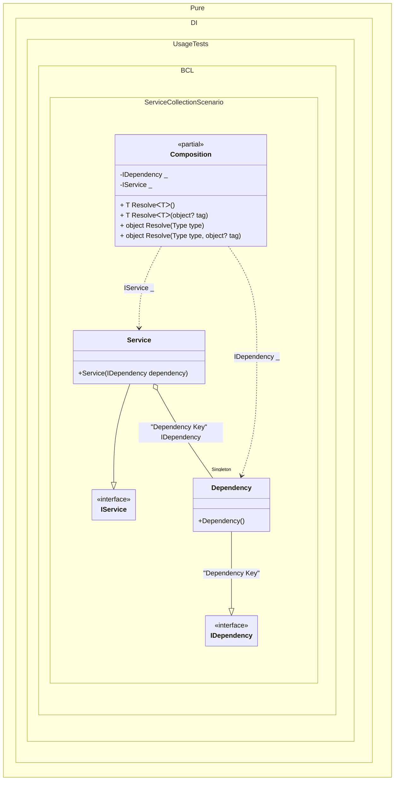

#### Service collection

[](../tests/Pure.DI.UsageTests/BaseClassLibrary/ServiceCollectionScenario.cs)

The `// OnNewRoot = On` hint specifies to create a static method that will be called for each registered composition root. This method can be used, for example, to create an _IServiceCollection_ object:


```c#
using Pure.DI.MS;
using Shouldly;
using Microsoft.Extensions.DependencyInjection;
using Pure.DI;

var composition = new Composition();
var serviceCollection = composition.ServiceCollection;
var serviceProvider = serviceCollection.BuildServiceProvider();
var service = serviceProvider.GetRequiredService<IService>();
var dependency = serviceProvider.GetRequiredKeyedService<IDependency>("Dependency Key");
service.Dependency.ShouldBe(dependency);

interface IDependency;

class Dependency : IDependency;

interface IService
{
    IDependency Dependency { get; }
}

class Service([Tag("Dependency Key")] IDependency dependency) : IService
{
    public IDependency Dependency { get; } = dependency;
}

partial class Composition : ServiceProviderFactory<Composition>
{
    public IServiceCollection ServiceCollection =>
        CreateServiceCollection(this);

    static void Setup() =>
        DI.Setup()
            .DependsOn(Base)
            .Bind<IDependency>("Dependency Key").As(Lifetime.Singleton).To<Dependency>()
            .Bind<IService>().To<Service>()
            .Root<IDependency>(tag: "Dependency Key")
            .Root<IService>();
}
```

<details>
<summary>Running this code sample locally</summary>

- Make sure you have the [.NET SDK 9.0](https://dotnet.microsoft.com/en-us/download/dotnet/9.0) or later is installed
- Create a net9.0 (or later) console application
- Add references to NuGet packages
  - [Pure.DI](https://www.nuget.org/packages/Pure.DI)
  - [Pure.DI.MS](https://www.nuget.org/packages/Pure.DI.MS)
  - [Shouldly](https://www.nuget.org/packages/Shouldly)
  - [Microsoft.Extensions.DependencyInjection](https://www.nuget.org/packages/Microsoft.Extensions.DependencyInjection)
- Copy the example code into the _Program.cs_ file

You are ready to run the example!

</details>


Class diagram:



