#### Service collection

The `// OnNewRoot = On` hint specifies to create a static method that will be called for each registered composition root. This method can be used, for example, to create an _IServiceCollection_ object:


```c#
using Pure.DI.MS;
using Shouldly;
using Microsoft.Extensions.DependencyInjection;
using Pure.DI;

var composition = new Composition();
var serviceCollection = composition.ServiceCollection;
var serviceProvider = serviceCollection.BuildServiceProvider();
var thermostat = serviceProvider.GetRequiredService<IThermostat>();
var sensor = serviceProvider.GetRequiredKeyedService<ISensor>("LivingRoom");
thermostat.Sensor.ShouldBe(sensor);

interface ISensor;

class TemperatureSensor : ISensor;

interface IThermostat
{
    ISensor Sensor { get; }
}

class Thermostat([Tag("LivingRoom")] ISensor sensor) : IThermostat
{
    public ISensor Sensor { get; } = sensor;
}

partial class Composition : ServiceProviderFactory<Composition>
{
    public IServiceCollection ServiceCollection =>
        CreateServiceCollection(this);

    static void Setup() =>
        DI.Setup()
            .Bind<ISensor>("LivingRoom").As(Lifetime.Singleton).To<TemperatureSensor>()
            .Bind<IThermostat>().To<Thermostat>()
            .Root<ISensor>(tag: "LivingRoom")
            .Root<IThermostat>();
}
```

<details>
<summary>Running this code sample locally</summary>

- Make sure you have the [.NET SDK 10.0](https://dotnet.microsoft.com/en-us/download/dotnet/10.0) or later is installed
```bash
dotnet --list-sdk
```
- Create a net10.0 (or later) console application
```bash
dotnet new console -n Sample
```
- Add references to NuGet packages
  - [Pure.DI](https://www.nuget.org/packages/Pure.DI)
  - [Pure.DI.MS](https://www.nuget.org/packages/Pure.DI.MS)
  - [Shouldly](https://www.nuget.org/packages/Shouldly)
  - [Microsoft.Extensions.DependencyInjection](https://www.nuget.org/packages/Microsoft.Extensions.DependencyInjection)
```bash
dotnet add package Pure.DI
dotnet add package Pure.DI.MS
dotnet add package Shouldly
dotnet add package Microsoft.Extensions.DependencyInjection
```
- Copy the example code into the _Program.cs_ file

You are ready to run the example 🚀
```bash
dotnet run
```

</details>

The following partial class will be generated:

```c#
partial class Composition
{
#if NET9_0_OR_GREATER
  private readonly Lock _lock = new Lock();
#else
  private readonly Object _lock = new Object();
#endif

  private TemperatureSensor? _singletonTemperatureSensor51;

  private ISensor Root2
  {
    [MethodImpl(MethodImplOptions.AggressiveInlining)]
    get
    {
      EnsureTemperatureSensorLivingRoomExists();
      return _singletonTemperatureSensor51;
      [MethodImpl(MethodImplOptions.AggressiveInlining)]
      void EnsureTemperatureSensorLivingRoomExists()
      {
        if (_singletonTemperatureSensor51 is null)
          lock (_lock)
            if (_singletonTemperatureSensor51 is null)
            {
              _singletonTemperatureSensor51 = new TemperatureSensor();
            }
      }
    }
  }

  private IThermostat Root1
  {
    [MethodImpl(MethodImplOptions.AggressiveInlining)]
    get
    {
      EnsureTemperatureSensorLivingRoomExists();
      return new Thermostat(_singletonTemperatureSensor51);
      [MethodImpl(MethodImplOptions.AggressiveInlining)]
      void EnsureTemperatureSensorLivingRoomExists()
      {
        if (_singletonTemperatureSensor51 is null)
          lock (_lock)
            if (_singletonTemperatureSensor51 is null)
            {
              _singletonTemperatureSensor51 = new TemperatureSensor();
            }
      }
    }
  }

  [MethodImpl(MethodImplOptions.AggressiveInlining)]
  public T Resolve<T>()
  {
    return Resolver<T>.Value.Resolve(this);
  }

  [MethodImpl(MethodImplOptions.AggressiveInlining)]
  public T Resolve<T>(object? tag)
  {
    return Resolver<T>.Value.ResolveByTag(this, tag);
  }

  [MethodImpl(MethodImplOptions.AggressiveInlining)]
  public object Resolve(Type type)
  {
    #if NETCOREAPP3_0_OR_GREATER
    var index = (int)(_bucketSize * (((uint)type.TypeHandle.GetHashCode()) % 4));
    #else
    var index = (int)(_bucketSize * (((uint)RuntimeHelpers.GetHashCode(type)) % 4));
    #endif
    ref var pair = ref _buckets[index];
    return Object.ReferenceEquals(pair.Key, type) ? pair.Value.Resolve(this) : Resolve(type, index);
  }

  [MethodImpl(MethodImplOptions.NoInlining)]
  private object Resolve(Type type, int index)
  {
    var finish = index + _bucketSize;
    while (++index < finish)
    {
      ref var pair = ref _buckets[index];
      if (Object.ReferenceEquals(pair.Key, type))
      {
        return pair.Value.Resolve(this);
      }
    }

    throw new CannotResolveException($"{CannotResolveMessage} {OfTypeMessage} {type}.", type, null);
  }

  [MethodImpl(MethodImplOptions.AggressiveInlining)]
  public object Resolve(Type type, object? tag)
  {
    #if NETCOREAPP3_0_OR_GREATER
    var index = (int)(_bucketSize * (((uint)type.TypeHandle.GetHashCode()) % 4));
    #else
    var index = (int)(_bucketSize * (((uint)RuntimeHelpers.GetHashCode(type)) % 4));
    #endif
    ref var pair = ref _buckets[index];
    return Object.ReferenceEquals(pair.Key, type) ? pair.Value.ResolveByTag(this, tag) : Resolve(type, tag, index);
  }

  [MethodImpl(MethodImplOptions.NoInlining)]
  private object Resolve(Type type, object? tag, int index)
  {
    var finish = index + _bucketSize;
    while (++index < finish)
    {
      ref var pair = ref _buckets[index];
      if (Object.ReferenceEquals(pair.Key, type))
      {
        return pair.Value.ResolveByTag(this, tag);
      }
    }

    throw new CannotResolveException($"{CannotResolveMessage} \"{tag}\" {OfTypeMessage} {type}.", type, tag);
  }

  private readonly static uint _bucketSize;
  private readonly static Pair<IResolver<Composition, object>>[] _buckets;

  static Composition()
  {
    var valResolver_0000 = new Resolver_0000();
    OnNewRoot<ISensor, TemperatureSensor>(valResolver_0000, "Root2", "LivingRoom", Lifetime.Singleton);
    Resolver<ISensor>.Value = valResolver_0000;
    var valResolver_0001 = new Resolver_0001();
    OnNewRoot<IThermostat, Thermostat>(valResolver_0001, "Root1", null, Lifetime.Transient);
    Resolver<IThermostat>.Value = valResolver_0001;
    _buckets = Buckets<IResolver<Composition, object>>.Create(
      4,
      out _bucketSize,
      new Pair<IResolver<Composition, object>>[2]
      {
         new Pair<IResolver<Composition, object>>(typeof(ISensor), valResolver_0000)
        ,new Pair<IResolver<Composition, object>>(typeof(IThermostat), valResolver_0001)
      });
  }

  private const string CannotResolveMessage = "Cannot resolve composition root ";
  private const string OfTypeMessage = "of type ";

  private class Resolver<T>: IResolver<Composition, T>
  {
    public static IResolver<Composition, T> Value = new Resolver<T>();

    public virtual T Resolve(Composition composite)
    {
      throw new CannotResolveException($"{CannotResolveMessage}{OfTypeMessage}{typeof(T)}.", typeof(T), null);
    }

    public virtual T ResolveByTag(Composition composite, object tag)
    {
      throw new CannotResolveException($"{CannotResolveMessage}\"{tag}\" {OfTypeMessage}{typeof(T)}.", typeof(T), tag);
    }
  }

  private sealed class Resolver_0000: Resolver<ISensor>
  {
    public override ISensor Resolve(Composition composition)
    {
      return base.Resolve(composition);
    }

    public override ISensor ResolveByTag(Composition composition, object tag)
    {
      switch (tag)
      {
        case "LivingRoom":
          return composition.Root2;

        default:
          return base.ResolveByTag(composition, tag);
      }
    }
  }

  private sealed class Resolver_0001: Resolver<IThermostat>
  {
    public override IThermostat Resolve(Composition composition)
    {
      return composition.Root1;
    }

    public override IThermostat ResolveByTag(Composition composition, object tag)
    {
      switch (tag)
      {
        case null:
          return composition.Root1;

        default:
          return base.ResolveByTag(composition, tag);
      }
    }
  }
}
```

Class diagram:

```mermaid
---
 config:
  maxTextSize: 2147483647
  maxEdges: 2147483647
  class:
   hideEmptyMembersBox: true
---
classDiagram
	TemperatureSensor --|> ISensor : "LivingRoom" 
	Thermostat --|> IThermostat
	Composition ..> Thermostat : IThermostat _
	Composition ..> TemperatureSensor : ISensor _
	Thermostat o-- "Singleton" TemperatureSensor : "LivingRoom"  ISensor
	namespace Pure.DI.UsageTests.BCL.ServiceCollectionScenario {
		class Composition {
		<<partial>>
		-ISensor _
		-IThermostat _
		+ T ResolveᐸTᐳ()
		+ T ResolveᐸTᐳ(object? tag)
		+ object Resolve(Type type)
		+ object Resolve(Type type, object? tag)
		}
		class ISensor {
			<<interface>>
		}
		class IThermostat {
			<<interface>>
		}
		class TemperatureSensor {
				<<class>>
			+TemperatureSensor()
		}
		class Thermostat {
				<<class>>
			+Thermostat(ISensor sensor)
		}
	}
```



